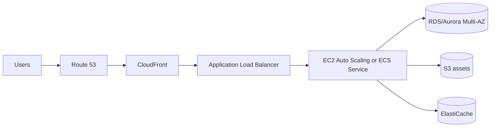
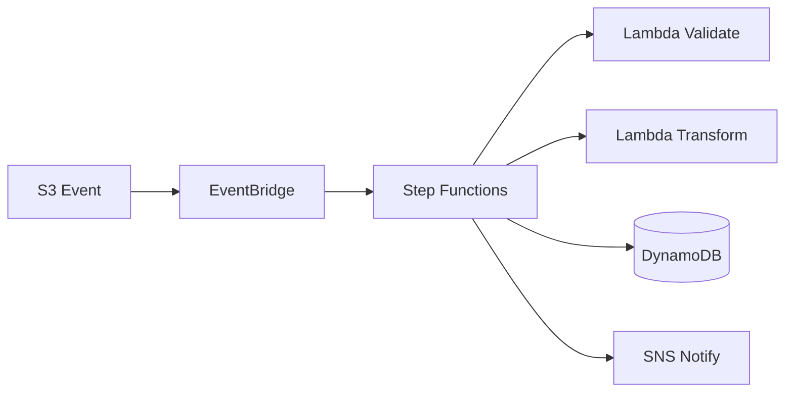
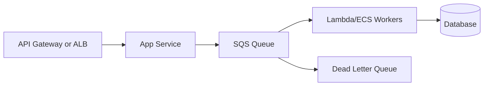

# AWS Certified Solutions Architect - Associate (SAA-C03) Architecture Decision Cheat Sheet

> **Scope**
>
> This is an architecture decision handbook, not an exam dump. It does not recreate or reference exam questions. It focuses on selecting AWS services for real architecture scenarios aligned with SAA-C03 objectives.

## Official Scope Snapshot

Current SAA-C03 domains:

| Domain | Weight | What to reason about |
|---|---:|---|
| Design Secure Architectures | 30% | Identity, encryption, network boundaries, data protection, least privilege |
| Design Resilient Architectures | 26% | High availability, disaster recovery, decoupling, backups, fault tolerance |
| Design High-Performing Architectures | 24% | Compute, storage, database, network, caching, elasticity |
| Design Cost-Optimized Architectures | 20% | Pricing models, right-sizing, managed services, storage classes, data transfer |

Primary references:

- [AWS SAA-C03 exam domains](https://docs.aws.amazon.com/aws-certification/latest/solutions-architect-associate-03/solutions-architect-associate-03-domain1.html)
- [AWS SAA-C03 in-scope services](https://docs.aws.amazon.com/aws-certification/latest/solutions-architect-associate-03/saa-03-in-scope-services.html)
- [AWS Well-Architected Framework](https://docs.aws.amazon.com/wellarchitected/latest/framework/welcome.html)

## Table Of Contents

- [Official Scope Snapshot](#official-scope-snapshot)
- [Official In-Scope Coverage Matrix](#official-in-scope-coverage-matrix)
- [How To Use This Guide](#how-to-use-this-guide)
- [Core Architecture Filters](#core-architecture-filters)
- [AWS Well-Architected Decision Lens](#aws-well-architected-decision-lens)
- [Shared Responsibility Model](#shared-responsibility-model)
- [High-Yield Limits And Numbers](#high-yield-limits-and-numbers)
- [Global Service Selection Rules](#global-service-selection-rules)
- [Decision Trees](#decision-trees)
- [Architecture Patterns](#architecture-patterns)
- [Common Scenario Recommendations](#common-scenario-recommendations)
- [Service Reference Cards](#service-reference-cards)
- [High-Value Comparison Tables](#high-value-comparison-tables)
- [Exam Reasoning Tips And Tricks](#exam-reasoning-tips-and-tricks)
- [Common Mistakes To Avoid](#common-mistakes-to-avoid)
- [Rapid Architecture Prompts](#rapid-architecture-prompts)
- [Sources And Verification Notes](#sources-and-verification-notes)

## Official In-Scope Coverage Matrix

This guide explicitly covers the official in-scope services listed by AWS. Some services appear in multiple domains; they are covered once in the most useful decision category and referenced elsewhere by comparison tables or decision trees.

| Official category | Official in-scope services | Covered in this guide as |
|---|---|---|
| Analytics | Athena, Data Exchange, Data Firehose, EMR, Glue, Kinesis, Lake Formation, MSK, OpenSearch Service, Amazon Quick, Redshift | Analytics service cards, Kinesis family card, streaming comparison table |
| Application Integration | AppFlow, AppSync, EventBridge, MQ, SNS, SQS, Step Functions | Application Integration service cards and async decision trees |
| AWS Cost Management | Budgets, Cost and Usage Report, Cost Explorer, Savings Plans | Cost Management service cards and cost tips |
| Compute | Batch, EC2, EC2 Auto Scaling, Elastic Beanstalk, Outposts, Serverless Application Repository, VMware Cloud on AWS, Wavelength | Compute service cards and compute decision tree |
| Containers | ECR, ECS, ECS Anywhere, EKS, EKS Anywhere, EKS Distro | Compute and Containers service cards |
| Database | Aurora, Aurora Serverless, DocumentDB, DynamoDB, ElastiCache, Keyspaces, Neptune, RDS, Redshift | Database service cards and database decision tree |
| Developer Tools | X-Ray | Observability card and tracing guidance |
| Front-End Web and Mobile | Amplify, API Gateway, Device Farm | Front-End, API, and Mobile service cards |
| Machine Learning | Comprehend, Kendra, Lex, Polly, Rekognition, SageMaker AI, Textract, Transcribe, Translate | Machine Learning and AI service cards |
| Management and Governance | Auto Scaling, CLI, CloudFormation, CloudTrail, CloudWatch, Compute Optimizer, Config, Control Tower, Health Dashboard, License Manager, Managed Grafana, Managed Service for Prometheus, Management Console, Organizations, Service Catalog, Systems Manager, Trusted Advisor, Well-Architected Tool | Management, Governance, and Observability service cards |
| Media Services | Elastic Transcoder, Kinesis Video Streams | Media service cards |
| Migration and Transfer | Application Migration Service, DataSync, DMS, Snow Family, Transfer Family | Migration and Transfer service cards |
| Networking and Content Delivery | Client VPN, CloudFront, Direct Connect, ELB, Global Accelerator, PrivateLink, Route 53, Site-to-Site VPN, Transit Gateway, VPC | Networking service cards and edge/network comparison tables |
| Security, Identity, and Compliance | Artifact, Audit Manager, ACM, CloudHSM, Cognito, Detective, Directory Service, Firewall Manager, GuardDuty, IAM Identity Center, Inspector, KMS, Macie, Network Firewall, RAM, Secrets Manager, Security Hub, Shield, WAF, IAM | Security service cards and security decision tree |
| Serverless | AppSync, Fargate, Lambda | Serverless cards under integration/compute plus serverless patterns |
| Storage | Backup, EBS, EFS, FSx, S3, S3 Glacier, Storage Gateway | Storage service cards and storage decision tree |

## How To Use This Guide

- Start with the decision trees.
- Confirm non-functional requirements: latency, durability, RTO/RPO, compliance, scale, operations, budget.
- Prefer managed services unless the scenario requires OS/runtime control.
- In questions about "best" service, identify the dominant requirement first.

> **Remember**
>
> AWS architecture answers usually hinge on one or two constraints: latency, durability, HA, security boundary, operational burden, or cost.

## Core Architecture Filters

| Requirement | First question | Typical service direction |
|---|---|---|
| Compute | Do you need server control? | Lambda, Fargate, ECS, EKS, EC2 |
| Storage | Object, block, or file? | S3, EBS, EFS, FSx |
| Database | Relational, key-value, document, graph, cache? | RDS/Aurora, DynamoDB, DocumentDB, Neptune, ElastiCache |
| Integration | Sync or async? | API Gateway/AppSync, SQS/SNS/EventBridge, Step Functions |
| Network | Public, private, hybrid, edge? | VPC, PrivateLink, VPN, Direct Connect, CloudFront, Route 53 |
| Security | Who can do what, and how is data protected? | IAM, KMS, Cognito, WAF, Shield, GuardDuty |
| Resilience | What RTO/RPO and blast radius? | Multi-AZ, Multi-Region, backups, queues, health checks |
| Cost | What is steady vs spiky? | Savings Plans, Reserved Instances, Spot, storage tiering |

## AWS Well-Architected Decision Lens

| Pillar | Design questions | Common AWS choices |
|---|---|---|
| Operational Excellence | Can you automate, observe, and safely change? | CloudFormation, Systems Manager, CloudWatch, CloudTrail, X-Ray |
| Security | Can every action and data path be authorized, encrypted, and audited? | IAM, KMS, ACM, WAF, Shield, GuardDuty, Config |
| Reliability | Can the workload survive failures and recover? | Multi-AZ, Auto Scaling, ELB, Route 53 health checks, backups, SQS |
| Performance Efficiency | Does the architecture match access patterns and latency needs? | CloudFront, ElastiCache, DynamoDB, Aurora, Lambda, ECS |
| Cost Optimization | Are resources sized, scheduled, and priced appropriately? | Cost Explorer, Budgets, Savings Plans, Spot, S3 lifecycle |
| Sustainability | Are you using efficient managed services and reducing waste? | Serverless, right-sizing, Graviton, lifecycle policies |

## Shared Responsibility Model

> **Remember**
>
> AWS is responsible for security **of** the cloud. You are responsible for security **in** the cloud. The more managed the service, the less infrastructure you operate, but you still own identity, data, configuration, and access decisions.

| Service type | AWS manages | Customer manages | Exam angle |
|---|---|---|---|
| EC2 / self-managed | Facilities, hardware, virtualization, managed service control planes | Guest OS, patches, agents, app, data, IAM, network rules | Highest customer responsibility |
| Containers on EC2 | AWS infrastructure and container service control plane | EC2 hosts, AMIs, container images, task config, IAM, network rules | ECS/EKS does not remove host patching if using EC2 nodes |
| Fargate / Lambda | Servers, OS patching, runtime infrastructure | Code, dependencies, IAM role, environment variables, data, VPC config | Choose when reducing operations is a requirement |
| RDS / Aurora | Database software patching options, backups platform, Multi-AZ mechanisms | Schema, data, users, parameter choices, backups policy, network/IAM access | Managed database still needs secure configuration |
| S3 / DynamoDB | Infrastructure, durability, availability mechanics | Bucket/table policy, encryption choice, access patterns, lifecycle, data classification | Misconfiguration is the common risk |
| IAM / Organizations | Service availability and APIs | Least privilege, MFA, roles, SCP design, credential lifecycle | Permissions are always customer-owned |

## High-Yield Limits And Numbers

These values are useful for service selection. Always verify exact quotas for production design, but these are strong exam-level mental anchors.

| Topic | Remember | Architecture implication |
|---|---|---|
| Lambda timeout | Maximum 15 minutes | Use ECS/Fargate, Batch, Step Functions, or managed media services for longer work |
| Lambda scaling | Scales by concurrent executions | Use reserved/provisioned concurrency for control and predictable cold-start behavior |
| SQS message retention | Up to 14 days | Use S3/event storage for longer-term replay |
| SQS visibility timeout | Must exceed normal processing time | Too short can cause duplicate processing |
| SQS Standard | At-least-once delivery, best-effort ordering | Workers must be idempotent |
| SQS FIFO | Exactly-once processing semantics with ordering per message group | Use when ordering/deduplication matters |
| Step Functions Standard | Durable long-running workflows | Use for auditable workflows and human/long-running processes |
| Step Functions Express | High-volume short workflows | Use for event processing where cost/throughput matters more than long audit history |
| API Gateway timeout | Has integration timeout limits | Long-running backend work should be async with SQS/Step Functions |
| ALB idle timeout | Default behavior can affect long-lived HTTP connections | Tune timeout or choose different protocol/service |
| EBS scope | AZ-scoped block volume | Snapshot/copy for cross-AZ or cross-Region recovery |
| EFS scope | Regional or One Zone file system | Regional EFS supports Multi-AZ shared file access |
| S3 durability | Designed for 11 9s durability | Durability does not mean immediate retrieval for archive classes |
| RDS Multi-AZ | HA/failover pattern | Not primarily for read scaling |
| RDS read replica | Read scaling pattern | Not the same as synchronous HA standby |
| DynamoDB partition key | Drives scale and hot-partition risk | Model access patterns before table design |
| Route 53 DNS failover | Depends on DNS TTL and resolver caching | Not instant failover |
| Direct Connect | Dedicated private connection, not automatically encrypted | Add VPN/MACsec where encryption is required |
| NAT Gateway | Charged hourly and per GB processed | Prefer VPC endpoints for supported private AWS service access |
| Cross-AZ traffic | Can incur data transfer costs | Avoid chatty cross-AZ dependencies where possible |

## Global Service Selection Rules

| Choose this | When the scenario says |
|---|---|
| Multi-AZ | High availability inside one Region |
| Multi-Region | Disaster recovery, global latency, regional isolation |
| S3 | Durable object storage, static content, backups, data lakes |
| EFS | Shared POSIX file system across Linux instances/containers |
| FSx | Managed Windows, Lustre, NetApp ONTAP, or OpenZFS file system |
| EBS | Low-latency block storage for one EC2 instance at a time |
| DynamoDB | Serverless key-value/document access at massive scale |
| RDS/Aurora | Managed relational database with SQL and transactions |
| ElastiCache | Sub-millisecond cache/session store |
| SQS | Decouple producers and consumers with buffering |
| SNS | Fan-out push notifications and pub/sub |
| EventBridge | Event bus, SaaS events, event routing |
| Step Functions | Workflow orchestration and state management |
| Lambda | Short-lived event-driven code without server management |
| Fargate | Serverless containers |
| EC2 | Full OS, kernel, agents, or specialized compute control |

## Decision Trees

### Compute

```text
Need to run code?
|
|-- Event-driven and short running?
|   |-- Yes, <= 15 minutes, stateless
|   |   `-- AWS Lambda
|   `-- No
|
|-- Containerized?
|   |-- Want AWS-native orchestration with low ops?
|   |   |-- Serverless runtime needed
|   |   |   `-- ECS on Fargate
|   |   `-- EC2 capacity control needed
|   |       `-- ECS on EC2
|   |
|   |-- Need Kubernetes API/ecosystem?
|   |   |-- Managed control plane
|   |   |   `-- EKS
|   |   `-- Hybrid/on-prem Kubernetes
|   |       `-- EKS Anywhere
|   |
|   `-- Simple web container from source/image
|       `-- App Runner
|
|-- Traditional server?
|   |-- Need OS/kernel/GPU/licensing control
|   |   `-- EC2
|   |-- Need simple PaaS deployment
|   |   `-- Elastic Beanstalk
|   `-- Batch jobs
|       `-- AWS Batch
```

### Storage

```text
Need storage?
|
|-- Object storage?
|   |-- Web assets, backups, logs, data lake
|   |   `-- Amazon S3
|   |-- Archive rarely accessed data
|   |   `-- S3 Glacier storage classes
|
|-- Block storage for EC2?
|   |-- Boot volume or database volume
|   |   `-- Amazon EBS
|   `-- Temporary high-performance local disk
|       `-- EC2 instance store
|
|-- Shared file storage?
|   |-- Linux POSIX, many clients
|   |   `-- Amazon EFS
|   |-- Windows SMB
|   |   `-- FSx for Windows File Server
|   |-- HPC / ML fast file system
|   |   `-- FSx for Lustre
|   |-- NetApp/OpenZFS features
|       `-- FSx for ONTAP/OpenZFS
|
`-- Hybrid storage bridge?
    `-- AWS Storage Gateway
```

### Databases

```text
Need a database?
|
|-- SQL, joins, transactions?
|   |-- Managed relational
|   |   |-- Standard engines
|   |   |   `-- Amazon RDS
|   |   |-- Cloud-native, high availability/performance
|   |       `-- Amazon Aurora
|   `-- Analytics warehouse
|       `-- Amazon Redshift
|
|-- Key-value or document at massive scale?
|   `-- Amazon DynamoDB
|
|-- JSON document with MongoDB compatibility?
|   `-- Amazon DocumentDB
|
|-- Graph relationships?
|   `-- Amazon Neptune
|
|-- Cassandra-compatible wide-column?
|   `-- Amazon Keyspaces
|
`-- Cache or session acceleration?
    `-- Amazon ElastiCache
```

### Integration

```text
Need to connect services?
|
|-- Direct request/response API?
|   |-- REST or HTTP
|   |   `-- Amazon API Gateway
|   |-- GraphQL
|   |   `-- AWS AppSync
|
|-- Async decoupling?
|   |-- Queue and pull-based processing
|   |   `-- Amazon SQS
|   |-- Pub/sub fan-out
|   |   `-- Amazon SNS
|   |-- Event routing between AWS/SaaS/apps
|       `-- Amazon EventBridge
|
|-- Ordered streaming data?
|   |-- Managed stream with consumers
|   |   `-- Amazon Kinesis Data Streams
|   |-- Kafka compatible
|   |   `-- Amazon MSK
|
`-- Multi-step workflow with retries/branches?
    `-- AWS Step Functions
```

### Networking And Edge

```text
Need network connectivity?
|
|-- Internet-facing app?
|   |-- Need static IP/global entry point
|   |   `-- AWS Global Accelerator
|   |-- Need CDN/static/cache/TLS at edge
|   |   `-- Amazon CloudFront
|   |-- Need DNS and health-based routing
|       `-- Amazon Route 53
|
|-- Private connectivity to AWS service/VPC?
|   |-- Service endpoint without public internet
|   |   `-- AWS PrivateLink / VPC endpoints
|   |-- Many VPCs/accounts connected
|       `-- AWS Transit Gateway
|
|-- Hybrid connectivity?
|   |-- Fast dedicated private link
|   |   `-- AWS Direct Connect
|   |-- Encrypted tunnel over internet
|       `-- AWS Site-to-Site VPN
```

### Security

```text
Need security control?
|
|-- Identity and authorization?
|   |-- Workforce identity
|   |   `-- IAM Identity Center
|   |-- AWS permissions
|   |   `-- IAM
|   |-- App user sign-up/sign-in
|       `-- Amazon Cognito
|
|-- Encryption keys/secrets?
|   |-- Managed keys
|   |   `-- AWS KMS
|   |-- Dedicated HSMs
|   |   `-- AWS CloudHSM
|   |-- Secrets rotation/retrieval
|       `-- AWS Secrets Manager
|
|-- Threat detection/posture?
|   |-- Threat detection
|   |   `-- Amazon GuardDuty
|   |-- Security findings hub
|   |   `-- AWS Security Hub
|   |-- Config compliance
|       `-- AWS Config
|
`-- Edge/network protection?
    |-- L7 web attacks
    |   `-- AWS WAF
    |-- DDoS
    |   `-- AWS Shield
    `-- Network firewalling
        `-- AWS Network Firewall
```

## Architecture Patterns

### Highly Available Web Application



Choose this when:

- You need a standard web tier with horizontal scaling.
- The database must survive AZ failure.
- Static assets benefit from caching at edge locations.

### Serverless Event Processing



Choose this when:

- Work is event-driven, bursty, and short-lived.
- You want managed retries, branching, and auditability.
- You prefer pay-per-use over idle capacity.

### Decoupled Queue Worker



Choose this when:

- Producers and consumers scale differently.
- You need buffering during spikes.
- Failed messages need isolation and replay.

### Multi-Region Disaster Recovery

| Strategy | RTO/RPO | Cost | Pattern |
|---|---|---:|---|
| Backup and restore | Hours+ | Low | Backups copied to second Region |
| Pilot light | Tens of minutes to hours | Low-medium | Minimal core infra always on |
| Warm standby | Minutes | Medium-high | Scaled-down full environment |
| Active-active | Seconds/minutes | Highest | Traffic served from multiple Regions |

> **Tip**
>
> Multi-AZ is not disaster recovery from a regional outage. Multi-Region is.

## Common Scenario Recommendations

| Scenario | Prefer | Avoid |
|---|---|---|
| Static website with global users | S3 + CloudFront + Route 53 | EC2 web servers for static files |
| Uploads from mobile clients | S3 presigned URLs + Cognito | Proxying all uploads through EC2 |
| Short image processing after upload | S3 event + Lambda | Always-on EC2 worker for rare events |
| Long video encoding pipeline | MediaConvert/Elastic Transcoder + SQS/Step Functions | Lambda for long-running jobs |
| Unpredictable key-value traffic | DynamoDB on-demand | Self-managed NoSQL on EC2 |
| Relational app requiring SQL | Aurora/RDS Multi-AZ | DynamoDB if joins/transactions dominate |
| Read-heavy database workload | Read replicas + cache | Scaling only the writer instance |
| Microservice fan-out | SNS or EventBridge | Hard-coded service-to-service calls |
| Ordered message processing | SQS FIFO or Kinesis | Standard SQS when strict order required |
| Hybrid low-latency private link | Direct Connect | Site-to-Site VPN only |
| Private access to S3/DynamoDB | Gateway VPC endpoint | NAT Gateway for private subnet access |
| Centralized multi-account governance | Organizations + Control Tower | One large shared AWS account |

## Service Reference Cards

Each service card is concise by design. Use it as a decision checklist.

### Analytics

#### Amazon Athena

| Field | Guidance |
|---|---|
| Overview | Serverless SQL query service for data in S3. |
| Purpose | Ad hoc analytics without provisioning a data warehouse. |
| When to use | Query logs, CSV/JSON/Parquet, data lake objects. |
| When NOT to use | Millisecond application queries or heavy BI concurrency needing warehouse tuning. |
| Strengths | Serverless, integrates with Glue Data Catalog, pay per scanned data. |
| Weaknesses | Performance depends on file layout, partitions, compression, and scanned bytes. |
| Pricing | Charged per TB scanned; reduce cost with Parquet/ORC, compression, partitioning. |
| Availability | Regional managed service; data durability depends on S3. |
| Scaling | AWS-managed; large scans still need good data design. |
| Security | IAM, S3 policies, KMS, Lake Formation permissions. |
| Common integrations | S3, Glue, Lake Formation, QuickSight/Quick Suite, CloudTrail logs. |
| Exam considerations | Choose for serverless SQL over S3 data, especially logs and data lakes. |

#### AWS Data Exchange

| Field | Guidance |
|---|---|
| Overview | Marketplace for third-party datasets. |
| Purpose | Subscribe to and use external data in AWS. |
| When to use | Need curated external datasets for analytics, ML, or enrichment. |
| When NOT to use | Internal ETL or private app integration. |
| Strengths | Simplifies procurement and delivery of data products. |
| Weaknesses | Data quality, licensing, and update cadence depend on provider. |
| Pricing | Dataset subscription fees plus downstream storage/compute. |
| Availability | Managed marketplace; data delivery varies by product. |
| Scaling | Dataset consumption scales with target services. |
| Security | IAM, provider terms, encryption on storage targets. |
| Common integrations | S3, Redshift, Lake Formation, APIs. |
| Exam considerations | Rarely the core answer; know it for external data subscriptions. |

#### Amazon Data Firehose

| Field | Guidance |
|---|---|
| Overview | Managed delivery stream for loading streaming data into destinations. |
| Purpose | Buffer, transform, and deliver streaming records. |
| When to use | Near-real-time delivery to S3, Redshift, OpenSearch, Splunk, HTTP endpoints. |
| When NOT to use | Complex consumer processing or replayable custom stream consumers. |
| Strengths | Fully managed, automatic scaling, optional Lambda transforms. |
| Weaknesses | Delivery buffering adds latency; less consumer control than Kinesis Data Streams. |
| Pricing | Based on data ingested, format conversion, VPC delivery, optional features. |
| Availability | Regional managed service with durable buffering. |
| Scaling | Automatically scales ingestion and delivery within quotas. |
| Security | IAM, KMS, VPC delivery, destination policies. |
| Common integrations | Kinesis Data Streams, CloudWatch Logs, S3, Redshift, OpenSearch. |
| Exam considerations | Choose when the goal is streaming data delivery, not custom stream processing. |

#### Amazon EMR

| Field | Guidance |
|---|---|
| Overview | Managed big data platform for Spark, Hive, Presto, and Hadoop ecosystems. |
| Purpose | Large-scale distributed analytics and ETL. |
| When to use | Existing Spark/Hadoop jobs, large transformations, data lake processing. |
| When NOT to use | Simple SQL over S3 where Athena is enough. |
| Strengths | Flexible engines, EC2/EKS/serverless deployment options. |
| Weaknesses | More operational tuning than Athena/Glue. |
| Pricing | Underlying compute/storage plus EMR charges; Spot can reduce cost. |
| Availability | Cluster design determines HA; data should live in S3 for durability. |
| Scaling | Supports managed scaling and transient clusters. |
| Security | IAM, Kerberos, KMS, security groups, private subnets. |
| Common integrations | S3, Glue Catalog, Lake Formation, CloudWatch, Step Functions. |
| Exam considerations | Choose for big data frameworks and custom distributed processing. |

#### AWS Glue

| Field | Guidance |
|---|---|
| Overview | Serverless data integration, ETL, crawlers, and Data Catalog. |
| Purpose | Discover, catalog, transform, and prepare data. |
| When to use | Serverless ETL, schema discovery, data lake cataloging. |
| When NOT to use | Ultra-low-latency streaming application logic. |
| Strengths | Managed Spark, crawlers, Data Catalog shared by Athena/EMR/Redshift Spectrum. |
| Weaknesses | Job startup latency; Spark tuning may still matter. |
| Pricing | Charged by data processing units, crawlers, and catalog storage/requests. |
| Availability | Regional managed service. |
| Scaling | Serverless capacity configured per job; auto scaling options available. |
| Security | IAM, KMS, VPC connections, Lake Formation permissions. |
| Common integrations | S3, Athena, EMR, Redshift, Lake Formation. |
| Exam considerations | Data Catalog is central for data lake metadata. |

#### Amazon Kinesis

| Field | Guidance |
|---|---|
| Overview | Family of managed streaming services for real-time data ingestion, processing, delivery, and video streams. |
| Purpose | Choose the correct Kinesis capability for streaming data workloads. |
| When to use | Scenarios mention real-time streams, ordered event ingestion, clickstreams, IoT telemetry, logs, or video streams. |
| When NOT to use | Simple task buffering where SQS is enough, or simple pub/sub fan-out where SNS/EventBridge fits better. |
| Strengths | Purpose-built streaming options: Data Streams for replayable streams, Data Firehose for delivery, Video Streams for video. |
| Weaknesses | Each Kinesis service solves a different problem; choosing the family name is not enough. |
| Pricing | Depends on chosen service: shards/on-demand stream throughput, delivery volume, storage, retrieval, or video minutes. |
| Availability | Regional managed services with Multi-AZ durability characteristics. |
| Scaling | Data Streams scales by shard or on-demand mode; Firehose scales delivery; Video Streams scales stream ingestion. |
| Security | IAM, KMS, TLS, VPC endpoints where supported. |
| Common integrations | Lambda, Firehose, S3, OpenSearch, Redshift, Flink, Rekognition Video. |
| Exam considerations | If the scenario says replay and multiple consumers, think Kinesis Data Streams; if it says deliver to S3/Redshift/OpenSearch, think Firehose. |

#### Amazon Kinesis Data Streams

| Field | Guidance |
|---|---|
| Overview | Real-time streaming data service with ordered shards. |
| Purpose | Ingest and process high-volume event streams. |
| When to use | Multiple consumers, replay, ordering per partition key, custom stream processing. |
| When NOT to use | Simple delivery to S3 where Firehose is enough. |
| Strengths | Retention/replay, enhanced fan-out, Lambda integration. |
| Weaknesses | Shard design and hot keys can affect throughput. |
| Pricing | Shards or on-demand throughput, PUT payload units, enhanced fan-out. |
| Availability | Multi-AZ within a Region. |
| Scaling | Shard split/merge or on-demand mode. |
| Security | IAM, KMS, VPC endpoints. |
| Common integrations | Lambda, Firehose, Flink, CloudWatch, S3. |
| Exam considerations | Choose over SQS when you need ordered replayable streams. |

#### AWS Lake Formation

| Field | Guidance |
|---|---|
| Overview | Data lake governance and access control service. |
| Purpose | Manage fine-grained permissions for lake data. |
| When to use | Centralized data lake access across accounts, tables, columns, and rows. |
| When NOT to use | Simple single-bucket app storage. |
| Strengths | Fine-grained permissions, data sharing, governance. |
| Weaknesses | Requires careful permission model planning. |
| Pricing | Usually no additional charge for many features; integrated services incur cost. |
| Availability | Regional; governed data often in S3. |
| Scaling | Scales via integrated analytics services. |
| Security | IAM plus Lake Formation grants, KMS, data filters. |
| Common integrations | S3, Glue, Athena, Redshift, EMR. |
| Exam considerations | Choose for governed data lakes and central access control. |

#### Amazon MSK

| Field | Guidance |
|---|---|
| Overview | Managed Apache Kafka. |
| Purpose | Kafka-compatible event streaming. |
| When to use | Existing Kafka apps, Kafka APIs, ecosystem compatibility. |
| When NOT to use | AWS-native streams are acceptable and simpler with Kinesis. |
| Strengths | Managed brokers, Kafka compatibility, MSK Serverless option. |
| Weaknesses | Kafka concepts and partition planning still apply. |
| Pricing | Broker/serverless capacity, storage, data transfer. |
| Availability | Multi-AZ broker deployment. |
| Scaling | Broker, partition, storage, or serverless scaling depending mode. |
| Security | IAM/SASL/SCRAM/TLS, KMS, VPC-only access. |
| Common integrations | Kafka clients, Lambda, Glue, Firehose, CloudWatch. |
| Exam considerations | Choose when the scenario explicitly needs Kafka compatibility. |

#### Amazon OpenSearch Service

| Field | Guidance |
|---|---|
| Overview | Managed OpenSearch for search, log analytics, and observability. |
| Purpose | Full-text search and near-real-time analytics. |
| When to use | Search boxes, log exploration, dashboards. |
| When NOT to use | Primary transactional database. |
| Strengths | Indexing, relevance search, aggregations, dashboards. |
| Weaknesses | Cluster sizing, shard design, and index lifecycle need care. |
| Pricing | Instances, storage, UltraWarm/cold storage, data transfer. |
| Availability | Multi-AZ with dedicated masters recommended for production. |
| Scaling | Scale nodes/storage; serverless option exists for simpler operations. |
| Security | IAM, fine-grained access, VPC, KMS, Cognito/SAML. |
| Common integrations | CloudWatch Logs, Firehose, Lambda, S3. |
| Exam considerations | Choose for search and log analytics, not durable system of record. |

#### Amazon Quick Suite / Amazon QuickSight

| Field | Guidance |
|---|---|
| Overview | AWS business intelligence and analytics experience, with QuickSight as the BI capability. |
| Purpose | Dashboards, BI visuals, and embedded analytics. |
| When to use | Business users need dashboards over AWS or external data. |
| When NOT to use | Raw ETL, stream processing, or operational alerting. |
| Strengths | Serverless BI, SPICE in-memory engine, AWS data integrations. |
| Weaknesses | Semantic modeling and dashboard governance still require design. |
| Pricing | User/session capacity and optional SPICE. |
| Availability | Managed regional service. |
| Scaling | Serverless BI capacity; SPICE accelerates reads. |
| Security | IAM, row/column security, VPC connections, federation. |
| Common integrations | Athena, Redshift, RDS, S3, OpenSearch. |
| Exam considerations | AWS scope may say Amazon Quick or Amazon QuickSuite; for SAA-C03 reasoning, associate it with BI dashboards and analytics consumption. |

#### Amazon Redshift

| Field | Guidance |
|---|---|
| Overview | Managed petabyte-scale data warehouse. |
| Purpose | SQL analytics over structured/semi-structured data. |
| When to use | Complex analytics, BI, high concurrency, warehouse workloads. |
| When NOT to use | OLTP application transactions or simple ad hoc S3 queries. |
| Strengths | Columnar storage, MPP, Spectrum, concurrency scaling, serverless option. |
| Weaknesses | Data modeling, distribution/sort keys, and workload management can matter. |
| Pricing | Provisioned nodes or serverless RPU, storage, snapshots. |
| Availability | RA3 snapshots and Multi-AZ options depending configuration. |
| Scaling | Resize clusters, concurrency scaling, serverless auto capacity. |
| Security | IAM, KMS, VPC, security groups, audit logs. |
| Common integrations | S3, Glue, Lake Formation, QuickSight, DMS. |
| Exam considerations | Choose for data warehousing, not general app databases. |

### Application Integration

#### Amazon AppFlow

| Field | Guidance |
|---|---|
| Overview | Managed SaaS data integration service. |
| Purpose | Transfer data between SaaS apps and AWS services. |
| When to use | Sync Salesforce/Slack/Google/SaaS data into S3 or analytics targets. |
| When NOT to use | Low-latency app messaging or complex custom ETL. |
| Strengths | No-code connectors, scheduling, private flows for supported apps. |
| Weaknesses | Connector capabilities vary. |
| Pricing | Flow runs and data processed. |
| Availability | Regional managed service. |
| Scaling | Managed per flow quotas. |
| Security | IAM, KMS, private connections where supported. |
| Common integrations | S3, Redshift, Salesforce, SAP, SaaS connectors. |
| Exam considerations | Choose for SaaS-to-AWS data transfer. |

#### AWS AppSync

| Field | Guidance |
|---|---|
| Overview | Managed GraphQL API service. |
| Purpose | Build GraphQL APIs with real-time and offline features. |
| When to use | Mobile/web apps need GraphQL, subscriptions, DynamoDB/Lambda integration. |
| When NOT to use | Simple REST API where API Gateway is enough. |
| Strengths | Managed GraphQL, real-time subscriptions, multiple data sources. |
| Weaknesses | GraphQL schema/resolver design required. |
| Pricing | Queries, mutations, real-time updates, caching. |
| Availability | Regional managed service; use CloudFront/global patterns if needed. |
| Scaling | Managed scaling. |
| Security | API keys, IAM, Cognito, OIDC, Lambda authorizers. |
| Common integrations | DynamoDB, Lambda, RDS, OpenSearch, EventBridge. |
| Exam considerations | Choose for GraphQL and real-time app synchronization. |

#### Amazon EventBridge

| Field | Guidance |
|---|---|
| Overview | Serverless event bus and scheduler. |
| Purpose | Route events between AWS services, SaaS apps, and custom apps. |
| When to use | Event-driven architectures, SaaS integration, loosely coupled routing. |
| When NOT to use | Large ordered stream replay where Kinesis/MSK fits better. |
| Strengths | Filtering, schema registry, cross-account buses, scheduler. |
| Weaknesses | Event size and throughput quotas; not strict ordered queue semantics. |
| Pricing | Events published, archive/replay, scheduler invocations. |
| Availability | Regional managed service. |
| Scaling | Managed scaling within quotas. |
| Security | IAM, resource policies, event bus policies, KMS for archives. |
| Common integrations | Lambda, Step Functions, SQS, SNS, API destinations, SaaS. |
| Exam considerations | Choose for event routing; choose SQS for buffering work items. |

#### Amazon MQ

| Field | Guidance |
|---|---|
| Overview | Managed ActiveMQ and RabbitMQ brokers. |
| Purpose | Migrate existing broker-based applications. |
| When to use | Need JMS, AMQP, MQTT, STOMP, OpenWire, RabbitMQ compatibility. |
| When NOT to use | New cloud-native apps that can use SQS/SNS/EventBridge. |
| Strengths | Protocol compatibility, managed broker operations. |
| Weaknesses | Broker capacity and failover design still matter. |
| Pricing | Broker instance, storage, data transfer. |
| Availability | Single-instance or active/standby Multi-AZ options. |
| Scaling | Vertical and storage scaling; not as elastic as SQS. |
| Security | VPC, security groups, TLS, credentials, KMS. |
| Common integrations | Existing messaging clients, Lambda for some configurations. |
| Exam considerations | Choose for lift-and-shift messaging compatibility. |

#### Amazon SNS

| Field | Guidance |
|---|---|
| Overview | Managed pub/sub notification service. |
| Purpose | Fan-out messages to multiple subscribers. |
| When to use | Push events to SQS, Lambda, HTTP, email, SMS, mobile push. |
| When NOT to use | Pull-based work queue with one consumer group. |
| Strengths | Fan-out, filtering, FIFO topics, broad protocols. |
| Weaknesses | Subscribers must handle delivery/retry behavior. |
| Pricing | Publish/delivery requests and notification type. |
| Availability | Regional highly available service. |
| Scaling | Managed scaling. |
| Security | IAM, topic policies, KMS, VPC endpoints. |
| Common integrations | SQS, Lambda, EventBridge, CloudWatch alarms. |
| Exam considerations | Choose when one message must notify many targets. |

#### Amazon SQS

| Field | Guidance |
|---|---|
| Overview | Managed message queue. |
| Purpose | Decouple and buffer asynchronous work. |
| When to use | Worker queues, backpressure, retries, DLQs. |
| When NOT to use | Pub/sub fan-out without queues or ordered stream replay. |
| Strengths | Durable, scalable, simple; Standard and FIFO queues. |
| Weaknesses | Standard queues are at-least-once and best-effort ordering. |
| Pricing | Requests, payload size, optional FIFO higher cost. |
| Availability | Regional multi-AZ managed durability. |
| Scaling | Virtually unlimited Standard throughput; FIFO has throughput modes. |
| Security | IAM, queue policies, KMS, VPC endpoints. |
| Common integrations | Lambda, ECS, SNS, EventBridge, Step Functions. |
| Exam considerations | Visibility timeout, DLQ, long polling, FIFO ordering are common architecture levers. |

#### AWS Step Functions

| Field | Guidance |
|---|---|
| Overview | Serverless workflow orchestration. |
| Purpose | Coordinate distributed steps with state, retries, and branching. |
| When to use | Multi-step business processes, sagas, ETL, approvals, retries. |
| When NOT to use | Single simple function or high-throughput streaming analytics. |
| Strengths | Visual workflows, error handling, service integrations. |
| Weaknesses | Workflow design and state payload limits matter. |
| Pricing | State transitions for Standard; requests/duration for Express. |
| Availability | Regional managed service. |
| Scaling | Standard for durable workflows; Express for high-volume short workflows. |
| Security | IAM execution role, KMS, VPC through integrated services. |
| Common integrations | Lambda, ECS, Glue, Batch, DynamoDB, SNS, SQS, EventBridge. |
| Exam considerations | Choose when orchestration is required; avoid chaining many Lambdas manually. |

### Compute And Containers

#### Amazon EC2

| Field | Guidance |
|---|---|
| Overview | Resizable virtual machines. |
| Purpose | General compute with OS/runtime control. |
| When to use | Custom agents, kernel tuning, GPUs, legacy apps, specialized networking. |
| When NOT to use | Simple event-driven code or containers with no server control requirement. |
| Strengths | Maximum flexibility, instance families, AMIs, placement groups. |
| Weaknesses | You manage OS patching, scaling design, and capacity. |
| Pricing | On-Demand, Reserved Instances, Savings Plans, Spot, Dedicated Hosts. |
| Availability | Instance lives in one AZ; use Auto Scaling across AZs for HA. |
| Scaling | Manual, scheduled, dynamic, or predictive via Auto Scaling groups. |
| Security | IAM roles, security groups, NACLs, SSM, EBS encryption. |
| Common integrations | EBS, EFS, ELB, Auto Scaling, CloudWatch, Systems Manager. |
| Exam considerations | Choose EC2 when control beats managed abstraction. |

#### Amazon EC2 Auto Scaling

| Field | Guidance |
|---|---|
| Overview | Maintains and scales EC2 fleets. |
| Purpose | Elastic capacity and self-healing. |
| When to use | Horizontally scalable EC2 applications. |
| When NOT to use | Stateful singleton servers without externalized state. |
| Strengths | Health replacement, scaling policies, lifecycle hooks. |
| Weaknesses | Needs stateless design and correct health checks. |
| Pricing | No extra charge; pay for launched resources. |
| Availability | Spread across subnets/AZs. |
| Scaling | Target tracking, step, simple, scheduled, predictive. |
| Security | Launch templates with instance profiles and encrypted volumes. |
| Common integrations | ELB, CloudWatch, SNS, Systems Manager. |
| Exam considerations | Use with ELB and Multi-AZ for resilient web tiers. |

#### AWS Auto Scaling

| Field | Guidance |
|---|---|
| Overview | Unified scaling plans for multiple resources. |
| Purpose | Coordinate scaling across services. |
| When to use | Need central scaling plans for EC2, ECS, DynamoDB, Aurora replicas. |
| When NOT to use | One simple resource with native scaling settings. |
| Strengths | Target tracking across resource types. |
| Weaknesses | Less commonly needed than service-specific scaling. |
| Pricing | No direct charge; resources cost money. |
| Availability | Depends on scaled resources. |
| Scaling | Policy-driven across supported services. |
| Security | IAM permissions for scaling actions. |
| Common integrations | EC2 Auto Scaling, ECS, DynamoDB, Aurora. |
| Exam considerations | Distinguish from EC2 Auto Scaling groups. |

#### AWS Batch

| Field | Guidance |
|---|---|
| Overview | Managed batch job scheduler. |
| Purpose | Run containerized batch workloads at scale. |
| When to use | Scientific jobs, rendering, ETL, ML batch tasks. |
| When NOT to use | Always-on APIs or simple Lambda-scale jobs. |
| Strengths | Queues, dependencies, compute environments, Spot support. |
| Weaknesses | Job startup latency; containerization required. |
| Pricing | No Batch fee; pay for EC2/Fargate resources. |
| Availability | Multi-AZ compute environments possible. |
| Scaling | Scales compute based on queue demand. |
| Security | IAM roles, VPC, security groups, ECR image controls. |
| Common integrations | ECS/Fargate, EC2, ECR, Step Functions, CloudWatch. |
| Exam considerations | Choose for managed long-running batch, not Lambda when >15 minutes. |

#### AWS Elastic Beanstalk

| Field | Guidance |
|---|---|
| Overview | PaaS for deploying web apps. |
| Purpose | Simplify deployment while using AWS resources underneath. |
| When to use | Developers want app deployment without manually wiring ELB/ASG/EC2. |
| When NOT to use | Need fine-grained infrastructure control or modern container orchestration. |
| Strengths | Quick environments, rolling deployments, managed platforms. |
| Weaknesses | Less flexible than direct IaC or containers. |
| Pricing | No Beanstalk charge; pay for resources. |
| Availability | Can create load-balanced Multi-AZ environments. |
| Scaling | Auto Scaling policies. |
| Security | IAM service roles, instance profiles, VPC controls. |
| Common integrations | EC2, ALB, RDS, CloudWatch, Code services. |
| Exam considerations | Choose for easy app deployment, not deepest customization. |

#### AWS Lambda

| Field | Guidance |
|---|---|
| Overview | Serverless function compute. |
| Purpose | Run code in response to events without managing servers. |
| When to use | Short stateless tasks, API backends, event processing, automation. |
| When NOT to use | Long-running tasks over 15 minutes, persistent connections, OS control. |
| Strengths | Pay per use, automatic scaling, many triggers. |
| Weaknesses | Cold starts, package/runtime limits, timeout, concurrency quotas. |
| Pricing | Requests and duration by memory/architecture; provisioned concurrency extra. |
| Availability | Runs across multiple AZs in a Region. |
| Scaling | Concurrent executions scale automatically within quotas. |
| Security | Execution roles, resource policies, VPC config, env encryption. |
| Common integrations | API Gateway, S3, DynamoDB, SQS, EventBridge, Step Functions. |
| Exam considerations | Lambda + SQS is a strong decoupled pattern; mind timeout and idempotency. |

#### AWS Fargate

| Field | Guidance |
|---|---|
| Overview | Serverless compute for containers. |
| Purpose | Run containers without managing EC2 hosts. |
| When to use | Container workloads with low infrastructure operations. |
| When NOT to use | Need host-level access, daemonsets, custom kernel, or cheapest steady large fleets. |
| Strengths | Per-task isolation, no host patching, works with ECS/EKS. |
| Weaknesses | Less host control; pricing can exceed optimized EC2 for steady workloads. |
| Pricing | vCPU, memory, ephemeral storage duration; Spot for ECS Fargate. |
| Availability | Tasks run in selected subnets/AZs. |
| Scaling | Scales via ECS/EKS service autoscaling. |
| Security | Task roles, security groups per task, private subnets. |
| Common integrations | ECS, EKS, ECR, ALB/NLB, CloudWatch. |
| Exam considerations | Choose for serverless containers. |

#### Amazon ECS

| Field | Guidance |
|---|---|
| Overview | AWS-native container orchestration. |
| Purpose | Run and manage Docker containers. |
| When to use | Microservices, batch containers, app modernization with AWS-native ops. |
| When NOT to use | Need Kubernetes API/ecosystem. |
| Strengths | Simple AWS integration, Fargate or EC2 launch types. |
| Weaknesses | Less portable than Kubernetes for some organizations. |
| Pricing | Control plane no charge; pay for EC2/Fargate resources. |
| Availability | Services across multiple AZs behind load balancers. |
| Scaling | Service Auto Scaling, capacity providers. |
| Security | Task roles, ECR scanning, security groups, Secrets Manager. |
| Common integrations | ALB/NLB, Cloud Map, ECR, CloudWatch, App Mesh. |
| Exam considerations | Choose ECS when Kubernetes is not required. |

#### Amazon ECS Anywhere

| Field | Guidance |
|---|---|
| Overview | Run ECS tasks on customer-managed infrastructure. |
| Purpose | Extend ECS control to on-prem or edge servers. |
| When to use | Hybrid container management with ECS APIs. |
| When NOT to use | Fully managed AWS-only containers. |
| Strengths | Consistent ECS tooling outside AWS. |
| Weaknesses | You manage external infrastructure. |
| Pricing | Per managed external instance plus external infra costs. |
| Availability | Depends on external environment. |
| Scaling | Manual or external automation. |
| Security | SSM agent, IAM roles, network connectivity. |
| Common integrations | ECS, Systems Manager, CloudWatch. |
| Exam considerations | Know it for hybrid ECS scenarios. |

#### Amazon EKS

| Field | Guidance |
|---|---|
| Overview | Managed Kubernetes service. |
| Purpose | Run Kubernetes workloads on AWS. |
| When to use | Need Kubernetes APIs, Helm, operators, portability, ecosystem. |
| When NOT to use | AWS-native containers with simpler operations are enough. |
| Strengths | Managed control plane, Fargate/managed node groups, ecosystem compatibility. |
| Weaknesses | Kubernetes operational complexity remains. |
| Pricing | Cluster fee plus compute/storage/network. |
| Availability | Control plane across AZs; worker nodes designed across AZs. |
| Scaling | Cluster Autoscaler/Karpenter, HPA, managed node groups, Fargate. |
| Security | IAM roles for service accounts, network policies, secrets encryption. |
| Common integrations | ECR, ELB, VPC CNI, CloudWatch, App Mesh. |
| Exam considerations | Choose EKS only when Kubernetes is a requirement. |

#### Amazon EKS Anywhere

| Field | Guidance |
|---|---|
| Overview | EKS-compatible Kubernetes outside AWS. |
| Purpose | Hybrid/on-prem Kubernetes consistency. |
| When to use | Need EKS-like Kubernetes on customer-managed infrastructure. |
| When NOT to use | Standard managed Kubernetes in AWS. |
| Strengths | Consistent tooling and lifecycle. |
| Weaknesses | Customer manages hardware and much of operations. |
| Pricing | Subscription/support for Anywhere plus infrastructure. |
| Availability | Depends on local design. |
| Scaling | Local infrastructure and Kubernetes autoscaling. |
| Security | Local identity/network controls plus AWS integrations. |
| Common integrations | EKS tooling, IAM, observability tools. |
| Exam considerations | Know for hybrid Kubernetes, not common core workloads. |

#### Amazon EKS Distro

| Field | Guidance |
|---|---|
| Overview | Open-source Kubernetes distribution used by Amazon EKS. |
| Purpose | Provide the same Kubernetes components and versions used by EKS for self-managed environments. |
| When to use | Need a consistent Kubernetes distribution for self-managed clusters. |
| When NOT to use | Need a managed Kubernetes control plane; use Amazon EKS. |
| Strengths | EKS-aligned Kubernetes builds, useful for consistency and portability. |
| Weaknesses | It is not a managed service; you operate the cluster lifecycle yourself. |
| Pricing | No direct service charge; infrastructure and operations are your responsibility. |
| Availability | Depends entirely on the environment where you deploy it. |
| Scaling | Kubernetes scaling depends on your cluster and infrastructure automation. |
| Security | You handle cluster patching, hardening, identity, networking, and policy controls. |
| Common integrations | EKS Anywhere, self-managed Kubernetes tooling, observability stacks. |
| Exam considerations | Distinguish EKS Distro from EKS: Distro is software; EKS is the managed AWS service. |

#### Amazon ECR

| Field | Guidance |
|---|---|
| Overview | Managed container image registry. |
| Purpose | Store, scan, and distribute container images. |
| When to use | ECS/EKS/Lambda container images. |
| When NOT to use | Non-container artifact management. |
| Strengths | IAM integration, lifecycle policies, replication, scanning. |
| Weaknesses | Registry only; does not run containers. |
| Pricing | Storage and data transfer. |
| Availability | Regional; cross-Region replication available. |
| Scaling | Managed image pull/push scaling. |
| Security | IAM, KMS, image scanning, repository policies. |
| Common integrations | ECS, EKS, Lambda, CodeBuild. |
| Exam considerations | Pair with ECS/EKS; use lifecycle policies to control cost. |

#### AWS Outposts

| Field | Guidance |
|---|---|
| Overview | AWS-managed infrastructure installed on-premises. |
| Purpose | Run AWS services locally for low latency or data residency. |
| When to use | Local processing with AWS APIs and hybrid requirements. |
| When NOT to use | Normal cloud workloads without location constraints. |
| Strengths | AWS hardware/service model in customer site. |
| Weaknesses | Capacity planning, site requirements, high cost. |
| Pricing | Term commitment for Outposts capacity. |
| Availability | Local rack/server design plus parent Region dependency for control plane. |
| Scaling | Add capacity physically. |
| Security | Shared responsibility includes physical site controls. |
| Common integrations | VPC, EC2, EBS, ECS/EKS, RDS on Outposts. |
| Exam considerations | Choose for on-prem low-latency/data residency with AWS consistency. |

#### AWS Wavelength

| Field | Guidance |
|---|---|
| Overview | AWS infrastructure embedded in 5G provider networks. |
| Purpose | Ultra-low-latency mobile edge apps. |
| When to use | 5G apps needing single-digit millisecond latency to devices. |
| When NOT to use | General edge caching; use CloudFront. |
| Strengths | Compute/storage close to telecom networks. |
| Weaknesses | Limited locations/services. |
| Pricing | Wavelength resources and data transfer. |
| Availability | Carrier zone design; use Region for resilient backend. |
| Scaling | Similar to EC2/EKS/ECS resources in Wavelength Zones. |
| Security | VPC, security groups, IAM. |
| Common integrations | EC2, EBS, VPC, ALB/NLB in supported cases. |
| Exam considerations | Choose for 5G ultra-low-latency edge compute. |

#### VMware Cloud on AWS

| Field | Guidance |
|---|---|
| Overview | VMware SDDC running on AWS infrastructure. |
| Purpose | Migrate/extend VMware workloads. |
| When to use | Need vSphere compatibility and rapid data center extension. |
| When NOT to use | Cloud-native modernization is acceptable. |
| Strengths | Familiar VMware tools, hybrid migration. |
| Weaknesses | Cost and less cloud-native elasticity. |
| Pricing | Host-based commitments. |
| Availability | Cluster and stretched cluster options. |
| Scaling | Add/remove hosts. |
| Security | VMware controls plus AWS networking/IAM boundaries. |
| Common integrations | Direct Connect, VPC, AWS native services. |
| Exam considerations | Choose for VMware compatibility and migration constraints. |

### Databases

#### Amazon RDS

| Field | Guidance |
|---|---|
| Overview | Managed relational databases for common engines. |
| Purpose | Run SQL databases with managed backups, patching, and HA options. |
| When to use | OLTP apps needing SQL, transactions, familiar engines. |
| When NOT to use | Massive key-value scale or schema-flexible access where DynamoDB fits. |
| Strengths | Multi-AZ, read replicas, automated backups, snapshots. |
| Weaknesses | Scaling writers often means vertical scale or read/write design changes. |
| Pricing | Instance, storage, I/O, backups, Multi-AZ, licensing. |
| Availability | Multi-AZ standby or cluster options depending engine. |
| Scaling | Vertical scaling, read replicas, storage autoscaling. |
| Security | IAM auth for some engines, KMS, VPC, security groups, Secrets Manager. |
| Common integrations | DMS, Lambda, CloudWatch, Performance Insights. |
| Exam considerations | Multi-AZ for HA; read replicas for read scale, not automatic failover for all engines. |

#### Amazon Aurora

| Field | Guidance |
|---|---|
| Overview | AWS cloud-native MySQL/PostgreSQL-compatible relational database. |
| Purpose | High-performance managed relational workloads. |
| When to use | Need relational compatibility with better HA/read scaling than standard RDS. |
| When NOT to use | Non-relational access or cheapest small database. |
| Strengths | Six-way replicated storage across 3 AZs, fast replicas, global database. |
| Weaknesses | Engine compatibility is high but not identical for every extension/version. |
| Pricing | Instance/ACU, storage, I/O, backups; serverless billed by capacity. |
| Availability | Storage across 3 AZs; replicas can promote quickly. |
| Scaling | Read replicas, Serverless v2, global reads, storage auto grows. |
| Security | KMS, IAM auth, VPC, security groups, Secrets Manager. |
| Common integrations | Lambda, RDS Proxy, DMS, CloudWatch. |
| Exam considerations | Choose Aurora for high availability/performance relational needs. |

#### Amazon Aurora Serverless

| Field | Guidance |
|---|---|
| Overview | On-demand auto-scaling Aurora capacity. |
| Purpose | Relational database capacity that scales with demand. |
| When to use | Variable/spiky relational workloads, dev/test, unpredictable traffic. |
| When NOT to use | Strict capacity control or unsupported engine/features. |
| Strengths | Scales ACUs, reduces idle cost, retains SQL model. |
| Weaknesses | Capacity scaling behavior and minimum ACUs affect cost/latency. |
| Pricing | ACU-hours, storage, I/O. |
| Availability | Uses Aurora distributed storage and Multi-AZ design. |
| Scaling | Automatically adjusts capacity within configured range. |
| Security | Same Aurora security model. |
| Common integrations | RDS Proxy, Lambda, Secrets Manager. |
| Exam considerations | Pick when relational workload is intermittent or unpredictable. |

#### Amazon DynamoDB

| Field | Guidance |
|---|---|
| Overview | Serverless key-value and document database. |
| Purpose | Low-latency access at massive scale. |
| When to use | Known access patterns, high scale, serverless apps, carts, sessions, IoT. |
| When NOT to use | Complex joins, ad hoc SQL analytics, relational constraints. |
| Strengths | Single-digit ms latency, global tables, TTL, streams, transactions. |
| Weaknesses | Requires access-pattern-first modeling; hot partitions can hurt. |
| Pricing | On-demand or provisioned capacity, storage, streams, backups, global tables. |
| Availability | Multi-AZ regional service; global tables replicate multi-Region. |
| Scaling | On-demand auto scales; provisioned supports auto scaling. |
| Security | IAM, KMS, VPC endpoints, fine-grained access. |
| Common integrations | Lambda, API Gateway, AppSync, Streams, DAX. |
| Exam considerations | Choose for scale and predictable key access; not for arbitrary joins. |

#### Amazon ElastiCache

| Field | Guidance |
|---|---|
| Overview | Managed Redis/Valkey and Memcached-compatible caching. |
| Purpose | Reduce latency and database load. |
| When to use | Read-heavy apps, sessions, leaderboards, rate limiting, pub/sub cache use cases. |
| When NOT to use | Durable primary database unless using cache-specific persistence knowingly. |
| Strengths | Sub-millisecond latency, clustering, replication. |
| Weaknesses | Cache invalidation, memory sizing, failover behavior require planning. |
| Pricing | Nodes/serverless capacity, data transfer, backups. |
| Availability | Multi-AZ replication groups for Redis/Valkey. |
| Scaling | Vertical, shards, replicas, serverless option. |
| Security | VPC, security groups, TLS, auth tokens, KMS where supported. |
| Common integrations | EC2, ECS, Lambda in VPC, RDS, DynamoDB DAX alternative. |
| Exam considerations | Use cache-aside for read acceleration; do not treat as system of record. |

#### Amazon DocumentDB

| Field | Guidance |
|---|---|
| Overview | Managed MongoDB-compatible document database. |
| Purpose | JSON document workloads using MongoDB APIs. |
| When to use | Lift/shift MongoDB-like apps requiring managed AWS service. |
| When NOT to use | Native DynamoDB scale/cost model fits, or exact MongoDB feature parity required. |
| Strengths | Managed backups, replication, scalable reads. |
| Weaknesses | Compatibility differs from upstream MongoDB. |
| Pricing | Instances, storage, I/O, backups. |
| Availability | Replicated storage across AZs; cluster replicas. |
| Scaling | Read replicas and instance scaling. |
| Security | VPC, KMS, TLS, security groups. |
| Common integrations | DMS, CloudWatch, Secrets Manager. |
| Exam considerations | Choose only when document/MongoDB compatibility is explicit. |

#### Amazon Neptune

| Field | Guidance |
|---|---|
| Overview | Managed graph database. |
| Purpose | Store and query highly connected data. |
| When to use | Fraud rings, recommendations, knowledge graphs, network relationships. |
| When NOT to use | Simple key-value or relational datasets. |
| Strengths | Gremlin/SPARQL/openCypher support, graph traversal performance. |
| Weaknesses | Specialized modeling; not for generic analytics. |
| Pricing | Instances, storage, I/O, backups. |
| Availability | Multi-AZ storage and read replicas. |
| Scaling | Read replicas, instance scaling, serverless option. |
| Security | VPC, IAM auth, KMS, TLS. |
| Common integrations | S3 import/export, IAM, CloudWatch. |
| Exam considerations | Choose for relationship traversal, not just "connected app users." |

#### Amazon Keyspaces

| Field | Guidance |
|---|---|
| Overview | Serverless Apache Cassandra-compatible database. |
| Purpose | Run Cassandra workloads without managing clusters. |
| When to use | Cassandra Query Language compatibility required. |
| When NOT to use | No Cassandra requirement; DynamoDB may be simpler. |
| Strengths | Serverless, scalable, managed. |
| Weaknesses | Cassandra compatibility constraints and data modeling still apply. |
| Pricing | On-demand/provisioned capacity, storage. |
| Availability | Multi-AZ regional service. |
| Scaling | Serverless capacity modes. |
| Security | IAM, KMS, VPC endpoints, TLS. |
| Common integrations | Cassandra drivers, CloudWatch. |
| Exam considerations | Choose for Cassandra compatibility. |

### Front-End, API, And Mobile

#### Amazon API Gateway

| Field | Guidance |
|---|---|
| Overview | Managed API front door for REST, HTTP, and WebSocket APIs. |
| Purpose | Expose, secure, throttle, and monitor APIs. |
| When to use | Serverless APIs, request throttling, auth, API keys, WebSockets. |
| When NOT to use | Simple container/EC2 HTTP routing where ALB is cheaper/simpler. |
| Strengths | Lambda integration, authorizers, caching, usage plans. |
| Weaknesses | Payload/timeout limits; per-request cost. |
| Pricing | Requests, data transfer, cache, WebSocket messages. |
| Availability | Regional, edge-optimized, or private APIs. |
| Scaling | Managed scaling with throttling quotas. |
| Security | IAM, Cognito, Lambda authorizers, resource policies, WAF. |
| Common integrations | Lambda, VPC Link, Step Functions, CloudWatch. |
| Exam considerations | Choose for managed API layer, especially with Lambda. |

#### AWS Amplify

| Field | Guidance |
|---|---|
| Overview | Full-stack web/mobile development and hosting platform. |
| Purpose | Build and deploy front-end apps with AWS backends. |
| When to use | Static SPA hosting, CI/CD, auth/API/storage for web/mobile. |
| When NOT to use | Complex enterprise platform requiring custom IaC from the start. |
| Strengths | Developer speed, hosting, Cognito/AppSync/S3 integrations. |
| Weaknesses | Abstraction may hide underlying resources. |
| Pricing | Build minutes, hosting storage, data transfer, backend services. |
| Availability | Uses global hosting/CDN patterns. |
| Scaling | Managed hosting and backend service scaling. |
| Security | Cognito, IAM roles, HTTPS, branch controls. |
| Common integrations | Cognito, AppSync, API Gateway, Lambda, S3. |
| Exam considerations | Know as a rapid web/mobile hosting and backend option. |

#### AWS Device Farm

| Field | Guidance |
|---|---|
| Overview | App testing on real mobile devices and browsers. |
| Purpose | Test mobile/web apps across device combinations. |
| When to use | Need managed device/browser test coverage. |
| When NOT to use | Production app hosting or backend testing only. |
| Strengths | Real devices, parallel tests. |
| Weaknesses | Testing scope only. |
| Pricing | Device minutes or private device plans. |
| Availability | Managed service. |
| Scaling | Parallel test execution. |
| Security | Upload controls and test isolation. |
| Common integrations | CI/CD systems. |
| Exam considerations | Peripheral service; know purpose. |

### Networking And Content Delivery

#### Amazon VPC

| Field | Guidance |
|---|---|
| Overview | Isolated virtual network in AWS. |
| Purpose | Define IP ranges, subnets, routing, and network controls. |
| When to use | Nearly all custom AWS workloads. |
| When NOT to use | Fully managed services that do not require VPC placement. |
| Strengths | Subnet isolation, routing, security groups, endpoints, peering. |
| Weaknesses | CIDR overlap and route complexity can constrain growth. |
| Pricing | VPC itself no charge; NAT Gateway, endpoints, traffic mirroring cost. |
| Availability | Subnets are AZ-scoped; VPC is Regional. |
| Scaling | Plan CIDR ranges and subnet capacity. |
| Security | Security groups, NACLs, flow logs, private subnets. |
| Common integrations | EC2, RDS, Lambda, ECS/EKS, PrivateLink, Transit Gateway. |
| Exam considerations | Public subnet has route to internet gateway; private subnet does not. |

#### Elastic Load Balancing

| Field | Guidance |
|---|---|
| Overview | Managed load balancing: ALB, NLB, GWLB, Classic. |
| Purpose | Distribute traffic and improve availability. |
| When to use | Multi-AZ apps, TLS termination, health checks. |
| When NOT to use | Static S3 website behind CloudFront only. |
| Strengths | Managed scaling, health routing, ALB path/host routing, NLB high performance. |
| Weaknesses | Cross-zone/data processing costs; idle timeout behavior. |
| Pricing | Hours and load balancer capacity units/data. |
| Availability | Deployed across selected AZs. |
| Scaling | Automatically scales. |
| Security | Security groups for ALB, TLS policies, WAF on ALB, private/internal LBs. |
| Common integrations | EC2, ECS, EKS, Auto Scaling, ACM, WAF. |
| Exam considerations | ALB for HTTP L7; NLB for TCP/UDP/TLS static IP/high throughput; GWLB for appliances. |

#### Amazon CloudFront

| Field | Guidance |
|---|---|
| Overview | Global content delivery network. |
| Purpose | Cache and accelerate content/API delivery at edge locations. |
| When to use | Static/dynamic content acceleration, global users, edge TLS, origin protection. |
| When NOT to use | Private-only internal apps with no edge requirement. |
| Strengths | Global caching, origin failover, signed URLs/cookies, WAF integration. |
| Weaknesses | Cache invalidation/design complexity. |
| Pricing | Data transfer out, requests, invalidations beyond free tier, functions. |
| Availability | Global edge network; origin should be resilient. |
| Scaling | Managed global scale. |
| Security | OAC/OAI for S3, TLS, WAF, Shield, signed URLs. |
| Common integrations | S3, ALB, API Gateway, Lambda@Edge, CloudFront Functions. |
| Exam considerations | Choose for global read latency and caching; pair with S3 for static sites. |

#### Amazon Route 53

| Field | Guidance |
|---|---|
| Overview | Managed DNS and domain registration. |
| Purpose | Route users to healthy endpoints. |
| When to use | Public/private DNS, health checks, latency/failover/geolocation routing. |
| When NOT to use | Layer 7 request routing inside an app; use ALB/API Gateway. |
| Strengths | Routing policies, health checks, private hosted zones. |
| Weaknesses | DNS caching means failover is not instant. |
| Pricing | Hosted zones, queries, health checks, domains. |
| Availability | Globally distributed DNS. |
| Scaling | Managed. |
| Security | IAM, DNSSEC support, private zone associations. |
| Common integrations | ELB aliases, CloudFront, S3 website endpoints, Global Accelerator. |
| Exam considerations | Weighted, latency, failover, geolocation, geoproximity policies are decision points. |

#### AWS Global Accelerator

| Field | Guidance |
|---|---|
| Overview | Anycast static IPs routing users over AWS global network. |
| Purpose | Improve global availability/performance for TCP/UDP apps. |
| When to use | Need static global IPs, fast regional failover, non-HTTP acceleration. |
| When NOT to use | Need content caching; use CloudFront. |
| Strengths | Anycast IPs, health-based endpoint routing, low-latency path. |
| Weaknesses | Does not cache content. |
| Pricing | Accelerator hours and data transfer premium. |
| Availability | Global service with regional endpoints. |
| Scaling | Managed. |
| Security | Works with Shield; endpoint security remains needed. |
| Common integrations | ALB, NLB, EC2 Elastic IPs. |
| Exam considerations | CloudFront caches HTTP; Global Accelerator accelerates network path and failover. |

#### AWS Direct Connect

| Field | Guidance |
|---|---|
| Overview | Dedicated private network connection to AWS. |
| Purpose | Predictable bandwidth and private hybrid connectivity. |
| When to use | High-throughput, consistent latency, private data center connectivity. |
| When NOT to use | Quick encrypted setup with low traffic; use VPN. |
| Strengths | Consistent performance, private VIF/public VIF/transit VIF. |
| Weaknesses | Provisioning lead time; encryption requires VPN/MACsec where supported. |
| Pricing | Port hours and data transfer out. |
| Availability | Use redundant connections/locations for HA. |
| Scaling | Choose port speeds, LAG, multiple connections. |
| Security | Private connectivity, MACsec options, combine with VPN for encryption. |
| Common integrations | VPC, Transit Gateway, Direct Connect Gateway. |
| Exam considerations | Dedicated connection for predictable hybrid network performance. |

#### AWS Site-to-Site VPN

| Field | Guidance |
|---|---|
| Overview | IPSec VPN between on-prem network and AWS. |
| Purpose | Encrypted hybrid connectivity over the internet. |
| When to use | Fast setup, backup to Direct Connect, moderate traffic. |
| When NOT to use | Need consistently high bandwidth/low jitter. |
| Strengths | Managed tunnels, encryption, BGP support. |
| Weaknesses | Internet-dependent performance. |
| Pricing | VPN connection hours and data transfer. |
| Availability | Two tunnels per connection; use redundant customer gateways. |
| Scaling | Transit Gateway for many VPCs; bandwidth has limits. |
| Security | IPSec, pre-shared keys/certificates, routing controls. |
| Common integrations | VPC virtual private gateway, Transit Gateway. |
| Exam considerations | VPN is encrypted; Direct Connect is dedicated but not automatically encrypted. |

#### AWS Client VPN

| Field | Guidance |
|---|---|
| Overview | Managed client-based VPN for users. |
| Purpose | Secure remote user access to VPC/on-prem networks. |
| When to use | Workforce needs VPN access to private AWS resources. |
| When NOT to use | Site-to-site network connectivity. |
| Strengths | OpenVPN-based, managed scaling, identity integration. |
| Weaknesses | Per-user/session networking design needed. |
| Pricing | Endpoint association hours and client connection hours. |
| Availability | Associate with subnets in multiple AZs. |
| Scaling | Managed. |
| Security | Mutual auth, AD, SAML, authorization rules. |
| Common integrations | VPC, Directory Service, IAM Identity Center/SAML. |
| Exam considerations | Client VPN is for users, Site-to-Site VPN is for networks. |

#### AWS Transit Gateway

| Field | Guidance |
|---|---|
| Overview | Regional hub for VPC and on-prem connectivity. |
| Purpose | Simplify many-to-many network routing. |
| When to use | Many VPCs/accounts/VPNs/Direct Connect attachments. |
| When NOT to use | Two VPCs with simple peering needs. |
| Strengths | Centralized routing, segmentation with route tables, scale. |
| Weaknesses | Data processing costs; routing design complexity. |
| Pricing | Attachments and data processing. |
| Availability | Regional service; attachments use subnets across AZs. |
| Scaling | Thousands of attachments depending quotas. |
| Security | Route tables, IAM, RAM sharing, network firewalls. |
| Common integrations | VPC, VPN, Direct Connect Gateway, RAM. |
| Exam considerations | Choose over mesh peering for many networks. |

#### AWS PrivateLink

| Field | Guidance |
|---|---|
| Overview | Private connectivity to services over AWS network using endpoints. |
| Purpose | Access services without public internet or CIDR routing exposure. |
| When to use | Private access to AWS services, SaaS, or your endpoint service. |
| When NOT to use | Full VPC-to-VPC routing; use peering or Transit Gateway. |
| Strengths | No public IPs, least network exposure, overlapping CIDRs possible. |
| Weaknesses | Service-specific connectivity; endpoint costs. |
| Pricing | Endpoint hourly and data processing. |
| Availability | Deploy interface endpoints in multiple AZs. |
| Scaling | Managed ENIs per AZ. |
| Security | Endpoint policies, security groups, IAM. |
| Common integrations | VPC endpoints, endpoint services, NLB. |
| Exam considerations | Gateway endpoints for S3/DynamoDB; interface endpoints for many services. |

### Storage

#### Amazon S3

| Field | Guidance |
|---|---|
| Overview | Durable object storage. |
| Purpose | Store objects, static content, backups, logs, data lakes. |
| When to use | Any object workload needing durability, scale, lifecycle, eventing. |
| When NOT to use | Block storage for databases or shared POSIX file system. |
| Strengths | 11 9s durability, versioning, lifecycle, replication, encryption, events. |
| Weaknesses | Object semantics; no in-place block updates or POSIX locking. |
| Pricing | Storage class, requests, retrieval, lifecycle transitions, data transfer. |
| Availability | Regional multi-AZ storage; class-specific availability. |
| Scaling | Virtually unlimited; prefix scaling is automatic for most designs. |
| Security | IAM, bucket policies, Block Public Access, KMS, Object Lock, access points. |
| Common integrations | CloudFront, Lambda, Athena, Glue, Backup, Storage Gateway. |
| Exam considerations | Use lifecycle classes; enable versioning/MFA Delete/Object Lock for protection. |

#### Amazon S3 Glacier Storage Classes

| Field | Guidance |
|---|---|
| Overview | Low-cost archive storage classes within S3. |
| Purpose | Retain rarely accessed data cheaply. |
| When to use | Compliance archives, backups, long-term retention. |
| When NOT to use | Frequently accessed or low-latency retrieval workloads. |
| Strengths | Very low storage cost, lifecycle integration, Vault Lock/Object Lock patterns. |
| Weaknesses | Retrieval time/cost varies by class. |
| Pricing | Low storage; retrieval and early deletion fees can matter. |
| Availability | Designed for high durability; availability varies by class. |
| Scaling | Managed at S3 scale. |
| Security | IAM, KMS, Object Lock, bucket policies. |
| Common integrations | S3 lifecycle, Backup, Athena for restored/queryable data patterns. |
| Exam considerations | Instant Retrieval for milliseconds; Flexible Retrieval minutes-hours; Deep Archive hours. |

#### Amazon EBS

| Field | Guidance |
|---|---|
| Overview | Persistent block storage for EC2. |
| Purpose | Boot and data volumes for instances. |
| When to use | Databases, file systems, low-latency block devices attached to EC2. |
| When NOT to use | Shared multi-instance file access; use EFS/FSx. |
| Strengths | Snapshots, encryption, volume types, high IOPS options. |
| Weaknesses | AZ-scoped; usually attached to one instance. |
| Pricing | Provisioned GB, IOPS/throughput for some types, snapshots. |
| Availability | Replicated within one AZ. |
| Scaling | Modify size/type/IOPS; snapshots to recreate in other AZ/Region. |
| Security | KMS encryption, IAM, snapshot sharing controls. |
| Common integrations | EC2, Backup, Data Lifecycle Manager. |
| Exam considerations | gp3 for general purpose; io2 for high IOPS/durability; snapshots are incremental in S3. |

#### Amazon EFS

| Field | Guidance |
|---|---|
| Overview | Managed elastic NFS file system. |
| Purpose | Shared Linux file storage. |
| When to use | Multiple EC2/ECS/EKS/Lambda clients need shared POSIX files. |
| When NOT to use | Windows SMB workloads or single-instance block storage. |
| Strengths | Elastic capacity, Multi-AZ regional option, access points. |
| Weaknesses | NFS latency/cost may not fit high-performance block workloads. |
| Pricing | Storage class, throughput mode, requests in infrequent access classes. |
| Availability | Regional file systems across AZs or One Zone lower-cost option. |
| Scaling | Elastic storage; throughput modes include bursting/elastic/provisioned. |
| Security | Security groups, IAM authorization, POSIX permissions, KMS, TLS. |
| Common integrations | EC2, ECS, EKS, Lambda, Backup. |
| Exam considerations | Choose for shared Linux files across AZs. |

#### Amazon FSx

| Field | Guidance |
|---|---|
| Overview | Managed high-performance file systems. |
| Purpose | Provide specialized file storage engines. |
| When to use | Windows SMB, Lustre HPC, NetApp ONTAP, OpenZFS requirements. |
| When NOT to use | Generic object storage or simple Linux NFS where EFS fits. |
| Strengths | Engine-specific features, high performance, managed operations. |
| Weaknesses | More specialized and configuration-heavy than S3/EFS. |
| Pricing | Storage, throughput, backups, SSD/HDD choices. |
| Availability | Single-AZ or Multi-AZ depending FSx type. |
| Scaling | Capacity/throughput scaling depends on file system type. |
| Security | AD integration for Windows, KMS, VPC security groups, ACLs. |
| Common integrations | EC2, EKS, S3 for Lustre import/export, Backup. |
| Exam considerations | Windows equals FSx for Windows; HPC scratch equals FSx for Lustre. |

#### AWS Storage Gateway

| Field | Guidance |
|---|---|
| Overview | Hybrid cloud storage appliance/service. |
| Purpose | Connect on-prem apps to AWS storage. |
| When to use | File, volume, or tape gateway patterns for hybrid migration/backup. |
| When NOT to use | Pure cloud-native storage with no on-prem dependency. |
| Strengths | Local cache with cloud durability, backup integration. |
| Weaknesses | Appliance/network dependency. |
| Pricing | Gateway type, storage, requests, data transfer. |
| Availability | Local appliance plus AWS backend; design local redundancy. |
| Scaling | Scale cache/local disks and AWS backend. |
| Security | IAM, KMS, TLS, CHAP for iSCSI options. |
| Common integrations | S3, S3 Glacier, EBS snapshots, Backup. |
| Exam considerations | File Gateway for NFS/SMB to S3; Tape Gateway for virtual tapes. |

#### AWS Backup

| Field | Guidance |
|---|---|
| Overview | Centralized backup policy service. |
| Purpose | Automate backups across AWS services and accounts. |
| When to use | Need compliance, backup plans, vaults, cross-account/Region copies. |
| When NOT to use | One-off manual snapshot only. |
| Strengths | Policy-based, centralized, audit-friendly. |
| Weaknesses | Restore testing and app consistency remain your responsibility. |
| Pricing | Backup storage, restore, cross-Region transfer. |
| Availability | Backup vaults are regional; copy for DR. |
| Scaling | Organization-wide policies. |
| Security | Backup vault access policies, KMS, Vault Lock. |
| Common integrations | EBS, EC2, RDS, DynamoDB, EFS, FSx, S3, Storage Gateway. |
| Exam considerations | Choose for centralized backup governance. |

### Migration And Transfer

#### AWS DataSync

| Field | Guidance |
|---|---|
| Overview | Online data transfer service. |
| Purpose | Move files/objects between on-prem, edge, and AWS storage. |
| When to use | Scheduled or one-time migrations to S3/EFS/FSx. |
| When NOT to use | Offline petabyte transfer; use Snow Family. |
| Strengths | Incremental transfer, encryption, validation, scheduling. |
| Weaknesses | Network bandwidth is still a constraint. |
| Pricing | Per GB copied plus storage/data transfer. |
| Availability | Agent-based/on-cloud task design. |
| Scaling | Multiple agents/tasks for throughput. |
| Security | TLS, IAM roles, VPC endpoints, KMS. |
| Common integrations | S3, EFS, FSx, on-prem NFS/SMB/object storage. |
| Exam considerations | Choose for online file migration, not database replication. |

#### AWS Database Migration Service (AWS DMS)

| Field | Guidance |
|---|---|
| Overview | Managed database migration and replication. |
| Purpose | Move databases to AWS with minimal downtime. |
| When to use | Homogeneous/heterogeneous DB migration, CDC replication. |
| When NOT to use | File transfer or app-level ETL only. |
| Strengths | Continuous replication, many source/target engines. |
| Weaknesses | Schema conversion may need SCT and validation. |
| Pricing | Replication instances/serverless capacity, storage, data transfer. |
| Availability | Multi-AZ replication instances available. |
| Scaling | Size replication capacity; parallel load options. |
| Security | VPC, IAM, KMS, Secrets Manager, TLS. |
| Common integrations | RDS, Aurora, Redshift, S3, DynamoDB, SCT. |
| Exam considerations | Choose DMS for database migration with ongoing replication. |

#### AWS Application Migration Service

| Field | Guidance |
|---|---|
| Overview | Lift-and-shift server migration service. |
| Purpose | Replicate source servers and launch them on AWS. |
| When to use | Migrate physical/virtual/cloud servers to EC2. |
| When NOT to use | Database-only migration or app modernization. |
| Strengths | Continuous block-level replication, cutover support. |
| Weaknesses | Migrates as-is; does not modernize architecture. |
| Pricing | Service usage terms plus EC2/EBS during staging and launch. |
| Availability | Staging area in target Region/AZs. |
| Scaling | Many source servers with replication settings. |
| Security | IAM, encrypted replication, VPC staging controls. |
| Common integrations | EC2, EBS, IAM, CloudWatch. |
| Exam considerations | Choose for rehost migration of servers. |

#### AWS Snow Family

| Field | Guidance |
|---|---|
| Overview | Physical devices for offline data transfer and edge compute. |
| Purpose | Move large datasets or run compute where connectivity is limited. |
| When to use | TB-PB transfer, disconnected/remote environments. |
| When NOT to use | Small online transfers with enough bandwidth. |
| Strengths | Secure appliance, edge compute options, avoids slow networks. |
| Weaknesses | Shipping logistics and transfer workflow. |
| Pricing | Device/job fees, shipping, extra days, data transfer/storage. |
| Availability | Physical device availability and shipping schedule. |
| Scaling | Multiple devices for large migrations. |
| Security | Encryption, TPM, tamper-resistant design, KMS-managed keys. |
| Common integrations | S3, EC2-compatible compute on some devices, DataSync after arrival. |
| Exam considerations | Snowcone small/edge; Snowball Edge TB-scale; Snowmobile exabyte-scale. |

#### AWS Transfer Family

| Field | Guidance |
|---|---|
| Overview | Managed SFTP, FTPS, FTP, and AS2 transfer endpoints. |
| Purpose | Modernize file transfer into AWS storage. |
| When to use | Partners require SFTP/FTPS/FTP/AS2 access to S3/EFS. |
| When NOT to use | App-native object APIs are acceptable. |
| Strengths | Managed protocols, identity provider options. |
| Weaknesses | Protocol endpoint cost; not for general app APIs. |
| Pricing | Endpoint hours and data uploaded/downloaded. |
| Availability | Multi-AZ managed endpoints. |
| Scaling | Managed. |
| Security | IAM, service-managed/custom IdP, VPC endpoints, KMS. |
| Common integrations | S3, EFS, Lambda identity provider, CloudWatch. |
| Exam considerations | Choose when legacy file transfer protocols must stay. |

### Security, Identity, And Compliance

#### AWS IAM

| Field | Guidance |
|---|---|
| Overview | Identity and access management for AWS resources. |
| Purpose | Authenticate and authorize AWS API actions. |
| When to use | Every AWS account/resource permission design. |
| When NOT to use | End-user app sign-up/sign-in; use Cognito. |
| Strengths | Policies, roles, federation, least privilege, condition keys. |
| Weaknesses | Policy complexity and accidental over-permissioning. |
| Pricing | No direct charge. |
| Availability | Global service. |
| Scaling | Scales to accounts/orgs; quotas apply. |
| Security | MFA, roles instead of long-term keys, permission boundaries, SCPs. |
| Common integrations | All AWS services, IAM Identity Center, Organizations. |
| Exam considerations | Roles are preferred for AWS services; resource policies enable cross-account access. |

#### AWS IAM Identity Center

| Field | Guidance |
|---|---|
| Overview | Central workforce access service for AWS accounts/apps. |
| Purpose | Single sign-on and permission sets. |
| When to use | Multi-account human access with federation. |
| When NOT to use | Application customer identity; use Cognito. |
| Strengths | Central assignments, permission sets, identity source integration. |
| Weaknesses | Requires account/org planning. |
| Pricing | No direct charge for core service. |
| Availability | Regional identity store configuration with AWS account access integration. |
| Scaling | Organization-wide access management. |
| Security | MFA, federation, least-privilege permission sets. |
| Common integrations | Organizations, external IdPs, AWS managed apps. |
| Exam considerations | Preferred for workforce SSO across multiple accounts. |

#### AWS Organizations

| Field | Guidance |
|---|---|
| Overview | Multi-account management service. |
| Purpose | Organize accounts, consolidated billing, and governance. |
| When to use | Separate workloads/environments/teams with central governance. |
| When NOT to use | Single-account experiments with no governance needs. |
| Strengths | OUs, SCPs, consolidated billing, delegated admin. |
| Weaknesses | SCPs limit permissions but do not grant permissions. |
| Pricing | No direct charge. |
| Availability | Global service. |
| Scaling | Designed for many accounts. |
| Security | SCPs, service control boundaries, account isolation. |
| Common integrations | Control Tower, IAM Identity Center, Config, Security Hub. |
| Exam considerations | Use separate accounts for blast-radius isolation. |

#### AWS KMS

| Field | Guidance |
|---|---|
| Overview | Managed encryption key service. |
| Purpose | Create/control cryptographic keys used by AWS services/apps. |
| When to use | Encrypt data at rest with managed audit and access control. |
| When NOT to use | Need exclusive HSM control; use CloudHSM. |
| Strengths | Service integration, key policies, rotation, CloudTrail audit. |
| Weaknesses | Regional keys unless multi-Region keys are configured. |
| Pricing | Keys, API requests, custom key stores. |
| Availability | Regional highly available service. |
| Scaling | Request quotas apply; use data key caching when needed. |
| Security | Key policies, IAM, grants, rotation, separation of duties. |
| Common integrations | S3, EBS, RDS, DynamoDB, Lambda, Secrets Manager, CloudTrail. |
| Exam considerations | KMS controls encryption keys; IAM alone is not enough if key policy denies access. |

#### AWS CloudHSM

| Field | Guidance |
|---|---|
| Overview | Dedicated hardware security modules in AWS. |
| Purpose | Customer-managed HSM-backed cryptography. |
| When to use | Regulatory need for dedicated HSM control or custom crypto. |
| When NOT to use | Standard AWS service encryption where KMS is sufficient. |
| Strengths | FIPS-validated HSMs, customer key control. |
| Weaknesses | More operational responsibility than KMS. |
| Pricing | HSM hourly charges. |
| Availability | Deploy cluster across AZs. |
| Scaling | Add HSMs to cluster. |
| Security | Customer manages users/keys; VPC isolation. |
| Common integrations | KMS custom key store, PKCS#11/JCE/CNG apps. |
| Exam considerations | Choose only when dedicated HSM requirement is explicit. |

#### AWS Secrets Manager

| Field | Guidance |
|---|---|
| Overview | Managed secrets storage and rotation. |
| Purpose | Store database credentials, API keys, tokens. |
| When to use | Need secret retrieval, rotation, audit, fine-grained access. |
| When NOT to use | Static non-secret configuration; use Parameter Store. |
| Strengths | Rotation workflows, RDS integration, KMS encryption. |
| Weaknesses | Costs more than basic Parameter Store. |
| Pricing | Per secret per month and API calls. |
| Availability | Regional; replicate secrets if needed. |
| Scaling | Managed API quotas. |
| Security | IAM, resource policies, KMS, CloudTrail. |
| Common integrations | RDS, Lambda rotation, ECS/EKS, CloudFormation. |
| Exam considerations | Choose for automatic credential rotation. |

#### AWS Certificate Manager

| Field | Guidance |
|---|---|
| Overview | Managed TLS certificate provisioning and renewal. |
| Purpose | Secure endpoints with public/private certificates. |
| When to use | TLS for ALB, CloudFront, API Gateway, NLB, internal PKI. |
| When NOT to use | Need certificate installed directly on arbitrary EC2 software without exportable public cert. |
| Strengths | Free public certs for integrated services, managed renewal. |
| Weaknesses | Public cert private keys are not exportable. |
| Pricing | Public certs free; private CA costs. |
| Availability | Regional except CloudFront requires us-east-1 certs. |
| Scaling | Managed renewal. |
| Security | DNS/email validation, IAM, private CA policies. |
| Common integrations | ELB, CloudFront, API Gateway, CloudFormation. |
| Exam considerations | Use ACM for managed TLS; remember CloudFront certificate Region. |

#### Amazon Cognito

| Field | Guidance |
|---|---|
| Overview | App user identity service. |
| Purpose | User sign-up, sign-in, federation, and AWS credential vending. |
| When to use | Web/mobile customer identity and social/enterprise federation. |
| When NOT to use | AWS workforce/admin access; use IAM Identity Center. |
| Strengths | User pools, identity pools, JWTs, MFA, hosted UI. |
| Weaknesses | Complex auth flows require careful design. |
| Pricing | Monthly active users and advanced security features. |
| Availability | Regional service. |
| Scaling | Managed user directory scaling. |
| Security | MFA, adaptive security, app clients, token scopes. |
| Common integrations | API Gateway, AppSync, ALB auth, IAM, social IdPs. |
| Exam considerations | User pools authenticate users; identity pools authorize AWS resource access. |

#### AWS WAF

| Field | Guidance |
|---|---|
| Overview | Web application firewall. |
| Purpose | Protect HTTP/S apps from common L7 attacks. |
| When to use | Need IP rules, rate limiting, SQLi/XSS protections, managed rule groups. |
| When NOT to use | Network-layer firewalling for non-HTTP traffic. |
| Strengths | Integrates at edge and regional entry points. |
| Weaknesses | Rules need tuning to avoid false positives. |
| Pricing | Web ACLs, rules, requests, managed rule groups. |
| Availability | Attached to CloudFront, ALB, API Gateway, AppSync. |
| Scaling | Managed with protected resource. |
| Security | Managed rules, rate-based rules, logging. |
| Common integrations | CloudFront, ALB, API Gateway, Shield, Firewall Manager. |
| Exam considerations | Choose WAF for layer 7 web attacks. |

#### AWS Shield

| Field | Guidance |
|---|---|
| Overview | DDoS protection service. |
| Purpose | Protect AWS resources from DDoS attacks. |
| When to use | Standard is automatic; Advanced for higher protection/support/cost safeguards. |
| When NOT to use | Application-layer rule customization; use WAF with Shield. |
| Strengths | Always-on DDoS protection, DRT support in Advanced. |
| Weaknesses | Advanced has recurring cost. |
| Pricing | Shield Standard included; Advanced monthly plus data transfer protections. |
| Availability | Global/regional depending protected resource. |
| Scaling | Managed mitigation. |
| Security | Integrates with edge services and WAF. |
| Common integrations | CloudFront, Route 53, Global Accelerator, ELB, WAF. |
| Exam considerations | Shield for DDoS; WAF for L7 filtering. |

#### Amazon GuardDuty

| Field | Guidance |
|---|---|
| Overview | Managed threat detection. |
| Purpose | Detect malicious or suspicious activity. |
| When to use | Continuous threat detection across accounts. |
| When NOT to use | Need preventive firewall rules only. |
| Strengths | Uses CloudTrail, VPC Flow Logs, DNS logs, EKS/S3/malware signals. |
| Weaknesses | Findings require response workflow. |
| Pricing | Analyzed events/data sources. |
| Availability | Regional; enable across Regions/accounts. |
| Scaling | Managed. |
| Security | Delegated admin, findings, EventBridge integration. |
| Common integrations | Security Hub, Detective, EventBridge, Organizations. |
| Exam considerations | Choose for threat detection, not compliance rules. |

#### AWS Security Hub

| Field | Guidance |
|---|---|
| Overview | Central security findings and posture management. |
| Purpose | Aggregate, prioritize, and check security findings. |
| When to use | Need unified view across GuardDuty, Inspector, Macie, Config, partners. |
| When NOT to use | Need raw log storage only. |
| Strengths | Standards checks, finding aggregation, cross-account admin. |
| Weaknesses | It aggregates; remediation still needs action. |
| Pricing | Security checks and finding ingestion. |
| Availability | Regional; aggregate cross-Region. |
| Scaling | Organization-wide. |
| Security | IAM, delegated admin, EventBridge response. |
| Common integrations | GuardDuty, Inspector, Macie, Config, Detective. |
| Exam considerations | Choose for central security posture/finding hub. |

#### Amazon Inspector

| Field | Guidance |
|---|---|
| Overview | Automated vulnerability management. |
| Purpose | Scan EC2, ECR images, and Lambda for vulnerabilities/exposure. |
| When to use | Need continuous vulnerability detection. |
| When NOT to use | Runtime threat detection; use GuardDuty. |
| Strengths | CVE findings, package vulnerability scanning. |
| Weaknesses | Remediation remains your responsibility. |
| Pricing | Per scanned resource/image/function. |
| Availability | Regional; enable where workloads run. |
| Scaling | Managed continuous scanning. |
| Security | IAM, delegated admin, Security Hub integration. |
| Common integrations | EC2, ECR, Lambda, Security Hub, EventBridge. |
| Exam considerations | Inspector scans vulnerabilities; GuardDuty detects threats. |

#### Amazon Macie

| Field | Guidance |
|---|---|
| Overview | Sensitive data discovery for S3. |
| Purpose | Find PII and sensitive data exposure. |
| When to use | Need classify/protect sensitive data in S3. |
| When NOT to use | General malware/threat detection. |
| Strengths | Managed data identifiers, S3 bucket posture. |
| Weaknesses | S3-focused; scanning costs can matter. |
| Pricing | S3 inventory evaluation and object scanning. |
| Availability | Regional. |
| Scaling | Managed. |
| Security | IAM, KMS, findings, allow lists. |
| Common integrations | S3, Security Hub, EventBridge, Organizations. |
| Exam considerations | Choose Macie for sensitive data discovery. |

#### AWS Config

| Field | Guidance |
|---|---|
| Overview | Resource configuration tracking and compliance rules. |
| Purpose | Audit resource state changes and evaluate compliance. |
| When to use | Need configuration history, compliance checks, drift visibility. |
| When NOT to use | Need application logs/metrics; use CloudWatch. |
| Strengths | Managed rules, conformance packs, aggregators. |
| Weaknesses | Can generate many records/costs; not real-time prevention. |
| Pricing | Configuration items, rule evaluations, conformance packs. |
| Availability | Regional; aggregators centralize. |
| Scaling | Account/Region aggregation. |
| Security | IAM, S3 delivery, KMS, organization rules. |
| Common integrations | Organizations, Security Hub, Systems Manager remediation. |
| Exam considerations | Config records "what changed"; CloudTrail records "who called what API." |

#### AWS CloudTrail

| Field | Guidance |
|---|---|
| Overview | AWS API activity logging. |
| Purpose | Governance, audit, and forensic trail of API calls. |
| When to use | Need who/what/when for AWS API actions. |
| When NOT to use | Need app performance metrics; use CloudWatch/X-Ray. |
| Strengths | Management events, data events, organization trails, Lake. |
| Weaknesses | Data events can be high volume/cost. |
| Pricing | Event history included; trails, data events, Lake ingestion/storage cost. |
| Availability | Global service; trails deliver to S3/CloudWatch Logs. |
| Scaling | Managed event capture. |
| Security | Log file validation, KMS, S3 bucket policies, MFA Delete/Object Lock. |
| Common integrations | S3, CloudWatch Logs, EventBridge, Athena, Security Hub. |
| Exam considerations | CloudTrail is for API audit; enable organization trails for multi-account. |

### Management, Governance, And Observability

#### Amazon CloudWatch

| Field | Guidance |
|---|---|
| Overview | Metrics, logs, alarms, dashboards, and events/observability. |
| Purpose | Monitor AWS resources and applications. |
| When to use | Need metrics, logs, alarms, dashboards, synthetic checks. |
| When NOT to use | API audit history; use CloudTrail. |
| Strengths | Native AWS telemetry, alarms, Logs Insights, Container Insights. |
| Weaknesses | Costs can grow with high-cardinality metrics/log ingestion. |
| Pricing | Metrics, logs ingestion/storage/query, alarms, dashboards, synthetics. |
| Availability | Regional service. |
| Scaling | Managed ingestion/query quotas. |
| Security | IAM, KMS for logs, log resource policies. |
| Common integrations | Most AWS services, Lambda, ECS/EKS, EventBridge. |
| Exam considerations | Metrics/alarms equal CloudWatch; API calls equal CloudTrail. |

#### AWS X-Ray

| Field | Guidance |
|---|---|
| Overview | Distributed tracing service. |
| Purpose | Trace requests across services and identify latency/errors. |
| When to use | Microservices or serverless apps need request-level tracing. |
| When NOT to use | Simple infrastructure metric alarms only. |
| Strengths | Service maps, traces, segment analysis. |
| Weaknesses | Requires instrumentation/sampling. |
| Pricing | Traces recorded and retrieved. |
| Availability | Regional. |
| Scaling | Sampling controls volume. |
| Security | IAM, encryption, daemon/SDK controls. |
| Common integrations | Lambda, API Gateway, ECS, EC2, App Mesh. |
| Exam considerations | Choose for distributed tracing, not log aggregation alone. |

#### AWS CloudFormation

| Field | Guidance |
|---|---|
| Overview | Infrastructure as code service. |
| Purpose | Provision AWS resources declaratively. |
| When to use | Repeatable environments, versioned infrastructure, drift detection. |
| When NOT to use | One-off console experimentation only. |
| Strengths | Native AWS support, change sets, stacks/StackSets. |
| Weaknesses | Template complexity and update rollback behavior. |
| Pricing | No direct charge for most use; resources cost money. |
| Availability | Regional stacks; StackSets across accounts/Regions. |
| Scaling | StackSets for organization-wide deployment. |
| Security | IAM service roles, stack policies, secrets handling. |
| Common integrations | Most AWS services, Service Catalog, CodePipeline. |
| Exam considerations | Use IaC for repeatability and operational excellence. |

#### AWS Systems Manager

| Field | Guidance |
|---|---|
| Overview | Operations hub for fleet and resource management. |
| Purpose | Patch, run commands, manage parameters, sessions, automation. |
| When to use | Manage EC2/on-prem instances without SSH, patching, inventory. |
| When NOT to use | Replace application monitoring entirely. |
| Strengths | Session Manager, Run Command, Patch Manager, Parameter Store. |
| Weaknesses | Requires SSM Agent and IAM/network setup. |
| Pricing | Many features included; advanced parameters/ops items may cost. |
| Availability | Regional service. |
| Scaling | Fleet-wide operations. |
| Security | IAM, no inbound SSH with Session Manager, KMS logs. |
| Common integrations | EC2, CloudWatch, Config, Automation, Secrets Manager. |
| Exam considerations | Prefer Session Manager over bastion/SSH for secure operations. |

#### AWS Control Tower

| Field | Guidance |
|---|---|
| Overview | Managed multi-account landing zone. |
| Purpose | Set up and govern accounts using best practices. |
| When to use | Need standardized account factory and guardrails. |
| When NOT to use | Single-account workload. |
| Strengths | Automates Organizations, IAM Identity Center, guardrails. |
| Weaknesses | Opinionated setup; customization must fit landing zone model. |
| Pricing | No direct charge; underlying services cost. |
| Availability | Multi-account/regional governance. |
| Scaling | Account Factory creates governed accounts. |
| Security | Preventive/detective controls, SCPs, Config rules. |
| Common integrations | Organizations, IAM Identity Center, Config, CloudTrail. |
| Exam considerations | Choose for governed landing zone setup. |

#### AWS Trusted Advisor

| Field | Guidance |
|---|---|
| Overview | Best-practice checks and recommendations. |
| Purpose | Identify cost, security, fault tolerance, performance, service limit issues. |
| When to use | Need account-level recommendations. |
| When NOT to use | Deep app-specific architecture review only. |
| Strengths | Quick checks; some available to all, more with support plans. |
| Weaknesses | Not a substitute for design review. |
| Pricing | Included with support plan level. |
| Availability | Global/account-level service. |
| Scaling | Organization views with supported plans. |
| Security | IAM permissions control access. |
| Common integrations | CloudWatch, Organizations, Support API. |
| Exam considerations | Know check categories and support plan dependency. |

#### AWS Compute Optimizer

| Field | Guidance |
|---|---|
| Overview | Resource right-sizing recommendation service. |
| Purpose | Improve cost/performance using utilization analysis. |
| When to use | Need EC2/EBS/Lambda/ECS/RDS recommendations. |
| When NOT to use | Need business-level cost allocation only; use Cost Explorer. |
| Strengths | Rightsizing and performance recommendations. |
| Weaknesses | Requires sufficient metrics/history; recommendations need validation. |
| Pricing | Core service often no charge; enhanced infrastructure metrics cost. |
| Availability | Regional/account aggregation. |
| Scaling | Organization-wide recommendations. |
| Security | IAM, Organizations integration. |
| Common integrations | CloudWatch metrics, Organizations. |
| Exam considerations | Choose for rightsizing compute resources. |

#### AWS Service Catalog

| Field | Guidance |
|---|---|
| Overview | Governed catalog of approved IT services. |
| Purpose | Let teams provision approved products. |
| When to use | Need standardized self-service infrastructure. |
| When NOT to use | Simple one-team IaC repo is enough. |
| Strengths | Portfolio/product governance, constraints. |
| Weaknesses | Requires catalog maintenance. |
| Pricing | No direct charge; provisioned resources cost. |
| Availability | Regional portfolios/products. |
| Scaling | Multi-account sharing. |
| Security | IAM, launch roles, constraints. |
| Common integrations | CloudFormation, Organizations, Control Tower. |
| Exam considerations | Choose for governed self-service provisioning. |

#### AWS License Manager

| Field | Guidance |
|---|---|
| Overview | Software license tracking and governance. |
| Purpose | Manage BYOL and license compliance. |
| When to use | Need control over commercial software licenses on AWS/on-prem. |
| When NOT to use | Open-source workloads with no license tracking needs. |
| Strengths | License rules, discovery, cross-account tracking. |
| Weaknesses | Depends on accurate license configurations. |
| Pricing | No direct charge; some discovery integrations may incur costs. |
| Availability | Regional/account-level with organization integration. |
| Scaling | Multi-account license management. |
| Security | IAM, Organizations. |
| Common integrations | EC2, Systems Manager, Organizations. |
| Exam considerations | Choose for BYOL governance. |

#### Amazon Managed Grafana

| Field | Guidance |
|---|---|
| Overview | Managed Grafana workspaces for dashboards and visualization. |
| Purpose | Visualize metrics, logs, and traces from AWS and external sources. |
| When to use | Teams need managed Grafana without operating servers. |
| When NOT to use | Simple CloudWatch-only dashboards are sufficient. |
| Strengths | Managed upgrades, AWS data source integrations, SSO support. |
| Weaknesses | Visualization layer only; telemetry still lives in source systems. |
| Pricing | Active users, workspace usage, and connected data source costs. |
| Availability | Regional managed service. |
| Scaling | Managed workspace capacity. |
| Security | IAM Identity Center/SAML, workspace roles, VPC/private data source options. |
| Common integrations | CloudWatch, X-Ray, Managed Service for Prometheus, OpenSearch, Timestream. |
| Exam considerations | Choose for managed Grafana dashboards across observability sources. |

#### Amazon Managed Service for Prometheus

| Field | Guidance |
|---|---|
| Overview | Managed Prometheus-compatible monitoring service. |
| Purpose | Collect and query container/application metrics with PromQL. |
| When to use | Kubernetes/container workloads use Prometheus metrics at scale. |
| When NOT to use | Basic AWS service metrics where CloudWatch alone is enough. |
| Strengths | Prometheus compatibility, managed scaling, long-term metric storage. |
| Weaknesses | Requires metric scraping/label design; high-cardinality metrics increase cost. |
| Pricing | Samples ingested, stored, and queried. |
| Availability | Regional managed service. |
| Scaling | Managed ingestion/query scaling within quotas. |
| Security | IAM, workspace policies, VPC endpoints, encryption. |
| Common integrations | EKS, ECS, ADOT, Managed Grafana, CloudWatch. |
| Exam considerations | Choose when Prometheus/PromQL is the monitoring requirement. |

#### AWS Health Dashboard

| Field | Guidance |
|---|---|
| Overview | AWS service and account health visibility. |
| Purpose | Track events affecting AWS services/resources. |
| When to use | Need operational awareness of AWS-side events. |
| When NOT to use | Application metrics and custom alarms. |
| Strengths | Account-specific health events. |
| Weaknesses | Does not monitor your app internals. |
| Pricing | Included; Health API depends on support plan. |
| Availability | Global/service-level view. |
| Scaling | Organization view available. |
| Security | IAM controls. |
| Common integrations | EventBridge, Organizations. |
| Exam considerations | Use for AWS service event awareness. |

#### AWS Well-Architected Tool

| Field | Guidance |
|---|---|
| Overview | Tool for reviewing workloads against Well-Architected Framework. |
| Purpose | Identify risks and improvement plans. |
| When to use | Formal architecture reviews. |
| When NOT to use | Continuous telemetry collection. |
| Strengths | Pillar-based review, lenses, milestones. |
| Weaknesses | Quality depends on honest inputs and follow-through. |
| Pricing | No direct charge. |
| Availability | Regional service. |
| Scaling | Review many workloads/lenses. |
| Security | IAM access to reviews. |
| Common integrations | Trusted Advisor, Organizations in some workflows. |
| Exam considerations | Know the six pillars and review mindset. |

### Cost Management

#### AWS Cost Explorer

| Field | Guidance |
|---|---|
| Overview | Cost analysis and visualization service. |
| Purpose | Understand spend trends and forecasts. |
| When to use | Analyze service/account/tag costs and usage over time. |
| When NOT to use | Need raw line-item data lake; use CUR. |
| Strengths | Interactive charts, forecasts, RI/SP recommendations. |
| Weaknesses | Less granular than CUR. |
| Pricing | UI included; API requests can cost. |
| Availability | Billing/global service. |
| Scaling | Account/organization cost views. |
| Security | IAM billing permissions. |
| Common integrations | Organizations, Budgets, Savings Plans. |
| Exam considerations | Choose for cost analysis and forecasting. |

#### AWS Budgets

| Field | Guidance |
|---|---|
| Overview | Budget tracking and alerts. |
| Purpose | Alert or act when cost/usage/reservation thresholds are crossed. |
| When to use | Need cost governance and notifications. |
| When NOT to use | Deep historical analysis; use Cost Explorer/CUR. |
| Strengths | Alerts, actions, cost/usage/RI/SP budgets. |
| Weaknesses | Not real-time hard spending cap. |
| Pricing | Some free budgets; additional/action features may cost. |
| Availability | Billing/global service. |
| Scaling | Multiple budgets across accounts/tags. |
| Security | IAM billing permissions, SNS alerts. |
| Common integrations | SNS, IAM, Organizations, Cost Explorer. |
| Exam considerations | Budgets notify; they do not inherently stop all spending. |

#### AWS Cost and Usage Report

| Field | Guidance |
|---|---|
| Overview | Detailed billing line-item export. |
| Purpose | Cost analytics at maximum granularity. |
| When to use | Need raw cost data in S3 for Athena/Redshift/BI. |
| When NOT to use | Quick visual cost trend; use Cost Explorer. |
| Strengths | Most detailed cost and usage data. |
| Weaknesses | Requires analytics setup and schema understanding. |
| Pricing | Report free; S3/Athena/analytics costs apply. |
| Availability | Delivered to S3. |
| Scaling | Large reports partitioned for analytics. |
| Security | S3/KMS/IAM controls. |
| Common integrations | S3, Athena, Glue, Redshift, QuickSight/Quick Suite. |
| Exam considerations | Choose CUR for detailed billing data lake. |

#### AWS Savings Plans

| Field | Guidance |
|---|---|
| Overview | Commitment-based compute discount model. |
| Purpose | Reduce compute cost for steady usage. |
| When to use | Predictable baseline EC2/Fargate/Lambda usage. |
| When NOT to use | Highly uncertain workloads with no baseline. |
| Strengths | Flexible discounts, especially Compute Savings Plans. |
| Weaknesses | Commitment applies whether used or not. |
| Pricing | Commit dollars/hour for 1 or 3 years. |
| Availability | Billing construct, not workload HA. |
| Scaling | Applies automatically to eligible usage. |
| Security | Billing permissions only. |
| Common integrations | Cost Explorer recommendations, Organizations billing. |
| Exam considerations | Savings Plans discount compute; Spot handles interruptible spare capacity. |

### Machine Learning And AI Services

#### Amazon SageMaker AI

| Field | Guidance |
|---|---|
| Overview | Managed ML build/train/deploy platform. |
| Purpose | End-to-end custom ML workflows. |
| When to use | Need custom model training, notebooks, endpoints, MLOps. |
| When NOT to use | Need simple pre-trained API like Translate/Rekognition. |
| Strengths | Managed training, hosting, pipelines, feature store. |
| Weaknesses | ML expertise and cost governance needed. |
| Pricing | Compute, storage, endpoints, training jobs. |
| Availability | Regional; endpoint HA by instance count/AZ support. |
| Scaling | Auto scaling endpoints; distributed training. |
| Security | IAM, VPC, KMS, private notebooks/endpoints. |
| Common integrations | S3, ECR, CloudWatch, Step Functions, Glue. |
| Exam considerations | Choose for custom ML, not managed AI API tasks. |

#### Amazon Rekognition

| Field | Guidance |
|---|---|
| Overview | Managed image/video analysis. |
| Purpose | Detect labels, faces, moderation, text, celebrities. |
| When to use | Pre-trained computer vision API. |
| When NOT to use | Need custom model training beyond service capabilities. |
| Strengths | No ML infrastructure, image/video support. |
| Weaknesses | API limits and responsible AI review required. |
| Pricing | Images processed, video minutes, face metadata storage. |
| Availability | Regional. |
| Scaling | Managed API. |
| Security | IAM, KMS/S3 controls for inputs/outputs. |
| Common integrations | S3, Lambda, Kinesis Video Streams. |
| Exam considerations | Choose for image/video recognition. |

#### Amazon Textract

| Field | Guidance |
|---|---|
| Overview | Document text and data extraction. |
| Purpose | Extract text, forms, tables from documents. |
| When to use | OCR and structured document extraction. |
| When NOT to use | General image label detection; use Rekognition. |
| Strengths | Forms/tables support, async processing. |
| Weaknesses | Accuracy depends on document quality/layout. |
| Pricing | Pages processed and feature type. |
| Availability | Regional. |
| Scaling | Managed sync/async APIs. |
| Security | IAM, S3/KMS controls. |
| Common integrations | S3, Lambda, Step Functions, Comprehend. |
| Exam considerations | Choose for document OCR. |

#### Amazon Comprehend

| Field | Guidance |
|---|---|
| Overview | Natural language processing API. |
| Purpose | Sentiment, entities, key phrases, language, classification. |
| When to use | Analyze text without custom NLP infrastructure. |
| When NOT to use | Speech-to-text or translation only. |
| Strengths | Pre-trained NLP and custom classification/entities. |
| Weaknesses | Domain accuracy may require custom models. |
| Pricing | Units of text processed/training. |
| Availability | Regional. |
| Scaling | Managed API/batch jobs. |
| Security | IAM, KMS, VPC endpoints in supported cases. |
| Common integrations | S3, Lambda, Glue, Step Functions. |
| Exam considerations | Choose for text understanding. |

#### Amazon Kendra

| Field | Guidance |
|---|---|
| Overview | Enterprise search service. |
| Purpose | Search across documents with ML-powered relevance. |
| When to use | Internal knowledge base search across repositories. |
| When NOT to use | Low-level custom search index requiring OpenSearch control. |
| Strengths | Connectors, semantic search, access control. |
| Weaknesses | Cost and connector limitations. |
| Pricing | Editions/capacity and connectors. |
| Availability | Regional. |
| Scaling | Capacity units. |
| Security | IAM, document ACLs, encryption. |
| Common integrations | S3, SharePoint, web crawlers, enterprise sources. |
| Exam considerations | Choose for intelligent enterprise document search. |

#### Amazon Lex

| Field | Guidance |
|---|---|
| Overview | Conversational bot service. |
| Purpose | Build chatbots and voice bots. |
| When to use | Need intent recognition and conversational flows. |
| When NOT to use | Text sentiment/entity analysis only. |
| Strengths | ASR/NLU integration, contact center use. |
| Weaknesses | Bot design/training required. |
| Pricing | Text/speech requests. |
| Availability | Regional. |
| Scaling | Managed. |
| Security | IAM, encryption, channel controls. |
| Common integrations | Lambda, Connect, messaging channels. |
| Exam considerations | Choose for chatbots. |

#### Amazon Polly

| Field | Guidance |
|---|---|
| Overview | Text-to-speech service. |
| Purpose | Convert text into lifelike speech. |
| When to use | Generate spoken audio from text. |
| When NOT to use | Speech-to-text; use Transcribe. |
| Strengths | Multiple voices/languages, neural voices. |
| Weaknesses | Voice/language feature availability varies. |
| Pricing | Characters synthesized. |
| Availability | Regional. |
| Scaling | Managed API. |
| Security | IAM, S3/KMS for output storage. |
| Common integrations | S3, Lambda, Lex. |
| Exam considerations | Polly speaks text. |

#### Amazon Transcribe

| Field | Guidance |
|---|---|
| Overview | Speech-to-text service. |
| Purpose | Convert audio/video speech to text. |
| When to use | Call transcription, captions, audio analytics. |
| When NOT to use | Text-to-speech; use Polly. |
| Strengths | Batch/streaming, speaker labels, custom vocabulary. |
| Weaknesses | Accuracy depends on audio quality/language. |
| Pricing | Audio seconds/minutes. |
| Availability | Regional. |
| Scaling | Managed batch/streaming. |
| Security | IAM, KMS, S3 controls. |
| Common integrations | S3, Kinesis Video Streams, Comprehend. |
| Exam considerations | Transcribe listens; Polly speaks. |

#### Amazon Translate

| Field | Guidance |
|---|---|
| Overview | Neural machine translation service. |
| Purpose | Translate text between languages. |
| When to use | Localization, multilingual content, chat translation. |
| When NOT to use | Speech transcription or document OCR. |
| Strengths | Managed API, batch translation, terminology support. |
| Weaknesses | Domain nuance may require human review. |
| Pricing | Characters translated. |
| Availability | Regional. |
| Scaling | Managed API/batch. |
| Security | IAM, KMS/S3 for batch. |
| Common integrations | S3, Lambda, Comprehend. |
| Exam considerations | Choose for language translation. |

### Media Services

#### Amazon Elastic Transcoder

| Field | Guidance |
|---|---|
| Overview | Managed media transcoding service. |
| Purpose | Convert media files into playback formats. |
| When to use | Legacy/simple transcoding workflows. |
| When NOT to use | New advanced workflows where AWS Elemental MediaConvert is preferred. |
| Strengths | Simple S3-based pipelines. |
| Weaknesses | Older service with fewer modern media features. |
| Pricing | Minutes transcoded by resolution. |
| Availability | Regional. |
| Scaling | Managed jobs/pipelines. |
| Security | IAM, S3/KMS. |
| Common integrations | S3, SNS. |
| Exam considerations | Know purpose; avoid Lambda for long video transcoding. |

#### Amazon Kinesis Video Streams

| Field | Guidance |
|---|---|
| Overview | Managed video stream ingestion and storage. |
| Purpose | Capture, process, and store video streams. |
| When to use | IoT cameras, live video analytics, WebRTC. |
| When NOT to use | Generic record stream without video needs; use Kinesis Data Streams. |
| Strengths | Durable video ingestion, time-indexed storage. |
| Weaknesses | Specialized API and pricing. |
| Pricing | Ingested data, stored data, consumed data, signaling. |
| Availability | Regional. |
| Scaling | Managed stream scaling within quotas. |
| Security | IAM, KMS, TLS. |
| Common integrations | Rekognition Video, SageMaker, WebRTC clients. |
| Exam considerations | Choose for streaming video ingestion. |

### Additional Security And Governance Services

#### AWS Artifact

| Field | Guidance |
|---|---|
| Overview | Self-service access to AWS compliance reports and agreements. |
| Purpose | Download audit reports and manage agreements. |
| When to use | Need AWS compliance documentation. |
| When NOT to use | Need to audit your own resource config; use Config/Audit Manager. |
| Strengths | Central compliance documentation. |
| Weaknesses | Informational; not enforcement. |
| Pricing | No direct charge. |
| Availability | Global console service. |
| Scaling | Account/organization access. |
| Security | IAM permissions. |
| Common integrations | Organizations for agreements. |
| Exam considerations | Choose for AWS compliance reports. |

#### AWS Audit Manager

| Field | Guidance |
|---|---|
| Overview | Automated evidence collection for audits. |
| Purpose | Map AWS usage to compliance frameworks. |
| When to use | Need audit evidence and assessment workflows. |
| When NOT to use | Real-time threat detection. |
| Strengths | Frameworks, evidence collection, assessment reports. |
| Weaknesses | Compliance interpretation remains your responsibility. |
| Pricing | Resource assessments. |
| Availability | Regional. |
| Scaling | Multi-account assessments. |
| Security | IAM, KMS, delegated admin. |
| Common integrations | Config, CloudTrail, Security Hub, Organizations. |
| Exam considerations | Choose for audit evidence automation. |

#### Amazon Detective

| Field | Guidance |
|---|---|
| Overview | Security investigation service. |
| Purpose | Analyze and investigate security findings. |
| When to use | Need relationship graphs around GuardDuty/Security Hub findings. |
| When NOT to use | Preventive controls or vulnerability scanning. |
| Strengths | Visual investigations, behavior baselines. |
| Weaknesses | Investigation tool, not prevention. |
| Pricing | Data ingested. |
| Availability | Regional. |
| Scaling | Account graph with Organizations. |
| Security | IAM, delegated admin. |
| Common integrations | GuardDuty, Security Hub, CloudTrail, VPC Flow Logs. |
| Exam considerations | Detective investigates; GuardDuty detects. |

#### AWS Directory Service

| Field | Guidance |
|---|---|
| Overview | Managed Microsoft AD and directory options. |
| Purpose | Provide directory services for AWS workloads. |
| When to use | Windows apps, domain join, AD-dependent workloads. |
| When NOT to use | Simple app user pool; use Cognito. |
| Strengths | Managed AD, AD Connector, Simple AD. |
| Weaknesses | Directory networking/trust design can be complex. |
| Pricing | Directory edition/size hourly. |
| Availability | Multi-AZ directory deployment. |
| Scaling | Size/edition dependent. |
| Security | VPC, security groups, trusts, MFA integration. |
| Common integrations | WorkSpaces, RDS SQL Server, FSx Windows, Client VPN. |
| Exam considerations | Choose Managed Microsoft AD for AD-aware AWS workloads. |

#### AWS Firewall Manager

| Field | Guidance |
|---|---|
| Overview | Central security policy management across accounts. |
| Purpose | Enforce WAF, Shield, security group, Network Firewall policies. |
| When to use | Multi-account centralized firewall governance. |
| When NOT to use | Single resource firewall setup. |
| Strengths | Organization-wide policy enforcement. |
| Weaknesses | Requires Organizations and policy planning. |
| Pricing | Policy/resource charges plus underlying services. |
| Availability | Regional/global depending policy type. |
| Scaling | Organization-wide. |
| Security | Delegated admin, Organizations, IAM. |
| Common integrations | WAF, Shield Advanced, Network Firewall, security groups. |
| Exam considerations | Choose for centralized multi-account firewall policies. |

#### AWS Network Firewall

| Field | Guidance |
|---|---|
| Overview | Managed network firewall for VPC traffic. |
| Purpose | Stateful inspection and filtering at network layer. |
| When to use | Need L3-L7 network inspection between subnets, VPCs, internet. |
| When NOT to use | HTTP app rule filtering only; use WAF. |
| Strengths | Managed scaling, Suricata-compatible rules, centralized inspection. |
| Weaknesses | Route design and cost complexity. |
| Pricing | Endpoint hours and traffic processed. |
| Availability | Deploy endpoints per AZ for HA. |
| Scaling | Managed. |
| Security | Stateful/stateless rules, TLS inspection features, logging. |
| Common integrations | VPC routing, Transit Gateway, Firewall Manager, CloudWatch. |
| Exam considerations | WAF is L7 web; Network Firewall is VPC network traffic. |

#### AWS Resource Access Manager (AWS RAM)

| Field | Guidance |
|---|---|
| Overview | Share AWS resources across accounts. |
| Purpose | Centralize ownership while sharing resources. |
| When to use | Share subnets, Transit Gateway, Route 53 Resolver rules, licenses. |
| When NOT to use | Need data-level app authorization. |
| Strengths | Cross-account sharing without duplication. |
| Weaknesses | Shared resource governance required. |
| Pricing | No direct charge. |
| Availability | Regional/global depending resource type. |
| Scaling | Organization-wide sharing. |
| Security | IAM, Organizations sharing controls. |
| Common integrations | VPC, Transit Gateway, License Manager, Route 53 Resolver. |
| Exam considerations | Choose for sharing network/governance resources across accounts. |

### Miscellaneous Developer And Access Tools

#### AWS CLI

| Field | Guidance |
|---|---|
| Overview | Command-line interface for AWS APIs. |
| Purpose | Script and operate AWS resources. |
| When to use | Automation, repeatable admin tasks, CI/CD scripts. |
| When NOT to use | Long-lived app credentials embedded in code. |
| Strengths | Broad API coverage, profiles, automation. |
| Weaknesses | Credential hygiene is critical. |
| Pricing | No direct charge. |
| Availability | Client tool; API availability depends on service. |
| Scaling | Scripted automation at API quotas. |
| Security | IAM roles, SSO profiles, MFA, least privilege. |
| Common integrations | All AWS APIs. |
| Exam considerations | Understand access keys vs roles conceptually. |

#### AWS Management Console

| Field | Guidance |
|---|---|
| Overview | Web interface for AWS management. |
| Purpose | Human administration and visibility. |
| When to use | Exploration, manual checks, dashboards. |
| When NOT to use | Repeatable production provisioning; use IaC. |
| Strengths | Visual, broad service access. |
| Weaknesses | Manual changes can cause drift. |
| Pricing | No direct charge. |
| Availability | Global web console. |
| Scaling | Human workflow, not automation. |
| Security | IAM Identity Center/IAM, MFA, CloudTrail audit. |
| Common integrations | All AWS services. |
| Exam considerations | Operational excellence favors automation over console-only changes. |

#### AWS Serverless Application Repository

| Field | Guidance |
|---|---|
| Overview | Repository of serverless applications. |
| Purpose | Discover/deploy reusable serverless components. |
| When to use | Need prebuilt Lambda/serverless app patterns. |
| When NOT to use | Custom enterprise deployment pipeline is required. |
| Strengths | Reusable apps, CloudFormation/SAM based. |
| Weaknesses | Must review permissions and code trust. |
| Pricing | No repository charge; deployed resources cost. |
| Availability | Regional. |
| Scaling | Deployed app scales per underlying services. |
| Security | IAM permissions, app policies, code review. |
| Common integrations | Lambda, API Gateway, DynamoDB, SAM/CloudFormation. |
| Exam considerations | Know as a source of reusable serverless apps. |

### High-Value Comparison Tables

#### SQS vs SNS vs EventBridge vs Kinesis

| Service | Pattern | Ordering | Replay | Consumers | Best for |
|---|---|---|---|---|---|
| SQS Standard | Queue | Best effort | Until deleted/retention | Competing consumers | Work buffering |
| SQS FIFO | Queue | Strict per message group | Until deleted/retention | Competing consumers | Ordered jobs |
| SNS | Pub/sub | FIFO option | No native replay | Push subscribers | Fan-out notifications |
| EventBridge | Event bus | Not primary feature | Archive/replay optional | Rule targets | Event routing/SaaS |
| Kinesis Data Streams | Stream | Per shard/partition key | Yes within retention | Multiple consumers | Ordered streaming analytics |
| MSK | Kafka stream | Per partition | Yes | Kafka consumer groups | Kafka compatibility |

#### ALB vs NLB vs CloudFront vs Global Accelerator

| Service | Layer | Caches? | Static IP? | Best for |
|---|---|---|---|---|
| ALB | Layer 7 HTTP/S | No | No fixed IP by default | Web apps, path/host routing |
| NLB | Layer 4 TCP/UDP/TLS | No | Yes per AZ | High-performance network traffic |
| CloudFront | Edge CDN | Yes | Not fixed origin IP use case | Global HTTP caching and TLS |
| Global Accelerator | Network edge | No | Two anycast static IPs | Global TCP/UDP acceleration/failover |

#### RDS Multi-AZ vs Read Replica

| Feature | Multi-AZ | Read Replica |
|---|---|---|
| Primary goal | High availability | Read scaling |
| Serves reads? | Usually no, depending engine/option | Yes |
| Failover | Automatic | Manual or engine-specific promotion |
| Replication | Synchronous or semi-synchronous depending engine | Asynchronous |
| Region support | Same Region/AZ-focused | Same or cross-Region |

#### S3 Storage Class Selection

| Class | Use when | Avoid when |
|---|---|---|
| S3 Standard | Frequent access, high availability | Data is rarely accessed |
| Intelligent-Tiering | Unknown/changing access | Objects are tiny/short-lived |
| Standard-IA | Infrequent access, milliseconds retrieval | Access is frequent |
| One Zone-IA | Re-creatable infrequent data | AZ-loss resilience required |
| Glacier Instant Retrieval | Rare access but milliseconds needed | Frequent retrieval |
| Glacier Flexible Retrieval | Archive with minutes-hours acceptable | Immediate access required |
| Glacier Deep Archive | Long-term archive, hours acceptable | Frequent or urgent restore |

#### NAT Gateway vs VPC Endpoint

| Need | Prefer |
|---|---|
| Private subnet instances access public internet | NAT Gateway |
| Private access to S3/DynamoDB | Gateway VPC endpoint |
| Private access to supported AWS APIs | Interface VPC endpoint |
| Reduce NAT data processing cost for AWS service traffic | VPC endpoint |

#### Route 53 Routing Policy Selection

| Policy | Choose when | Watch out for |
|---|---|---|
| Simple | One record answer, no special routing | No health-based or weighted routing logic |
| Weighted | Split traffic by percentage | Good for blue/green and gradual migration |
| Latency-based | Route users to lowest-latency Region | Requires resources in multiple Regions |
| Failover | Active-passive disaster recovery | Depends on health checks and DNS TTL behavior |
| Geolocation | Route by user location | Based on geographic origin, not latency |
| Geoproximity | Route by location with bias controls | Often used with Traffic Flow |
| Multivalue answer | Return multiple healthy records | Not a replacement for ELB |
| IP-based | Route based on client CIDR blocks | Useful for known client networks |

#### EBS Volume Type Selection

| Volume type | Choose when | Avoid when |
|---|---|---|
| gp3 | General-purpose SSD with independent IOPS/throughput tuning | Need extreme IOPS beyond gp3 limits |
| gp2 | Existing general-purpose workloads | New designs usually prefer gp3 for cost/performance control |
| io2 / io2 Block Express | Mission-critical high-IOPS databases | Cost-sensitive general workloads |
| st1 | Throughput-optimized HDD for large sequential workloads | Boot volumes or random small I/O |
| sc1 | Cold HDD for infrequently accessed sequential data | Performance-sensitive workloads |
| Magnetic previous generation | Legacy only | New workloads |

#### VPC Connectivity Choices

| Requirement | Prefer |
|---|---|
| Connect two VPCs with non-overlapping CIDRs | VPC peering |
| Connect many VPCs and on-prem networks | Transit Gateway |
| Expose a service privately to consumers | PrivateLink endpoint service |
| Access supported AWS APIs privately | Interface VPC endpoint |
| Access S3 or DynamoDB privately | Gateway VPC endpoint |
| Connect branch/data center quickly | Site-to-Site VPN |
| Predictable private hybrid bandwidth | Direct Connect |
| Remote user access to VPC | Client VPN |

## Exam Reasoning Tips And Tricks

> **Mentor Tip**
>
> Do not look for the fanciest service. Look for the service that directly satisfies the strongest constraint with the least operational burden.

### Read The Scenario In This Order

1. Identify the workload type: web app, batch, stream, migration, storage, database, analytics, hybrid, or security.
2. Find the hard requirement: latency, RTO/RPO, ordering, compliance, protocol compatibility, scale, or cost.
3. Remove services that violate a hard limit.
4. Prefer managed/serverless services if no control requirement is stated.
5. Check whether the answer optimizes for availability, performance, security, or cost.

### Common Keyword To Service Mapping

| Scenario language | Strong candidate |
|---|---|
| "No servers to manage", "event driven", "short task" | Lambda |
| "Containers without managing instances" | Fargate |
| "Kubernetes" | EKS |
| "Full control of OS", "custom driver", "special licensing" | EC2 |
| "Shared Linux file system" | EFS |
| "Windows file share" | FSx for Windows File Server |
| "HPC scratch file system" | FSx for Lustre |
| "Object storage", "static website", "data lake" | S3 |
| "Archive for years at lowest cost" | S3 Glacier Deep Archive |
| "SQL, joins, transactions" | RDS or Aurora |
| "Serverless key-value at any scale" | DynamoDB |
| "Sub-millisecond cache" | ElastiCache |
| "Queue workers", "buffer spikes" | SQS |
| "Fan-out to multiple subscribers" | SNS |
| "Event routing across AWS/SaaS" | EventBridge |
| "Ordered replayable stream" | Kinesis Data Streams |
| "Deliver stream to S3/Redshift/OpenSearch" | Data Firehose |
| "GraphQL API" | AppSync |
| "Managed REST/HTTP API for Lambda" | API Gateway |
| "Global content cache" | CloudFront |
| "Global static IP and fast failover" | Global Accelerator |
| "Dedicated private hybrid link" | Direct Connect |
| "Encrypted hybrid tunnel over internet" | Site-to-Site VPN |
| "Private AWS API access from VPC" | VPC endpoint / PrivateLink |
| "Central network hub for many VPCs" | Transit Gateway |
| "Detect threats" | GuardDuty |
| "Find sensitive data in S3" | Macie |
| "Vulnerability scanning" | Inspector |
| "API audit trail" | CloudTrail |
| "Metrics, logs, alarms" | CloudWatch |
| "Configuration compliance and drift" | Config |

### Elimination Rules

| If the scenario requires | Eliminate |
|---|---|
| Execution longer than 15 minutes | Lambda-only designs |
| Strict message ordering | SQS Standard, SNS Standard, unordered EventBridge designs |
| Complex joins and ad hoc relational queries | DynamoDB as the primary database |
| Shared POSIX file semantics | S3 and EBS-only designs |
| Multi-instance shared Windows file access | EBS and EFS |
| Regional outage resilience | Single-Region Multi-AZ only |
| Millisecond archive retrieval | Glacier Flexible Retrieval and Deep Archive |
| Dedicated private line | Site-to-Site VPN as the primary answer |
| Kafka client compatibility | Kinesis-only answers |
| Customer-managed dedicated HSM | Standard KMS keys only |

### Cost Clue Patterns

| Cost clue | Reasoning move |
|---|---|
| Spiky or unpredictable compute | Serverless, Fargate, Auto Scaling, on-demand capacity |
| Steady baseline compute | Savings Plans or Reserved Instances |
| Fault-tolerant/interruption-tolerant compute | Spot Instances or Spot Fleet |
| Rarely accessed objects | S3 lifecycle to IA/Glacier classes |
| Unknown object access pattern | S3 Intelligent-Tiering |
| Heavy private subnet traffic to S3/DynamoDB | Gateway VPC endpoint instead of NAT Gateway |
| Cross-AZ chatter | Co-locate chatty tiers or understand data transfer cost |
| Read-heavy relational database | Read replicas and caching before scaling writer |
| Idle dev/test environments | Scheduling, smaller instances, serverless, or stop/start |

### Availability And DR Shortcuts

| Requirement | Likely pattern |
|---|---|
| Survive instance failure | Auto Scaling group or managed service replacement |
| Survive AZ failure | Multi-AZ architecture |
| Survive regional failure | Multi-Region DR |
| Lowest-cost DR | Backup and restore |
| Faster DR with low idle cost | Pilot light |
| Minutes-level DR | Warm standby |
| Near-continuous global availability | Active-active |
| Protect accidental deletion | Versioning, backups, Object Lock, MFA Delete where appropriate |
| Reduce blast radius | Multiple accounts, separate subnets, separate Regions, least privilege |

### Security Shortcuts

| Requirement | Likely pattern |
|---|---|
| Human access to many AWS accounts | IAM Identity Center |
| AWS service access to AWS service | IAM role |
| Cross-account resource sharing | Resource policy, AWS RAM, or role assumption depending service |
| App customer sign-in | Cognito user pools |
| Temporary AWS credentials for app users | Cognito identity pools or STS |
| Encrypt data at rest with managed keys | KMS |
| Rotate database secrets | Secrets Manager |
| TLS certificates for ALB/API Gateway/CloudFront | ACM |
| Block SQL injection/XSS at edge/app entry | WAF |
| DDoS protection | Shield, often with CloudFront/Route 53/WAF |

### Performance Shortcuts

| Bottleneck | First fixes to consider |
|---|---|
| Global read latency | CloudFront, Global Accelerator, Route 53 latency routing |
| Database read pressure | Read replicas, ElastiCache, query/index tuning |
| DynamoDB throttling | Partition key design, on-demand/provisioned capacity, adaptive capacity, DAX for reads |
| Lambda cold starts | Right-size memory, provisioned concurrency, reduce package size |
| S3 analytics scans too expensive/slow | Partition data, compress, convert CSV/JSON to Parquet/ORC |
| Container scale lag | Target tracking, queue-depth scaling, capacity providers, Fargate |
| Hybrid network inconsistency | Direct Connect with VPN backup |

### Last-Minute Mental Models

- **Scale out before scale up** when the app can be stateless.
- **Queue before worker** when traffic spikes faster than processing capacity.
- **Cache before database scaling** when reads dominate and stale data is acceptable.
- **Multi-AZ before Multi-Region** for normal high availability; Multi-Region only when DR/global requirements justify it.
- **Read replica is not the same thing as Multi-AZ standby.**
- **Durability is not availability.** S3 Standard is highly durable and highly available; Glacier Deep Archive is highly durable but retrieval is slow.
- **Private subnet is not automatically private from all egress.** NAT allows outbound internet; VPC endpoints keep supported AWS service traffic private.
- **Security groups are stateful; NACLs are stateless.**
- **SCPs do not grant permissions.** They set maximum permission boundaries for accounts/OUs.
- **KMS key policy matters.** IAM permission alone cannot use a key if the key policy does not allow it.
- **Operational overhead is a requirement.** If two answers work, the more managed one often wins unless cost/control says otherwise.

## Common Mistakes To Avoid

- Choosing read replicas for database high availability instead of Multi-AZ.
- Using NAT Gateway for S3/DynamoDB traffic when gateway endpoints meet the need.
- Putting state on EC2 instances in an Auto Scaling group.
- Using Lambda for jobs that regularly exceed 15 minutes.
- Selecting DynamoDB without clear partition key and access patterns.
- Treating ElastiCache as a durable primary database.
- Assuming Direct Connect is encrypted by default.
- Confusing CloudTrail audit logs with CloudWatch metrics/logs.
- Using one AWS account for every workload and environment.
- Making S3 public when CloudFront OAC or presigned URLs fit better.
- Forgetting cross-Region backup/replication for regional disaster recovery.
- Ignoring data transfer costs between AZs, Regions, NAT Gateways, and internet egress.

## Rapid Architecture Prompts

Before choosing a service, ask:

- What is the access pattern?
- What is the failure domain?
- What is the acceptable RTO/RPO?
- Is the workload steady, spiky, or batch?
- Is ordering required?
- Is replay required?
- Is the data structured, semi-structured, unstructured, or relational?
- Does the app require shared file semantics?
- Is the user global, regional, internal, or hybrid?
- Can the team operate this service safely?
- What is the most expensive dimension: compute, storage, requests, I/O, or transfer?

> **Architecture Tip**
>
> The most "AWS-native" answer is often the one that removes undifferentiated operations while still satisfying the hard requirement. Managed and serverless services win unless the scenario demands control, compatibility, or specialized performance.

## Sources And Verification Notes

This cheat sheet is based on:

- Current AWS SAA-C03 official in-scope services and domain pages, checked on July 20, 2026.
- AWS Well-Architected Framework concepts.
- General AWS public documentation patterns for service use cases, pricing dimensions, scaling behavior, availability characteristics, and security controls.
- AWS architecture best practices and service-selection reasoning from Solutions Architect experience and model training data up to June 2024.

Use this guide for certification revision and architecture reasoning. For production designs, always re-check current AWS documentation for exact quotas, pricing, regional availability, feature support, and service naming changes.
