# AWS VPC Networking Cheat Sheet

**Quick Reference Guide for AWS Networking Architecture, Troubleshooting & Certification**

---

## Table of Contents

1. [VPC Fundamentals](#1-vpc-fundamentals)
2. [Internet Connectivity](#2-internet-connectivity)
3. [Internal VPC Traffic](#3-internal-vpc-traffic)
4. [VPC-to-VPC Connectivity](#4-vpc-to-vpc-connectivity)
5. [Hybrid Networking](#5-hybrid-networking)
6. [Private Connectivity](#6-private-connectivity)
7. [Public vs Private Access](#7-public-vs-private-access)
8. [Network Security](#8-network-security)
9. [Kubernetes Networking](#9-kubernetes-networking)
10. [Serverless Networking](#10-serverless-networking)
11. [DNS](#11-dns)
12. [End-to-End Packet Flows](#12-end-to-end-packet-flows)
13. [Troubleshooting Checklist](#13-troubleshooting-checklist)
14. [Best Practices](#14-best-practices)

---

## 1. VPC Fundamentals

### Overview
A VPC is an isolated virtual network in AWS. It provides complete control over IP addressing, subnets, route tables, and network gateways.

### Key Concepts

| Component | Description | CIDR Range |
|-----------|-------------|------------|
| **VPC** | Isolated network | /16 to /28 |
| **Subnet** | Subdivision of VPC | Smaller than VPC CIDR |
| **Public Subnet** | Has route to IGW | Any valid CIDR |
| **Private Subnet** | No direct internet route | Any valid CIDR |
| **Route Table** | Controls traffic routing | N/A |

### CIDR Planning

```
VPC: 10.0.0.0/16 (65,536 IPs)
├── Public Subnet AZ-A: 10.0.1.0/24 (256 IPs)
├── Public Subnet AZ-B: 10.0.2.0/24 (256 IPs)
├── Private Subnet AZ-A: 10.0.11.0/24 (256 IPs)
└── Private Subnet AZ-B: 10.0.12.0/24 (256 IPs)
```

**AWS Reserved IPs per Subnet:**
- `.0` - Network address
- `.1` - VPC router
- `.2` - DNS server
- `.3` - Reserved for future use
- `.255` - Broadcast (not supported but reserved)

### VPC Limits

| Resource | Default Limit | Hard Limit |
|----------|---------------|------------|
| VPCs per Region | 5 | Increasable |
| Subnets per VPC | 200 | Increasable |
| Route Tables per VPC | 200 | Increasable |
| Routes per Route Table | 50 | 1000 (with request) |
| Elastic IPs | 5 | Increasable |

### Exam Tip
**VPCs are region-scoped, subnets are AZ-scoped.** You cannot span a subnet across multiple AZs.

---

## 2. Internet Connectivity

### Internet → Public EC2

#### Overview
Direct internet access to an EC2 instance with a public IP in a public subnet. Requires IGW and proper route table configuration.

#### Mermaid Diagram

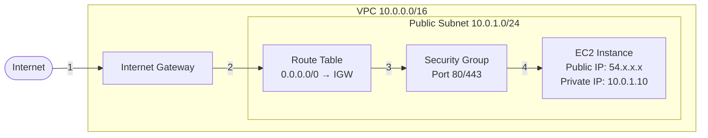

#### Packet Flow

1. Client sends HTTP/HTTPS request to public IP (54.x.x.x)
2. Internet Gateway receives traffic and performs DNAT (54.x.x.x → 10.0.1.10)
3. Route table directs traffic to EC2 instance
4. Security Group evaluates inbound rules
5. EC2 processes request and responds
6. IGW performs SNAT (10.0.1.10 → 54.x.x.x) for return traffic

#### Routing

**Public Subnet Route Table:**
| Destination | Target |
|-------------|--------|
| 10.0.0.0/16 | local |
| 0.0.0.0/0 | igw-xxxxx |

#### Security

**Security Group (Stateful):**
- Inbound: 0.0.0.0/0 on port 80, 443
- Outbound: Automatic return traffic allowed

**Network ACL (Stateless):**
- Must allow inbound on 80/443
- Must allow outbound ephemeral ports (1024-65535)

#### NAT

- **DNAT:** IGW translates Public IP → Private IP (inbound)
- **SNAT:** IGW translates Private IP → Public IP (outbound)
- Public IP association happens at IGW, not on the ENI

#### Common Issues

- Missing route to IGW (0.0.0.0/0 → igw-xxxxx)
- No public IP or Elastic IP assigned
- Security Group blocking inbound traffic
- NACL blocking traffic (check ephemeral ports)
- EC2 in private subnet without IGW route

#### Best Practices

- Use Elastic IPs for stable public addresses
- Deploy across multiple AZs for HA
- Enable VPC Flow Logs for monitoring
- Use least privilege Security Groups

#### Exam Tip
**IGW is horizontally scaled, redundant, and highly available.** No bandwidth constraints. Public IPs are not visible to the EC2 OS—only private IPs appear in `ifconfig`.

---

### Internet → ALB → Private EC2

#### Overview
Application Load Balancer in public subnets forwards traffic to EC2 instances in private subnets. ALB provides SSL termination, path-based routing, and health checks.

#### Mermaid Diagram

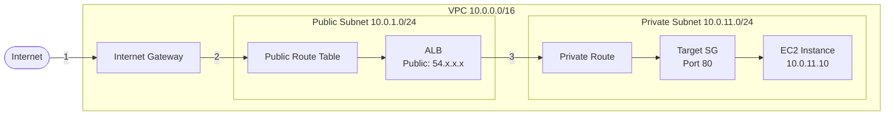

#### Packet Flow

1. Client sends HTTPS request to ALB DNS name
2. DNS resolves to ALB public IP in multiple AZs
3. IGW routes traffic to ALB in public subnet
4. ALB terminates SSL and selects healthy target
5. ALB forwards HTTP request to private EC2
6. EC2 responds to ALB
7. ALB responds to client via IGW

#### Routing

**Public Subnet (ALB):**
| Destination | Target |
|-------------|--------|
| 10.0.0.0/16 | local |
| 0.0.0.0/0 | igw-xxxxx |

**Private Subnet (EC2):**
| Destination | Target |
|-------------|--------|
| 10.0.0.0/16 | local |

#### Security

**ALB Security Group:**
- Inbound: 0.0.0.0/0 on 443 (HTTPS)
- Outbound: Target SG on 80 (HTTP)

**Target Security Group:**
- Inbound: ALB SG on port 80
- Outbound: All traffic (default)

**NACL Considerations:**
- Public subnet: Allow 443 inbound, ephemeral outbound
- Private subnet: Allow ALB traffic, ephemeral response

#### NAT

- **No SNAT on ALB** for target traffic (EC2 sees ALB private IP)
- ALB preserves client IP in `X-Forwarded-For` header
- ALB uses its private IP as source when forwarding to targets

#### Return Path

EC2 → ALB → IGW → Internet. EC2 does not need internet access; ALB handles all external communication.

#### Common Issues

- ALB in private subnet (must be public)
- Target SG not allowing ALB SG
- Health check path returning non-200
- Targets in different VPC without peering
- No multi-AZ deployment causing outage

#### Best Practices

- Deploy ALB across at least 2 AZs
- Use target health checks with appropriate thresholds
- Enable access logs to S3
- Use security groups (not CIDR) for target rules
- Enable deletion protection for production

#### Exam Tip
**ALB operates at Layer 7 (HTTP/HTTPS).** Supports path-based and host-based routing. Targets can be EC2, ECS, Lambda, or IP addresses.

---

### Internet → NLB → Private EC2

#### Overview
Network Load Balancer provides ultra-low latency Layer 4 load balancing. Preserves source IP and supports static IPs via Elastic IP.

#### Mermaid Diagram

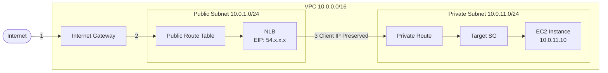

#### Packet Flow

1. Client sends TCP request to NLB Elastic IP
2. IGW routes to NLB in public subnet
3. NLB selects target using flow hash algorithm
4. NLB forwards packet **preserving client source IP**
5. EC2 receives packet with original client IP
6. EC2 responds directly back through NLB

#### Routing

Same as ALB scenario—public subnet needs IGW route.

#### Security

**Target Security Group:**
- Inbound: Client CIDR on target port (NLB doesn't have SG)
- Must allow actual client IPs, not NLB IPs

**NLB:**
- No security groups (operates at network layer)
- Use target security groups or NACLs

#### NAT

- **No NAT:** Client source IP is preserved end-to-end
- EC2 sees actual client IP in connection
- No `X-Forwarded-For` needed (Layer 4)

#### Return Path

EC2 → NLB → IGW → Internet. Return packets go through NLB.

#### Common Issues

- Target SG blocking client CIDR (not NLB)
- Cross-zone load balancing disabled causing imbalance
- Health check port/protocol mismatch
- Targets not registered in all AZs
- Connection timeout too short

#### Best Practices

- Use Elastic IPs for static IP requirements
- Enable cross-zone load balancing
- Use TCP health checks for simple services
- Deploy targets in multiple AZs
- Use for extreme performance requirements (millions of RPS)

#### Exam Tip
**NLB operates at Layer 4 (TCP/UDP/TLS).** Preserves client source IP. Supports static IPs and PrivateLink. Can handle millions of requests per second with ultra-low latency.

---

### EC2 → Internet (via IGW)

#### Overview
EC2 instance with public IP can directly access the internet through an Internet Gateway.

#### Mermaid Diagram

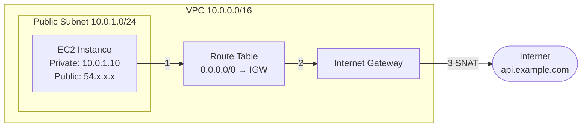

#### Packet Flow

1. EC2 sends outbound request to internet (source: 10.0.1.10)
2. Route table directs to IGW
3. IGW performs SNAT (10.0.1.10 → 54.x.x.x)
4. Packet reaches internet with public IP as source
5. Response returns to public IP
6. IGW performs DNAT and forwards to EC2

#### Routing

| Destination | Target |
|-------------|--------|
| 10.0.0.0/16 | local |
| 0.0.0.0/0 | igw-xxxxx |

#### Security

- Security Group must allow outbound traffic (default allows all)
- NACL must allow outbound traffic and inbound ephemeral responses

#### NAT

- **SNAT:** 10.0.1.10 → 54.x.x.x (outbound)
- **DNAT:** 54.x.x.x → 10.0.1.10 (inbound)

#### Exam Tip
Public EC2 instances use IGW for both inbound and outbound internet access. The public IP never appears on the instance itself.

---

### Private EC2 → NAT Gateway → Internet

#### Overview
Private EC2 instances without public IPs access the internet through a NAT Gateway deployed in a public subnet.

#### Mermaid Diagram

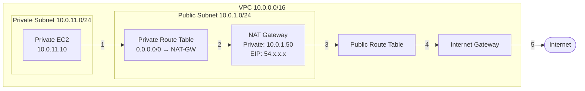

#### Packet Flow

1. Private EC2 sends request (source: 10.0.11.10, dest: 8.8.8.8)
2. Private route table directs to NAT Gateway
3. NAT Gateway performs SNAT (10.0.11.10 → 10.0.1.50)
4. Public route table directs to IGW
5. IGW performs SNAT (10.0.1.50 → 54.x.x.x)
6. Traffic reaches internet with NAT Gateway's EIP
7. Response follows reverse path with DNAT

#### Routing

**Private Route Table:**
| Destination | Target |
|-------------|--------|
| 10.0.0.0/16 | local |
| 0.0.0.0/0 | nat-xxxxx |

**Public Route Table:**
| Destination | Target |
|-------------|--------|
| 10.0.0.0/16 | local |
| 0.0.0.0/0 | igw-xxxxx |

#### Security

**Private EC2 Security Group:**
- Outbound: Allow HTTPS (443) to 0.0.0.0/0

**NAT Gateway:**
- No security group (managed service)
- Automatically allows all outbound traffic

#### NAT

**Double SNAT:**
1. NAT Gateway: 10.0.11.10 → 10.0.1.50
2. IGW: 10.0.1.50 → 54.x.x.x

Final source IP seen by internet: NAT Gateway's Elastic IP

#### Common Issues

- NAT Gateway in private subnet (must be in public subnet)
- Private route table pointing to IGW instead of NAT Gateway
- NAT Gateway has no Elastic IP
- Single NAT Gateway creating single point of failure
- NAT Gateway in wrong AZ

#### Best Practices

- Deploy one NAT Gateway per AZ for high availability
- Use separate route tables per AZ pointing to local NAT Gateway
- Monitor CloudWatch metrics: BytesInFromSource, BytesOutToDestination
- Consider NAT Instance for cost savings in dev environments
- For IPv6, use Egress-only IGW instead

#### Exam Tip
**NAT Gateway is managed, highly available within an AZ.** Supports up to 45 Gbps. For multi-AZ HA, deploy one NAT Gateway per AZ. NAT Gateways are not associated with security groups.

---

### IPv6 → Egress-only Internet Gateway

#### Overview
Egress-only IGW allows IPv6 instances to initiate outbound connections while blocking inbound connections from the internet.

#### Mermaid Diagram

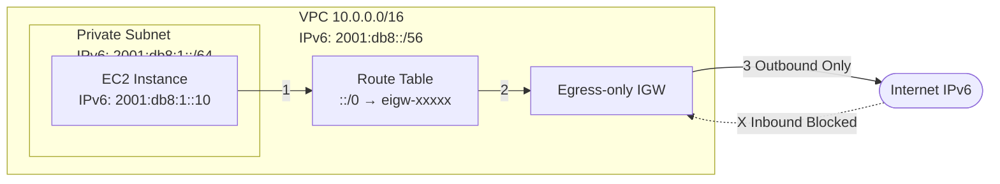

#### Packet Flow

**Outbound:**
1. EC2 initiates connection to IPv6 destination
2. Route table directs to Egress-only IGW
3. EIGW allows outbound traffic (stateful)
4. Return traffic automatically allowed

**Inbound:**
- Unsolicited inbound IPv6 traffic blocked
- EIGW maintains stateful tracking

#### Routing

| Destination | Target |
|-------------|--------|
| 10.0.0.0/16 | local |
| 2001:db8::/56 | local |
| ::/0 | eigw-xxxxx |

#### Security

- Security groups work the same for IPv6
- NACLs must explicitly allow IPv6 ranges
- Egress-only IGW is stateful (like NAT Gateway)

#### NAT

**No NAT for IPv6.** All IPv6 addresses are globally unique and routable. Egress-only IGW provides firewall functionality, not address translation.

#### Common Issues

- Forgetting to assign IPv6 CIDR to VPC and subnets
- Using regular IGW instead of Egress-only IGW
- NACL blocking IPv6 traffic
- Application not configured for dual-stack

#### Best Practices

- Use Egress-only IGW for private IPv6 subnets
- Use regular IGW for public IPv6 access
- Configure dual-stack (IPv4 + IPv6)
- Test applications with IPv6
- Enable VPC Flow Logs for IPv6 traffic

#### Exam Tip
**Egress-only IGW is for IPv6 only.** Works like NAT Gateway but without address translation. IPv6 has no concept of private addresses—all are public. Stateful like NAT Gateway.

---

## 3. Internal VPC Traffic

### EC2 → EC2 (Same Subnet)

#### Overview
Instances in the same subnet communicate directly without routing through gateways. Traffic stays within the subnet's Layer 2 domain.

#### Mermaid Diagram

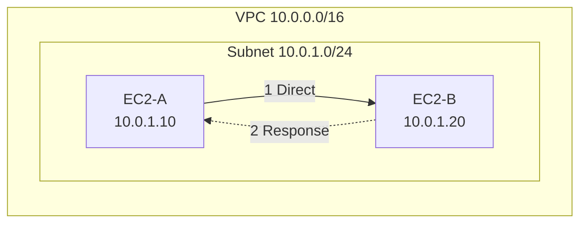

#### Packet Flow

1. EC2-A sends packet to 10.0.1.20
2. ARP resolution happens within subnet
3. Traffic flows directly (Layer 2)
4. Security groups evaluated on both sides
5. EC2-B responds directly to EC2-A

#### Routing

| Destination | Target |
|-------------|--------|
| 10.0.0.0/16 | local |

The `local` route handles all intra-VPC traffic.

#### Security

**Security Groups:**
- EC2-B must allow inbound from EC2-A's SG or IP
- Stateful: Return traffic automatically allowed

**Network ACLs:**
- Must allow both inbound and outbound
- Evaluated for traffic entering/leaving subnet

#### NAT

No NAT—private IPs used directly.

#### Common Issues

- Security group not allowing source instance
- NACL blocking traffic (check both directions)
- Incorrect IP addressing
- MTU issues with jumbo frames

#### Best Practices

- Reference security groups in rules (not IPs)
- Use descriptive names for security groups
- Keep NACLs at default (allow all) unless specific need
- Monitor with VPC Flow Logs

#### Exam Tip
**Same-subnet traffic is Layer 2.** Route tables are not involved. Security groups are stateful; NACLs are stateless.

---

### EC2 → EC2 (Different Subnets)

#### Overview
Cross-subnet communication within a VPC uses the VPC router. Traffic is routed at Layer 3.

#### Mermaid Diagram

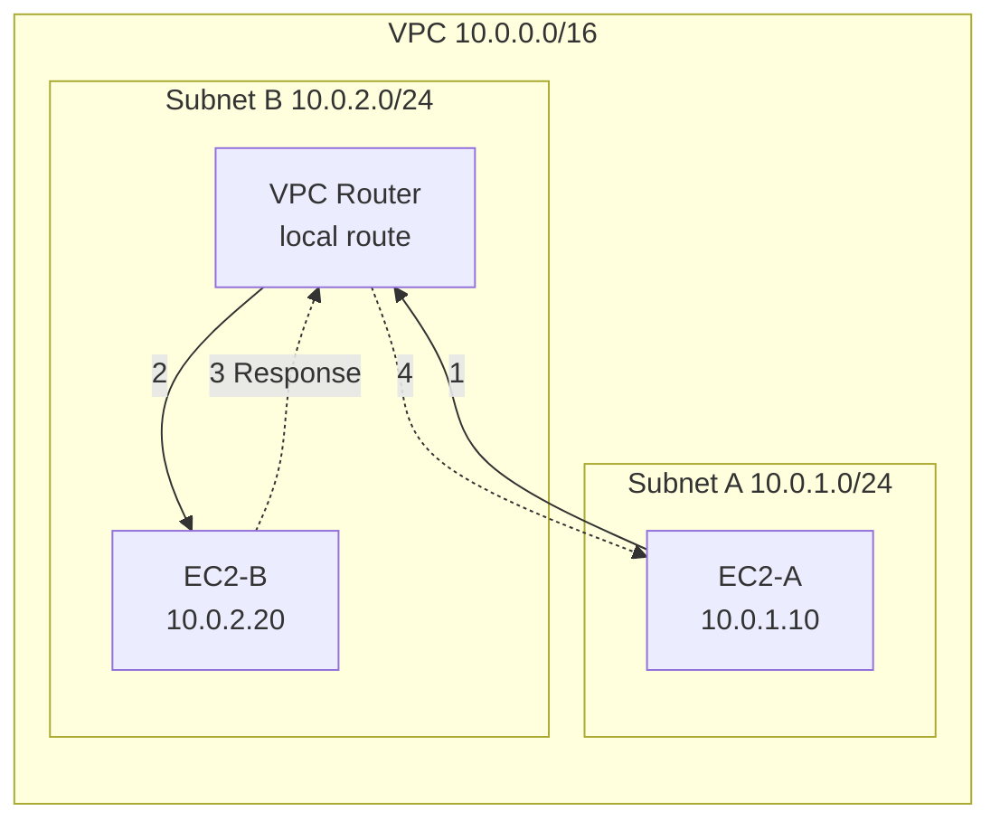

#### Packet Flow

1. EC2-A sends packet to 10.0.2.20
2. Route table lookup: matches `10.0.0.0/16 → local`
3. VPC router forwards to destination subnet
4. Subnet B NACL evaluated (inbound)
5. EC2-B security group evaluated
6. EC2-B processes and responds
7. Return path through VPC router

#### Routing

Both subnets use the same route table or have separate tables with local route:

| Destination | Target |
|-------------|--------|
| 10.0.0.0/16 | local |

#### Security

**Security Groups:**
- EC2-B SG must allow EC2-A (by SG ID or CIDR)
- Return traffic automatically allowed (stateful)

**NACLs:**
- Subnet A: Allow outbound to 10.0.2.0/24
- Subnet B: Allow inbound from 10.0.1.0/24
- Both: Allow ephemeral ports for responses

#### Common Issues

- NACLs blocking cross-subnet traffic
- Security group rules too restrictive
- Different route tables with misconfiguration
- Overlapping CIDR blocks (different VPCs)

#### Best Practices

- Use security group references for cross-subnet rules
- Organize subnets by tier (web, app, data)
- Use separate route tables for public/private
- Document subnet purposes clearly

#### Exam Tip
**Cross-subnet traffic uses the VPC router.** All intra-VPC traffic uses the implicit `local` route. NACLs are evaluated at subnet boundaries.

---

### Private → Public Subnet Communication

#### Overview
Private instances can communicate with public instances within the same VPC without traversing the internet.

#### Mermaid Diagram

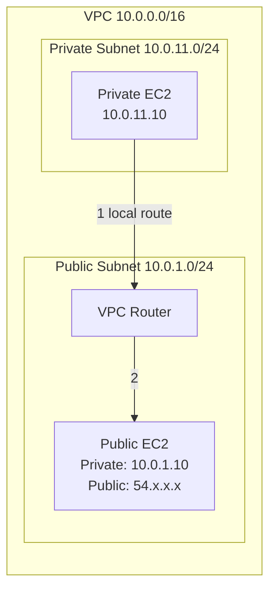

#### Packet Flow

1. Private EC2 sends packet to 10.0.1.10 (private IP)
2. VPC router uses local route
3. Traffic stays within VPC (does not use IGW)
4. Public EC2 receives packet from private IP
5. Response goes directly back

#### Routing

Both use `local` route for intra-VPC communication.

#### Security

Public EC2 security group must allow inbound from private subnet or security group.

#### NAT

**No NAT.** Private IPs communicate directly. The public IP of the public EC2 is not involved.

#### Common Issues

- Attempting to connect to public IP from inside VPC
- Security group blocking private IP ranges
- Using public DNS name that resolves to public IP

#### Best Practices

- Always use private IPs for intra-VPC communication
- Use Route 53 private hosted zones for DNS
- Avoid hairpinning through internet gateway

#### Exam Tip
**Intra-VPC traffic always uses private IPs, never traverses IGW.** More secure and lower latency than routing through internet.

---

### ECS/EKS Internal Communication

#### Overview
Container tasks/pods communicate within VPC using ENIs. Each task/pod gets an IP from the VPC subnet.

#### Mermaid Diagram

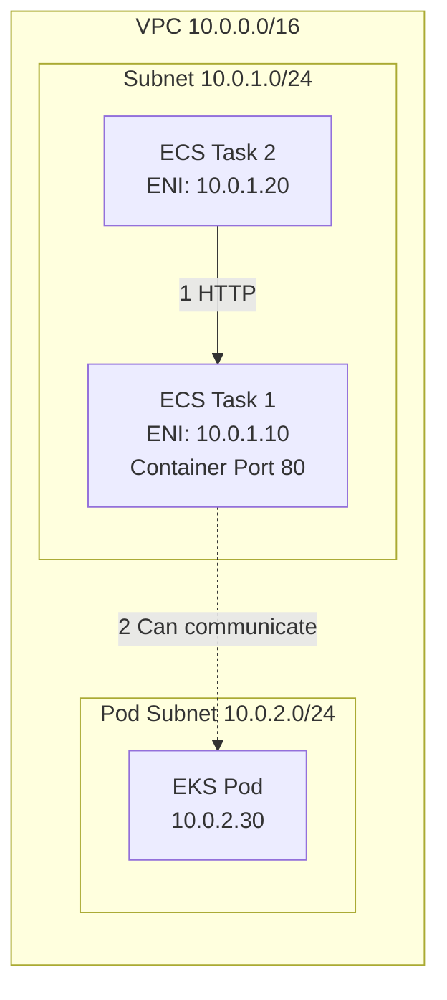

#### Packet Flow

**ECS (awsvpc mode):**
1. Each task gets dedicated ENI with VPC IP
2. Task-to-task communication uses VPC networking
3. Security groups attached to ENI

**EKS:**
1. Pods get IPs from VPC subnets (VPC CNI)
2. Pod-to-pod uses standard VPC routing
3. Security groups for pods (optional)

#### Routing

Standard VPC routing with `local` routes.

#### Security

**ECS:**
- Task security groups control traffic
- Fine-grained per-task rules

**EKS:**
- Pod security groups (using Security Groups for Pods)
- Network policies (Calico/Cilium)
- Node security groups as fallback

#### Common Issues

- Insufficient IPs in subnet for tasks/pods
- Security group not allowing inter-task communication
- Network policies blocking traffic (EKS)
- Service mesh mTLS misconfiguration

#### Best Practices

- Use dedicated subnets for pods (EKS)
- Plan IP space carefully (EKS can consume IPs quickly)
- Use service discovery (Cloud Map, CoreDNS)
- Implement network policies for zero-trust
- Use VPC CNI prefix delegation for more IPs per node

#### Exam Tip
**ECS awsvpc mode gives each task an ENI.** EKS VPC CNI assigns IPs from VPC subnets to pods. Both integrate natively with VPC networking, security groups, and flow logs.

---

## 4. VPC-to-VPC Connectivity

### VPC Peering

#### Overview
VPC Peering creates a direct network connection between two VPCs. Traffic stays on AWS backbone, never traverses the internet.

#### Mermaid Diagram

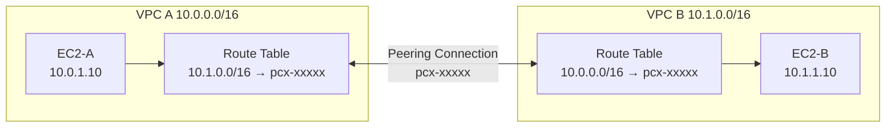

#### Packet Flow

1. EC2-A sends packet to 10.1.1.10
2. Route table matches 10.1.0.0/16 → pcx-xxxxx
3. Traffic goes through peering connection
4. VPC B route table receives traffic
5. Packet delivered to EC2-B
6. Response follows reverse path

#### Routing

**VPC A Route Table:**
| Destination | Target |
|-------------|--------|
| 10.0.0.0/16 | local |
| 10.1.0.0/16 | pcx-xxxxx |

**VPC B Route Table:**
| Destination | Target |
|-------------|--------|
| 10.1.0.0/16 | local |
| 10.0.0.0/16 | pcx-xxxxx |

#### Security

- Security groups cannot reference peered VPC SGs (unless same region)
- Use CIDR blocks in security group rules
- NACLs must allow traffic from peer VPC CIDR

#### NAT

No NAT. Private IPs used directly across peering connection.

#### Common Issues

- Overlapping CIDR blocks (peering rejected)
- Missing routes in one or both VPCs
- Security groups blocking peer VPC CIDR
- Attempting transitive routing (not supported)
- Peering connection not accepted

#### Best Practices

- Plan non-overlapping CIDR blocks
- Update all relevant route tables
- Use descriptive peering connection names
- Document peering relationships
- Monitor with VPC Flow Logs
- Limit peering connections (use Transit Gateway for many VPCs)

#### Exam Tip
**VPC Peering is non-transitive.** If A peers with B, and B peers with C, A cannot reach C. No overlapping CIDRs allowed. Works cross-region and cross-account.

---

### Cross-Region VPC Peering

#### Overview
VPC Peering across regions enables global VPC connectivity. Traffic encrypted and stays on AWS global backbone.

#### Mermaid Diagram

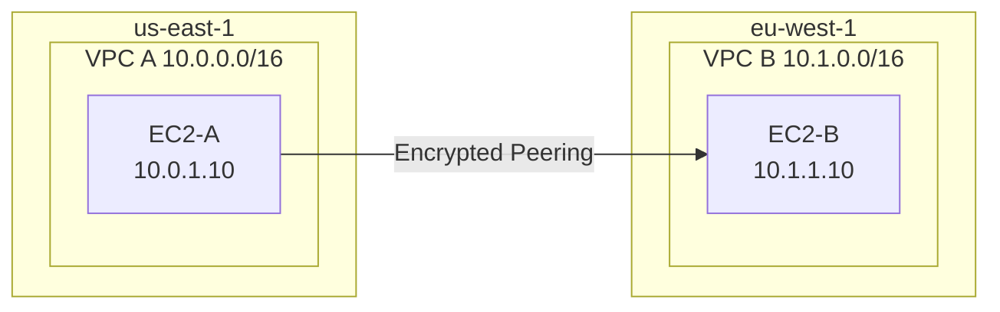

#### Packet Flow

Same as intra-region peering, but traffic traverses AWS global network between regions.

#### Routing

Same as intra-region peering—add routes pointing to peering connection.

#### Security

- Inter-region traffic is automatically encrypted
- Security groups use CIDR blocks (not SG references)
- Data transfer charges apply for cross-region traffic

#### Common Issues

- Forgetting encryption is automatic
- Not accounting for inter-region latency
- Data transfer cost surprises
- Regional service limits differ

#### Best Practices

- Use for disaster recovery and global applications
- Monitor data transfer costs
- Consider latency for real-time applications
- Use CloudWatch metrics for monitoring
- Document cross-region dependencies

#### Exam Tip
**Cross-region peering traffic is encrypted by default.** Data transfer charges apply. Same limitations as intra-region peering (no transitivity, no overlapping CIDRs).

---

### Transit Gateway

#### Overview
Transit Gateway acts as a hub connecting multiple VPCs, VPNs, and Direct Connect. Simplifies complex network topologies.

#### Mermaid Diagram

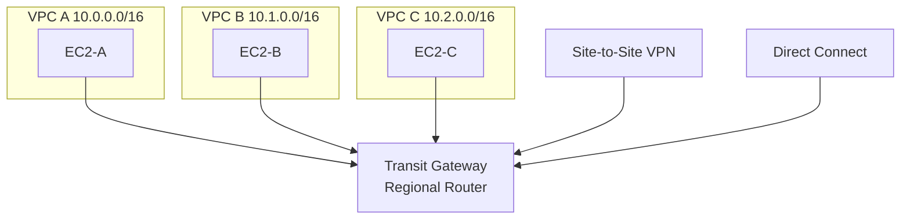

#### Packet Flow

1. EC2-A sends packet to 10.1.1.10
2. Route table directs to Transit Gateway (tgw-xxxxx)
3. TGW route table determines next hop
4. TGW forwards to VPC B attachment
5. Packet delivered to EC2-B via VPC B route table

#### Routing

**VPC A Route Table:**
| Destination | Target |
|-------------|--------|
| 10.0.0.0/16 | local |
| 10.0.0.0/8 | tgw-xxxxx |

**TGW Route Table:**
| Destination | Target |
|-------------|--------|
| 10.0.0.0/16 | vpc-a-attachment |
| 10.1.0.0/16 | vpc-b-attachment |
| 10.2.0.0/16 | vpc-c-attachment |
| 192.168.0.0/16 | vpn-attachment |

#### Security

- Security groups use CIDR blocks (not cross-VPC SG references)
- TGW supports Network Firewall integration
- Appliance mode for stateful inspection

#### NAT

No NAT at TGW layer. Private IPs preserved.

#### Common Issues

- Missing routes in VPC or TGW route tables
- TGW attachment not associated with route table
- Overlapping CIDRs causing routing conflicts
- Propagation disabled for attachments
- CIDR conflicts with on-premises

#### Best Practices

- Use separate TGW route tables for isolation
- Enable route propagation where appropriate
- Plan CIDR blocks to avoid overlaps
- Use Resource Access Manager (RAM) for sharing
- Monitor with CloudWatch and VPC Flow Logs
- Consider appliance mode for firewalls

#### Exam Tip
**Transit Gateway supports transitive routing.** Regional resource but supports cross-region peering. Supports up to 5,000 VPC attachments. Enables hub-and-spoke topology.

---

### Hub-and-Spoke with Transit Gateway

#### Overview
Centralized architecture with shared services VPC connected to multiple spoke VPCs through Transit Gateway.

#### Mermaid Diagram

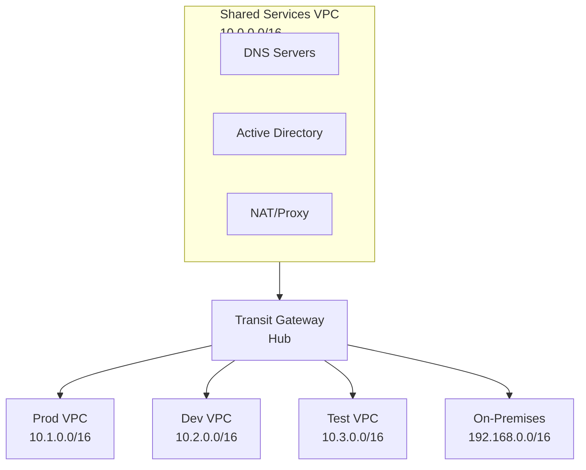

#### Packet Flow

Spokes can communicate with hub (shared services) and optionally with each other based on TGW route table configuration.

#### Routing

**TGW Route Table (Shared Services):**
- Allows all spoke VPCs and on-premises

**TGW Route Table (Spokes):**
- Allow hub only (isolated)
- OR allow hub + other spokes (connected)

#### Security

Use security groups to enforce spoke isolation even if routing allows connectivity.

#### Best Practices

- Use separate TGW route tables for isolation
- Centralize shared services (DNS, monitoring, security)
- Implement least privilege routing
- Use VPC Flow Logs for traffic analysis
- Document spoke purposes and access patterns

#### Exam Tip
**Hub-and-spoke reduces peering connections.** Use TGW route table associations to control spoke-to-spoke communication.

---

### Shared Services VPC

#### Overview
Centralized VPC hosting common services like DNS, Active Directory, monitoring, and security tools.

#### Mermaid Diagram

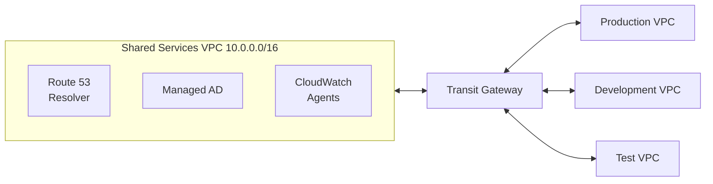

#### Common Services

- **DNS:** Route 53 Resolver endpoints
- **Identity:** AWS Managed Microsoft AD
- **Security:** Centralized firewalls, IDS/IPS
- **Monitoring:** Log aggregation, metrics
- **Egress:** Centralized NAT or proxy servers

#### Routing

All VPCs route to shared services CIDR via Transit Gateway or VPC Peering.

#### Best Practices

- Use AWS RAM to share resources
- Implement strict security group rules
- Use VPC endpoints in shared VPC
- Monitor costs (central services can be expensive)
- Automate deployment with IaC

#### Exam Tip
**Shared Services VPC reduces duplication and centralizes management.** Commonly paired with Transit Gateway for connectivity.

---

## 5. Hybrid Networking

### Site-to-Site VPN

#### Overview
IPsec VPN connection between AWS VPC and on-premises network over the internet. AWS provides two VPN endpoints for redundancy.

#### Mermaid Diagram

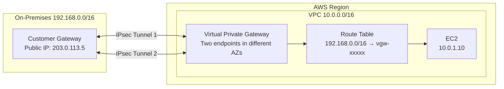

#### Packet Flow

1. On-prem host sends packet to 10.0.1.10
2. On-prem router forwards to customer gateway
3. Packet encrypted and sent via IPsec tunnel
4. VGW receives and decrypts
5. VPC route table directs to EC2
6. Response follows reverse path
7. Return traffic encrypted through tunnel

#### Routing

**VPC Route Table:**
| Destination | Target |
|-------------|--------|
| 10.0.0.0/16 | local |
| 192.168.0.0/16 | vgw-xxxxx |

**On-Premises Router:**
- Route AWS VPC CIDR to customer gateway

#### Security

- VPN traffic encrypted using IPsec
- Supports IKEv1 and IKEv2
- Pre-shared keys or certificate authentication
- Security groups allow on-prem CIDR

#### NAT

No NAT at VPN level. Private IPs used end-to-end.

#### Return Path

Symmetric—traffic returns through same VPN tunnel.

#### Common Issues

- Customer gateway behind NAT (requires NAT-T)
- Firewall blocking UDP 500/4500
- Routing issues on customer side
- Only one tunnel active (by design, one standby)
- MTU issues (max 1400 bytes due to IPsec overhead)
- Asymmetric routing causing drops

#### Best Practices

- Use both tunnels (active/passive)
- Enable BGP for dynamic routing
- Monitor tunnel status with CloudWatch
- Set proper TCP MSS clamping (1360)
- Use accelerated VPN for better performance
- Test failover scenarios
- Document encryption settings

#### Exam Tip
**Site-to-Site VPN provides two tunnels for HA.** Throughput limit: 1.25 Gbps per tunnel. Encrypted over internet. VGW or Transit Gateway can terminate VPN.

---

### Direct Connect

#### Overview
Dedicated network connection between on-premises and AWS via AWS Direct Connect locations. More consistent performance than VPN.

#### Mermaid Diagram

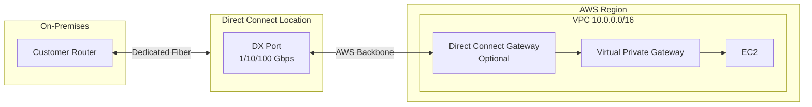

#### Packet Flow

1. On-prem sends traffic to AWS via dedicated connection
2. Traffic enters Direct Connect location
3. Routed to Direct Connect Gateway (optional) or VGW
4. VGW forwards to VPC
5. Response follows same path

#### Routing

**BGP required** for route advertisement between on-prem and AWS.

**VPC Route Table:**
| Destination | Target |
|-------------|--------|
| 10.0.0.0/16 | local |
| 192.168.0.0/16 | vgw-xxxxx |

#### Security

- **Not encrypted by default**—use VPN over Direct Connect for encryption
- Dedicated connection reduces exposure vs internet
- Use MACsec for Layer 2 encryption (10/100 Gbps ports)
- Private traffic never traverses internet

#### Virtual Interfaces (VIFs)

| Type | Purpose | VLAN |
|------|---------|------|
| **Private VIF** | Access VPC via VGW | 802.1Q |
| **Public VIF** | Access AWS public services (S3, etc.) | 802.1Q |
| **Transit VIF** | Connect to Transit Gateway | 802.1Q |

#### Common Issues

- Single point of failure (use multiple connections)
- BGP misconfiguration
- VLAN tagging issues
- Long lead time for provisioning (weeks)
- Bandwidth not meeting requirements
- LOA-CFA (Letter of Authorization) issues

#### Best Practices

- Deploy redundant connections in different locations
- Use Direct Connect Gateway for multi-region access
- Combine with VPN for backup
- Monitor with CloudWatch metrics
- Use LAG (Link Aggregation Groups) for bandwidth
- Implement SLA monitoring

#### Exam Tip
**Direct Connect is NOT encrypted by default.** Use VPN over Direct Connect for encryption. Supports up to 100 Gbps. Requires BGP. Use DX Gateway to connect to multiple VPCs.

---

### Direct Connect + VPN Backup

#### Overview
Hybrid approach using Direct Connect for primary connectivity and Site-to-Site VPN as failover backup.

#### Mermaid Diagram

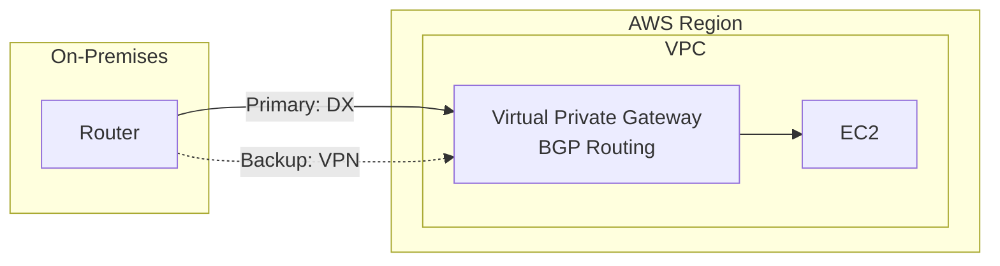

#### Packet Flow

**Normal Operation:**
- Traffic flows via Direct Connect (preferred route via BGP)

**Failover:**
- Direct Connect fails
- BGP detects failure
- Traffic automatically routes through VPN

#### Routing

BGP advertises same prefixes with different priorities:
- Direct Connect: Higher priority (lower AS path or local preference)
- VPN: Lower priority (backup)

#### Common Issues

- BGP weights not configured correctly
- VPN bandwidth insufficient for failover
- Asymmetric routing during failover
- MTU mismatch between DX and VPN

#### Best Practices

- Test failover regularly
- Monitor both paths with CloudWatch
- Configure BGP properly for failover
- Ensure VPN bandwidth meets minimum requirements
- Document failover procedures
- Use BGP communities for path control

#### Exam Tip
**VPN provides cost-effective backup for Direct Connect.** Use BGP to control failover. VPN throughput (1.25 Gbps) may be lower than Direct Connect.

---

### Transit Gateway + VPN

#### Overview
Site-to-Site VPN terminates on Transit Gateway instead of VGW, enabling VPN access to multiple VPCs.

#### Mermaid Diagram

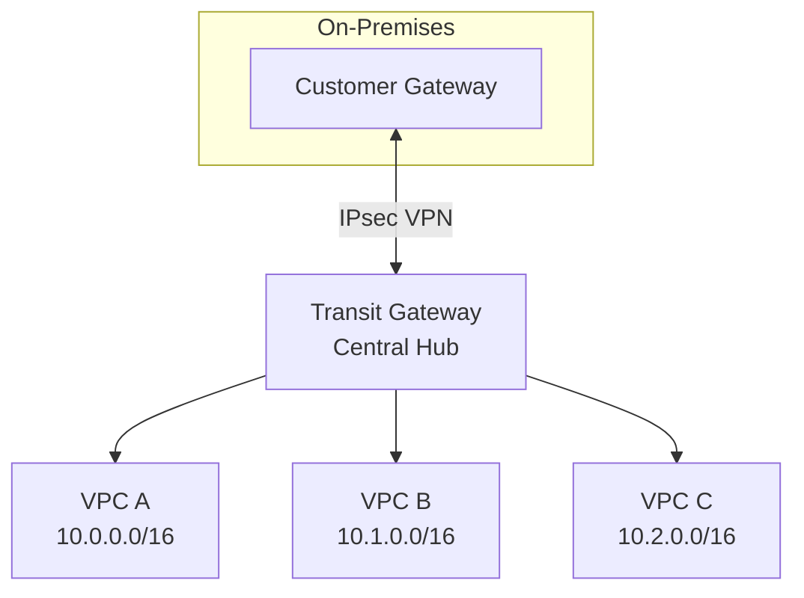

#### Packet Flow

1. On-prem traffic enters VPN to Transit Gateway
2. TGW route table determines destination VPC
3. Traffic forwarded to appropriate VPC attachment
4. VPC receives traffic from TGW

#### Routing

**TGW Route Table:**
- Propagate VPC routes
- Static or BGP routes to on-premises

#### Best Practices

- Use for multiple VPC connectivity
- Enable ECMP for bandwidth scaling (up to 50 Gbps)
- Configure BGP for dynamic routing
- Use accelerated VPN for performance

#### Exam Tip
**TGW supports ECMP with multiple VPN tunnels for higher throughput.** Single VPN connection = 1.25 Gbps. ECMP enables up to 50 Gbps.

---

### Transit Gateway + Direct Connect

#### Overview
Direct Connect terminates on Transit Gateway via Transit VIF, providing high-bandwidth access to multiple VPCs and regions.

#### Mermaid Diagram

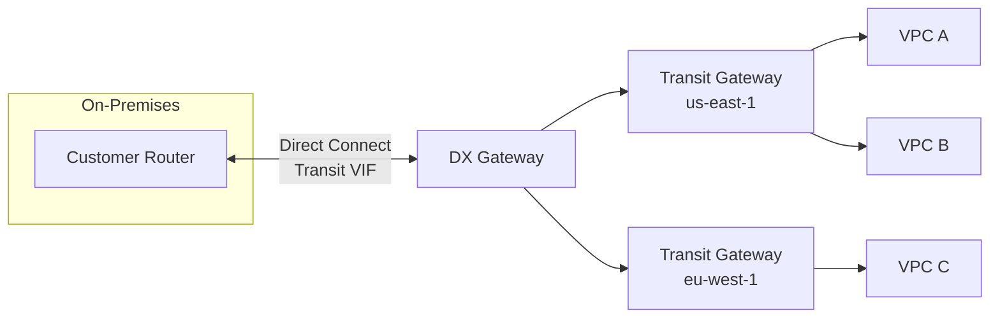

#### Packet Flow

1. On-prem traffic via Direct Connect
2. Direct Connect Gateway receives traffic
3. DXGW forwards to appropriate regional TGW
4. TGW routes to destination VPC

#### Best Practices

- Use for multi-region, multi-VPC connectivity
- Implement with VPN backup
- Use BGP for dynamic routing
- Monitor with CloudWatch

#### Exam Tip
**DX Gateway with TGW enables global connectivity.** Single Direct Connect can reach multiple regions via TGW peering.

---

## 6. Private Connectivity

### S3 Gateway Endpoint

#### Overview
Gateway endpoint allows private access to S3 from VPC without internet gateway or NAT. Traffic stays within AWS network.

#### Mermaid Diagram

```mermaid
flowchart LR
    subgraph VPC[VPC 10.0.0.0/16]
        subgraph PrivateSubnet[Private Subnet]
            EC2[EC2<br/>10.0.11.10]
        end
        
        EC2 -->|1 S3 API Call| RT[Route Table<br/>pl-xxxxx → vpce-xxxxx]
        RT -->|2| VPCE[Gateway Endpoint<br/>vpce-xxxxx]
    end
    
    VPCE -->|3 AWS Network| S3[S3 Bucket<br/>my-bucket]
```

#### Packet Flow

1. EC2 makes S3 API call (e.g., `aws s3 ls`)
2. Route table matches S3 prefix list (pl-xxxxx)
3. Traffic directed to gateway endpoint
4. Request reaches S3 via AWS private network
5. S3 responds via same path

#### Routing

Gateway endpoint automatically adds route:

| Destination | Target |
|-------------|--------|
| pl-xxxxx (S3 prefix list) | vpce-xxxxx |

#### Security

**Endpoint Policy:**
- Controls which S3 buckets are accessible
- Can restrict to specific principals or actions

**S3 Bucket Policy:**
```json
{
  "Condition": {
    "StringEquals": {
      "aws:sourceVpce": "vpce-xxxxx"
    }
  }
}
```

#### NAT

No NAT. Direct communication via AWS network.

#### Common Issues

- Endpoint policy too restrictive
- S3 bucket policy blocking VPC endpoint
- Wrong route table associated with endpoint
- DNS resolution issues (use AWS DNS)

#### Best Practices

- Use for cost savings (no data transfer charges via NAT)
- Restrict with endpoint policies
- Use S3 bucket policies to require VPC endpoint
- Associate with all relevant route tables
- Monitor with CloudTrail and S3 access logs

#### Exam Tip
**Gateway endpoints are free and highly available.** Only for S3 and DynamoDB. Automatically adds routes to route tables. Traffic never leaves AWS network.

---

### DynamoDB Gateway Endpoint

#### Overview
Gateway endpoint for DynamoDB provides private access without internet/NAT gateway. Same concepts as S3 gateway endpoint.

#### Mermaid Diagram

```mermaid
flowchart LR
    subgraph VPC[VPC 10.0.0.0/16]
        subgraph PrivateSubnet[Private Subnet]
            EC2[EC2 Instance]
        end
        
        EC2 -->|1 DynamoDB API| RT[Route Table<br/>pl-xxxxx → vpce-xxxxx]
        RT -->|2| VPCE[Gateway Endpoint]
    end
    
    VPCE -->|3 AWS Network| DDB[DynamoDB Table]
```

#### Best Practices

- Same as S3 Gateway Endpoint
- Use endpoint policies to restrict tables
- Free of charge, no availability concerns

#### Exam Tip
**Only S3 and DynamoDB support Gateway Endpoints.** All other AWS services use Interface Endpoints.

---

### Interface Endpoint (PrivateLink)

#### Overview
Elastic Network Interface (ENI) in your subnet providing private access to AWS services and third-party services via PrivateLink.

#### Mermaid Diagram

```mermaid
flowchart LR
    subgraph VPC[VPC 10.0.0.0/16]
        subgraph PrivateSubnet[Private Subnet 10.0.11.0/24]
            EC2[EC2<br/>10.0.11.10]
        end
        
        EC2 -->|1 DNS: ssm.us-east-1.amazonaws.com| ENI[Interface Endpoint ENI<br/>10.0.11.100]
    end
    
    ENI -->|2 PrivateLink| SSM[AWS Systems Manager<br/>Service]
```

#### Packet Flow

1. EC2 resolves service DNS name
2. Private DNS returns endpoint ENI IP (10.0.11.100)
3. EC2 sends request to ENI in same VPC
4. PrivateLink forwards to AWS service
5. Response returns via same path

#### Routing

No route table changes needed. Uses DNS and security groups.

#### Security

**Security Group (on endpoint ENI):**
- Inbound: Allow from EC2 instances (port 443)
- Evaluated like any ENI

#### DNS

**Private DNS enabled:**
- Service DNS name (e.g., `ssm.region.amazonaws.com`) resolves to endpoint ENI IP

**Private DNS disabled:**
- Use endpoint-specific DNS name
- Example: `vpce-xxxxx.ssm.us-east-1.vpce.amazonaws.com`

#### Common Issues

- Private DNS not enabled
- Security group blocking traffic to endpoint
- Endpoint not in correct subnet/AZ
- DNS resolution failing (check enableDnsSupport)

#### Best Practices

- Enable private DNS for seamless migration
- Deploy endpoints in multiple AZs for HA
- Use security groups to control access
- Monitor with VPC Flow Logs
- Consider costs (charged per endpoint per AZ per hour)

#### Supported Services

- AWS services: SSM, Secrets Manager, ECR, SQS, SNS, CloudWatch, etc.
- Third-party SaaS via PrivateLink
- Your own services (NLB + PrivateLink)

#### Exam Tip
**Interface Endpoints use ENIs with private IPs.** Charged per endpoint and data processed. Enable private DNS for easy adoption. Supports hundreds of AWS services.

---

### PrivateLink (Service Provider)

#### Overview
Expose your own services to other VPCs or AWS accounts using PrivateLink. Service runs behind Network Load Balancer.

#### Mermaid Diagram

```mermaid
flowchart LR
    subgraph ConsumerVPC[Consumer VPC 10.1.0.0/16]
        Consumer[Consumer EC2]
        Consumer --> EndpointENI[Interface Endpoint<br/>10.1.11.50]
    end
    
    EndpointENI <-->|PrivateLink| NLB
    
    subgraph ProviderVPC[Provider VPC 10.0.0.0/16]
        NLB[Network Load Balancer] --> Service[Service Instances]
    end
```

#### Packet Flow

1. Consumer sends request to endpoint ENI in their VPC
2. PrivateLink routes to provider's NLB
3. NLB distributes to service instances
4. Response returns via same path

#### Setup

**Provider Side:**
1. Deploy service behind NLB
2. Create VPC Endpoint Service
3. Whitelist consumer AWS accounts/IAM principals

**Consumer Side:**
1. Create Interface Endpoint to service
2. Provider accepts connection request
3. Access service via endpoint DNS

#### Security

- Provider controls which accounts can connect
- Consumer uses security groups on endpoint ENI
- No IP overlap required (PrivateLink handles addressing)

#### Best Practices

- Use for SaaS offerings or shared services
- Implement acceptance required for security
- Monitor connections with CloudWatch
- Document endpoint service name for consumers
- Use domain name with private hosted zone

#### Exam Tip
**PrivateLink requires NLB on provider side.** Supports cross-account and cross-VPC connectivity without peering. No CIDR overlap issues. Scalable to thousands of consumers.

---

### VPC Lattice

#### Overview
Application-layer networking service that connects services across VPCs and accounts. Simplifies service-to-service communication with built-in authentication and observability.

#### Mermaid Diagram

```mermaid
flowchart TD
    subgraph VPC_A[VPC A]
        ServiceA[Service A]
    end
    
    subgraph VPC_B[VPC B]
        ServiceB[Service B]
    end
    
    subgraph VPC_C[VPC C]
        ServiceC[Service C]
    end
    
    ServiceA --> Lattice
    ServiceB --> Lattice
    ServiceC --> Lattice
    
    Lattice[VPC Lattice<br/>Service Network]
```

#### Key Features

- Service discovery and connectivity
- Built-in authentication (IAM, OIDC)
- Request-level authorization policies
- Traffic management and load balancing
- Observability with CloudWatch and access logs

#### Best Practices

- Use for microservices architectures
- Implement fine-grained auth policies
- Leverage built-in service discovery
- Monitor with CloudWatch metrics
- Integrate with service mesh for advanced scenarios

#### Exam Tip
**VPC Lattice operates at Layer 7.** Simplifies service mesh and cross-VPC connectivity. Alternative to Transit Gateway for service-to-service communication.

---

## 7. Public vs Private Access

### Public API Gateway

#### Overview
API Gateway with public endpoint accessible from the internet. Used for public APIs, mobile backends, and webhooks.

#### Mermaid Diagram

```mermaid
flowchart LR
    Internet([Internet Client]) -->|1 HTTPS| APIGW[API Gateway<br/>Public Endpoint<br/>xxxx.execute-api.region.amazonaws.com]
    
    APIGW -->|2 Invoke| Lambda[Lambda Function<br/>or Backend]
```

#### Packet Flow

1. Client sends HTTPS request to API Gateway public endpoint
2. API Gateway authenticates and authorizes (IAM, Cognito, Lambda authorizer)
3. API Gateway invokes backend (Lambda, HTTP, AWS service)
4. Backend processes and responds
5. API Gateway returns response to client

#### Security

- **TLS encryption** (mandatory HTTPS)
- **Authentication:** IAM, Cognito, API keys, Lambda authorizer
- **Resource policies** to restrict IPs or VPCs
- **Throttling** to prevent abuse
- **WAF integration** for DDoS protection

#### Common Issues

- CORS misconfiguration
- Authentication failing
- Throttling limits hit
- Lambda timeout
- Backend unreachable

#### Best Practices

- Use custom domains with ACM certificates
- Enable CloudWatch logging
- Implement request validation
- Use usage plans for rate limiting
- Enable AWS WAF for security
- Cache responses when appropriate

#### Exam Tip
**Public API Gateway is internet-accessible by default.** Use resource policies or authentication to restrict access. Supports REST, HTTP, and WebSocket APIs.

---

### Private API Gateway

#### Overview
API Gateway accessible only from within VPC via Interface Endpoint. Used for internal APIs and microservices.

#### Mermaid Diagram

```mermaid
flowchart LR
    subgraph VPC[VPC 10.0.0.0/16]
        subgraph PrivateSubnet[Private Subnet]
            EC2[EC2 Instance]
        end
        
        EC2 -->|1 HTTPS| ENI[VPC Endpoint ENI<br/>10.0.11.100]
    end
    
    ENI -->|2 PrivateLink| APIGW[Private API Gateway]
    APIGW -->|3| Lambda[Lambda Function]
```

#### Packet Flow

1. EC2 resolves API Gateway DNS to endpoint ENI IP
2. Request sent to endpoint ENI in VPC
3. PrivateLink forwards to API Gateway
4. API Gateway invokes backend
5. Response returns via same path

#### Security

- **VPC Endpoint required** for access
- **Resource policy** to allow only VPC endpoint
- Security groups control access to endpoint
- No internet exposure

**Resource Policy Example:**
```json
{
  "Effect": "Allow",
  "Principal": "*",
  "Action": "execute-api:Invoke",
  "Resource": "*",
  "Condition": {
    "StringEquals": {
      "aws:sourceVpce": "vpce-xxxxx"
    }
  }
}
```

#### Common Issues

- Endpoint not in correct VPC/subnet
- Resource policy blocking requests
- DNS resolution failing
- Security group blocking traffic

#### Best Practices

- Use for internal microservices
- Deploy endpoints in multiple AZs
- Use private DNS for seamless access
- Implement strict resource policies
- Monitor with VPC Flow Logs

#### Exam Tip
**Private API Gateway requires VPC Endpoint.** Only accessible from within VPC or via Direct Connect/VPN. Use resource policies to enforce VPC endpoint access.

---

### Internal vs Internet-facing ALB

#### Overview
Application Load Balancers can be internet-facing (public) or internal (private), controlling access to backend services.

#### Comparison

| Feature | Internet-facing ALB | Internal ALB |
|---------|-------------------|--------------|
| **Subnet** | Public subnet | Private subnet |
| **IP** | Public + Private | Private only |
| **Route Table** | Requires IGW route | No IGW needed |
| **Access** | Internet clients | VPC/on-prem only |
| **Use Case** | Public web apps | Microservices, internal apps |

#### Mermaid Diagram

```mermaid
flowchart TD
    Internet([Internet]) -->|1| IGW[IGW]
    
    subgraph VPC[VPC 10.0.0.0/16]
        IGW --> PublicALB[Internet-facing ALB<br/>Public Subnet]
        
        PublicALB -->|2| AppEC2[App EC2<br/>Private Subnet]
        
        AppEC2 -->|3| InternalALB[Internal ALB<br/>Private Subnet]
        
        InternalALB -->|4| DataEC2[Data EC2<br/>Private Subnet]
    end
```

#### Packet Flow - Internet-facing

1. Internet client → IGW → Public ALB
2. Public ALB → Private EC2 targets
3. Response: EC2 → ALB → IGW → Internet

#### Packet Flow - Internal

1. VPC instance → Internal ALB
2. Internal ALB → Private targets
3. Response: Targets → ALB → VPC instance

#### Security

**Internet-facing ALB:**
- Security Group: Allow 443 from 0.0.0.0/0
- WAF for protection

**Internal ALB:**
- Security Group: Allow from specific VPC CIDRs or SGs
- Not directly exposed to internet

#### Best Practices

- Use internet-facing for web frontends
- Use internal for microservices tiers
- Implement multi-tier architecture
- Layer security controls at each tier
- Use private hosted zones for internal ALB DNS

#### Exam Tip
**ALB subnet type determines public/private.** Internet-facing ALB needs public subnet with IGW route. Internal ALB has no public IP and is VPC-only.

---

### Bastion Host vs Session Manager

#### Overview
Two approaches for remote access to private EC2 instances. Bastion Host is traditional; Session Manager is modern and more secure.

#### Comparison

| Feature | Bastion Host | Session Manager |
|---------|--------------|-----------------|
| **Infrastructure** | EC2 in public subnet | No infrastructure |
| **Access Method** | SSH/RDP | Browser/CLI |
| **Authentication** | SSH keys / RDP | IAM |
| **Auditing** | Custom logs | CloudTrail + S3 |
| **Network** | Requires public IP/IGW | Uses Systems Manager |
| **Cost** | EC2 instance cost | Free (SSM included) |
| **Maintenance** | Patching required | AWS managed |

#### Mermaid Diagram - Bastion Host

```mermaid
flowchart LR
    Admin([Admin]) -->|1 SSH| IGW[Internet Gateway]
    
    subgraph VPC[VPC 10.0.0.0/16]
        IGW --> Bastion[Bastion Host<br/>Public Subnet<br/>Public IP]
        
        Bastion -->|2 SSH| PrivateEC2[Private EC2<br/>Private Subnet<br/>10.0.11.10]
    end
```

#### Mermaid Diagram - Session Manager

```mermaid
flowchart LR
    Admin([Admin]) -->|1 HTTPS| SSM[AWS Systems Manager<br/>Public Endpoint]
    
    SSM <-->|2 PrivateLink| VPCEndpoint
    
    subgraph VPC[VPC 10.0.0.0/16]
        VPCEndpoint[SSM VPC Endpoint] --> PrivateEC2[Private EC2<br/>SSM Agent<br/>No public IP]
    end
```

#### Packet Flow - Bastion

1. Admin SSH to bastion public IP
2. Bastion SSH to private EC2 private IP
3. Admin manages private EC2 through bastion

#### Packet Flow - Session Manager

1. Admin starts session via AWS Console/CLI
2. Request goes to Systems Manager service
3. SSM Agent on EC2 establishes connection
4. Encrypted tunnel created via VPC Endpoint (or internet)
5. Admin interacts with EC2 shell

#### Security - Bastion

- Restrict bastion SG to admin IPs only
- Use SSH key pairs, no passwords
- Implement multi-factor authentication
- Rotate keys regularly
- Enable CloudWatch logging

#### Security - Session Manager

- IAM-based access control
- No SSH keys to manage
- All sessions logged to CloudTrail and S3
- Supports MFA enforcement
- No inbound ports required

#### Common Issues - Bastion

- Bastion host compromise (single point of entry)
- SSH key management overhead
- No native session recording

#### Common Issues - Session Manager

- SSM Agent not installed/running
- IAM permissions missing (EC2 instance role)
- VPC Endpoint missing (for private instances)
- Region mismatch

#### Best Practices

**Bastion Host:**
- Use as last resort (legacy compatibility)
- Harden OS extensively
- Use small instance type
- Enable termination protection

**Session Manager (Preferred):**
- Use for all new deployments
- Enable session logging to S3
- Use VPC Endpoints for private instances
- Integrate with AWS Organizations for central management
- Use session document for restricted commands

#### Exam Tip
**Session Manager eliminates need for bastion hosts and SSH keys.** Uses IAM for authentication. No inbound ports required. Fully auditable via CloudTrail.

---

## 8. Network Security

### AWS Network Firewall

#### Overview
Managed network firewall service providing stateful inspection, intrusion prevention, and web filtering at the VPC level.

#### Mermaid Diagram

```mermaid
flowchart LR
    subgraph VPC[VPC 10.0.0.0/16]
        subgraph FirewallSubnet[Firewall Subnet]
            NFW[Network Firewall<br/>Endpoint]
        end
        
        subgraph ProtectedSubnet[Protected Subnet]
            EC2[EC2 Workload]
        end
        
        EC2 -->|1 All Traffic| RT[Route Table<br/>0.0.0.0/0 → NFW Endpoint]
        RT -->|2 Inspect| NFW
    end
    
    NFW -->|3 Allow/Deny| IGW[Internet Gateway]
```

#### Packet Flow

1. EC2 sends outbound traffic
2. Route table directs to Network Firewall endpoint
3. Firewall inspects packet against rules
4. Allowed traffic forwarded to IGW
5. Blocked traffic dropped and logged

#### Rule Types

| Type | Purpose | Example |
|------|---------|---------|
| **Stateless** | Fast filtering | Allow TCP 443 from any |
| **Stateful - 5-tuple** | Connection tracking | Allow established connections |
| **Stateful - Domain** | Domain filtering | Block *.malicious.com |
| **Stateful - Suricata** | IPS/IDS rules | Alert on SQL injection |

#### Deployment Models

**Centralized (Inspection VPC):**
- Dedicated VPC for firewall
- All traffic routes through inspection VPC via TGW
- Centralized logging and management

**Distributed:**
- Firewall endpoint in each VPC
- Simpler architecture
- Higher cost (multiple firewalls)

#### Security

- Stateful inspection of all traffic
- TLS/SSL decryption (optional)
- Intrusion prevention system (IPS)
- Suricata-compatible rules
- Domain name filtering
- Log to S3, CloudWatch, Kinesis

#### Common Issues

- Incorrect route table configuration
- Asymmetric routing causing drops
- Rules blocking legitimate traffic
- Performance impact with TLS decryption
- Cost (charged per endpoint, per GB processed)

#### Best Practices

- Use centralized inspection VPC with Transit Gateway
- Start with logging mode, then enforce
- Use managed rule groups (AWS Managed Threat Signatures)
- Enable logging to multiple destinations
- Monitor CloudWatch metrics
- Test rule changes in non-production first
- Use stateless rules for performance-critical filtering

#### Exam Tip
**Network Firewall is stateful and supports Suricata rules.** Deployed as VPC endpoint. Scales automatically. Use for east-west (VPC-to-VPC) and north-south (internet) traffic inspection.

---

### Gateway Load Balancer (GWLB)

#### Overview
Layer 3 load balancer for deploying third-party virtual appliances (firewalls, IDS/IPS) transparently in the network path.

#### Mermaid Diagram

```mermaid
flowchart LR
    Internet([Internet]) -->|1| IGW[Internet Gateway]
    
    subgraph VPC[VPC 10.0.0.0/16]
        IGW --> GWLB[Gateway Load Balancer]
        
        subgraph SecurityVPC[Security Subnet]
            GWLB -->|2 GENEVE| Appliance1[Firewall 1]
            GWLB -->|2 GENEVE| Appliance2[Firewall 2]
        end
        
        Appliance1 -.->|3 Inspected| GWLB
        GWLB -->|4| Workload[Workload Subnet<br/>EC2 Instances]
    end
```

#### Packet Flow

1. Traffic enters via IGW
2. Route table directs to GWLB endpoint
3. GWLB distributes to appliance fleet using flow hash
4. Appliance inspects and returns traffic to GWLB
5. GWLB forwards to destination
6. Return traffic follows reverse path

#### Key Features

- **Transparent:** Preserves source/destination IPs
- **Protocol:** GENEVE encapsulation
- **Scaling:** Auto-scales appliance fleet
- **Health Checks:** Monitors appliance health
- **Sticky:** Flow-based stickiness (5-tuple)

#### Routing

**Ingress Route Table (IGW):**
| Destination | Target |
|-------------|--------|
| 10.0.1.0/24 | gwlbe-xxxxx |

**Workload Route Table:**
| Destination | Target |
|-------------|--------|
| 0.0.0.0/0 | gwlbe-xxxxx |

#### Use Cases

- Third-party firewalls (Palo Alto, Fortinet, Check Point)
- IDS/IPS systems
- Data loss prevention (DLP)
- Network monitoring and analytics

#### Common Issues

- Appliance not supporting GENEVE
- Asymmetric routing causing drops
- Appliance health check misconfiguration
- Flow stickiness causing imbalance

#### Best Practices

- Deploy appliances across multiple AZs
- Use Auto Scaling for appliance fleet
- Enable cross-zone load balancing
- Monitor appliance health and performance
- Test failover scenarios
- Use for centralized inspection with Transit Gateway

#### Exam Tip
**GWLB operates at Layer 3.** Uses GENEVE protocol. Enables transparent insertion of virtual appliances. Supports cross-zone load balancing.

---

### East-West Traffic Inspection

#### Overview
Inspecting traffic between VPCs or within VPCs (lateral movement). Typically uses centralized firewall in inspection VPC with Transit Gateway.

#### Mermaid Diagram

```mermaid
flowchart LR
    subgraph VPC_A[VPC A]
        EC2A[EC2-A]
    end
    
    EC2A --> TGW[Transit Gateway]
    
    TGW --> InspectionVPC
    
    subgraph InspectionVPC[Inspection VPC]
        Firewall[Network Firewall<br/>or GWLB + Appliances]
    end
    
    Firewall --> TGW2[Transit Gateway]
    
    TGW2 --> VPC_B
    
    subgraph VPC_B[VPC B]
        EC2B[EC2-B]
    end
```

#### Packet Flow

1. VPC A → TGW
2. TGW routes to inspection VPC
3. Firewall inspects east-west traffic
4. If allowed, TGW routes to VPC B
5. Response follows reverse path

#### Routing

**TGW Route Table (Spoke VPCs):**
- Point all remote VPC CIDRs to inspection VPC attachment

**TGW Route Table (Inspection VPC):**
- Route all VPC CIDRs back to respective attachments

#### Best Practices

- Use for zero-trust architecture
- Enable for sensitive workloads
- Monitor firewall performance and capacity
- Consider costs (data processing + TGW charges)
- Use Network Firewall appliance mode on TGW

#### Exam Tip
**East-west inspection requires centralized architecture.** Use Transit Gateway with inspection VPC. Can use Network Firewall or GWLB with third-party appliances.

---

### North-South Traffic Inspection

#### Overview
Inspecting traffic between VPC and internet (ingress/egress). Uses firewall in public or dedicated subnet.

#### Mermaid Diagram

```mermaid
flowchart LR
    Internet([Internet]) <-->|1| IGW[Internet Gateway]
    
    subgraph VPC[VPC]
        IGW <-->|2| Firewall[Network Firewall<br/>or Appliance]
        Firewall <-->|3| Workloads[Workload Subnets]
    end
```

#### Packet Flow

**Ingress (Internet → VPC):**
1. IGW receives traffic
2. IGW route table directs to firewall
3. Firewall inspects and forwards to workload
4. Response follows reverse path

**Egress (VPC → Internet):**
1. Workload sends to firewall
2. Firewall inspects and forwards to IGW
3. IGW performs SNAT and sends to internet

#### Routing

**IGW Route Table:**
| Destination | Target |
|-------------|--------|
| 10.0.1.0/24 | firewall-endpoint |

**Workload Route Table:**
| Destination | Target |
|-------------|--------|
| 0.0.0.0/0 | firewall-endpoint |

#### Best Practices

- Use for compliance requirements
- Inspect egress for data exfiltration
- Inspect ingress for threats
- Enable logging for forensics
- Monitor performance and adjust capacity

#### Exam Tip
**North-south inspection uses IGW route tables.** Network Firewall supports automatic failover. Can combine with GWLB for third-party appliances.

---

## 9. Kubernetes Networking

### Internet → ALB → EKS

#### Overview
External traffic reaches EKS pods through Application Load Balancer. AWS Load Balancer Controller manages ALB lifecycle based on Ingress resources.

#### Mermaid Diagram

```mermaid
flowchart LR
    Internet([Internet]) -->|1 HTTPS| IGW[Internet Gateway]
    
    subgraph VPC[VPC 10.0.0.0/16]
        IGW -->|2| ALB[ALB<br/>Public Subnet<br/>Managed by LB Controller]
        
        subgraph EKS[EKS Cluster]
            ALB -->|3 Target: Pod IPs| Pod1[Pod 1<br/>10.0.11.45]
            ALB -->|3 Target: Pod IPs| Pod2[Pod 2<br/>10.0.11.67]
        end
    end
```

#### Packet Flow

1. Client sends request to ALB DNS
2. ALB routes to healthy pod IP directly (IP mode)
3. Pod processes request
4. Response returns through ALB

#### Routing

Pods get IPs from VPC subnets via VPC CNI. No additional routing needed.

#### Security

**ALB Security Group:**
- Inbound: 443 from 0.0.0.0/0

**Pod Security Group (optional):**
- Inbound: Allow from ALB security group
- Requires Security Groups for Pods feature

#### Components

- **AWS Load Balancer Controller:** Manages ALB/NLB from Kubernetes
- **Ingress Resource:** Defines routing rules
- **Service (NodePort):** Fallback for instance mode

#### Target Modes

| Mode | Target | Performance | Use Case |
|------|--------|-------------|----------|
| **IP** | Pod IPs directly | Better | Preferred (VPC CNI) |
| **Instance** | Node IPs | Additional hop | Legacy |

#### Common Issues

- Load Balancer Controller not installed
- IAM permissions missing (IRSA)
- Pod IPs not routable (wrong CNI)
- Security group blocking ALB → Pod traffic
- Insufficient IPs in subnet

#### Best Practices

- Use IP target mode for performance
- Deploy ALB across multiple AZs
- Use Security Groups for Pods
- Enable VPC CNI prefix delegation for more IPs
- Monitor with Container Insights

#### Exam Tip
**AWS Load Balancer Controller is required for ALB Ingress.** IP mode targets pod IPs directly. Requires VPC CNI for pod IP assignment.

---

### Pod → Pod Communication

#### Overview
Pods within EKS cluster communicate directly using VPC CNI. Each pod gets a VPC IP address.

#### Mermaid Diagram

```mermaid
flowchart LR
    subgraph VPC[VPC 10.0.0.0/16]
        subgraph EKS[EKS Cluster]
            subgraph Node1[Node 1]
                Pod1[Pod 1<br/>10.0.11.45]
                Pod2[Pod 2<br/>10.0.11.67]
            end
            
            subgraph Node2[Node 2]
                Pod3[Pod 3<br/>10.0.12.88]
            end
            
            Pod1 -->|1 Direct| Pod2
            Pod1 -->|2 Via VPC| Pod3
        end
    end
```

#### Packet Flow

**Same Node:**
1. Pod-to-pod via virtual Ethernet bridge
2. No external routing

**Different Nodes:**
1. Pod sends to remote pod IP
2. VPC routing delivers packet
3. Target node delivers to pod

#### Routing

VPC CNI configures routes on each node. Standard VPC routing applies between nodes.

#### Security

**Network Policies:**
- Kubernetes-native (Calico, Cilium)
- Control pod-to-pod traffic

**Security Groups for Pods:**
- VPC security groups attached to pods
- Fine-grained per-pod control

#### Common Issues

- IP exhaustion (VPC CNI consumes many IPs)
- Network policies blocking traffic
- MTU issues causing packet drops
- CNI plugin misconfiguration

#### Best Practices

- Use VPC CNI prefix delegation (more IPs per node)
- Implement network policies for zero-trust
- Use separate subnets for pods
- Monitor IP utilization
- Plan CIDR blocks carefully

#### Exam Tip
**VPC CNI assigns VPC IPs to pods.** Pods are first-class VPC citizens. Alternative CNIs (Calico, Cilium) provide network policy features.

---

### Pod → RDS

#### Overview
EKS pods access RDS databases using VPC networking. Connection via private IP.

#### Mermaid Diagram

```mermaid
flowchart LR
    subgraph VPC[VPC 10.0.0.0/16]
        subgraph PodSubnet[Pod Subnet 10.0.11.0/24]
            Pod[Pod<br/>10.0.11.45<br/>App Container]
        end
        
        Pod -->|1 SQL| RDS
        
        subgraph DBSubnet[DB Subnet 10.0.21.0/24]
            RDS[RDS Instance<br/>10.0.21.10<br/>Port 3306]
        end
    end
```

#### Packet Flow

1. Pod resolves RDS endpoint to private IP
2. Pod sends SQL query to RDS IP
3. RDS security group validates source
4. RDS processes query and responds

#### Security

**RDS Security Group:**
- Inbound: Allow port 3306 from pod subnet CIDR or pod security group

**Network Policy (Optional):**
- Allow egress from pods to RDS CIDR

#### Best Practices

- Use Kubernetes Secrets or Secrets Manager for credentials
- Use RDS Proxy for connection pooling
- Implement SSL/TLS for encryption in transit
- Use separate subnet for RDS
- Enable VPC Flow Logs for troubleshooting
- Use IAM database authentication

#### Exam Tip

**Pods access RDS like any VPC resource.** Use RDS Proxy to improve connection management. Enable encryption in transit and at rest.

---

### Pod → Internet

#### Overview
Pods access internet through NAT Gateway or load balancer, depending on subnet type and SNAT configuration.

#### Mermaid Diagram

```mermaid
flowchart LR
    subgraph VPC[VPC 10.0.0.0/16]
        subgraph PrivatePodSubnet[Private Pod Subnet]
            Pod[Pod<br/>10.0.11.45]
        end
        
        Pod -->|1| RT[Route Table<br/>0.0.0.0/0 → NAT-GW]
        
        subgraph PublicSubnet[Public Subnet]
            RT -->|2| NAT[NAT Gateway<br/>EIP: 54.x.x.x]
        end
        
        NAT -->|3| IGW[Internet Gateway]
    end
    
    IGW -->|4| Internet([Internet])
```

#### Packet Flow

1. Pod sends request to internet
2. Route table directs to NAT Gateway
3. NAT Gateway performs SNAT to its EIP
4. Traffic exits via IGW
5. Response returns via reverse path

#### Routing

**Pod Subnet Route Table:**
| Destination | Target |
|-------------|--------|
| 10.0.0.0/16 | local |
| 0.0.0.0/0 | nat-xxxxx |

#### Security

**Pod Security Group (if enabled):**
- Outbound: Allow HTTPS to 0.0.0.0/0

**Network Policy:**
- Control which pods can access internet

#### SNAT Considerations

**VPC CNI SNAT:**
- Enabled by default for pods in private subnets
- Disabled (`AWS_VPC_K8S_CNI_EXTERNALSNAT=false`) if using NAT Gateway

#### Common Issues

- Insufficient NAT Gateway capacity
- Pod security group blocking outbound
- IP exhaustion preventing pod scheduling
- Network policy denying egress

#### Best Practices

- Deploy NAT Gateway per AZ for HA
- Disable VPC CNI SNAT when using NAT Gateway
- Use VPC endpoints for AWS services (avoid NAT)
- Monitor NAT Gateway metrics
- Implement egress filtering with Network Firewall
- Use network policies to restrict internet access

#### Exam Tip
**VPC CNI can perform SNAT or use NAT Gateway.** For private pods with NAT Gateway, disable VPC CNI SNAT. Use VPC endpoints to avoid NAT Gateway costs.

---

## 10. Serverless Networking

### Lambda → RDS

#### Overview
Lambda functions in VPC can access RDS instances using ENIs. Requires VPC configuration on Lambda function.

#### Mermaid Diagram

```mermaid
flowchart LR
    Lambda([Lambda Function<br/>VPC-attached]) -->|1 Via ENI| ENI[ENI in Lambda Subnet<br/>10.0.11.50]
    
    subgraph VPC[VPC 10.0.0.0/16]
        ENI -->|2 SQL| RDS
        
        subgraph DBSubnet[DB Subnet]
            RDS[RDS Instance<br/>10.0.21.10]
        end
    end
```

#### Packet Flow

1. Lambda invocation creates/reuses ENI
2. Lambda sends query via ENI to RDS private IP
3. RDS security group validates source
4. RDS processes and responds
5. Response delivered via ENI to Lambda

#### Routing

Standard VPC routing. Lambda ENI subnet needs route to RDS subnet.

#### Security

**Lambda Execution Role:**
- RDS permissions (if using IAM auth)
- VPC permissions (create/attach ENI)

**RDS Security Group:**
- Inbound: Allow from Lambda security group

**Lambda Security Group:**
- Outbound: Allow to RDS port

#### Common Issues

- ENI creation slow (cold start delay)
- Insufficient IPs in Lambda subnet
- Security group blocking traffic
- Lambda timeout too short
- RDS connection limits exceeded

#### Best Practices

- Use RDS Proxy to manage connections
- Provision sufficient ENI capacity
- Use Secrets Manager for credentials
- Enable VPC Flow Logs for troubleshooting
- Use Hyperplane ENIs (automatic, improved performance)
- Consider Lambda outside VPC + RDS Proxy + PrivateLink

#### Exam Tip
**Lambda in VPC uses ENIs.** ENI creation adds cold start latency (now <1s with Hyperplane). Use RDS Proxy to avoid connection exhaustion.

---

### Lambda → Internet

#### Overview
VPC-attached Lambda functions need NAT Gateway or VPC endpoints to access internet or AWS services.

#### Mermaid Diagram

```mermaid
flowchart LR
    Lambda([Lambda Function<br/>VPC-attached]) -->|1| ENI[ENI<br/>10.0.11.50]
    
    subgraph VPC[VPC 10.0.0.0/16]
        subgraph LambdaSubnet[Lambda Subnet Private]
            ENI
        end
        
        ENI -->|2| RT[Route Table<br/>0.0.0.0/0 → NAT-GW]
        
        subgraph PublicSubnet[Public Subnet]
            RT -->|3| NAT[NAT Gateway]
        end
        
        NAT -->|4| IGW[Internet Gateway]
    end
    
    IGW -->|5| Internet([Internet])
```

#### Packet Flow

1. Lambda sends request to internet
2. Traffic routes to NAT Gateway
3. NAT Gateway performs SNAT
4. IGW forwards to internet
5. Response returns via reverse path

#### Routing

**Lambda Subnet Route Table:**
| Destination | Target |
|-------------|--------|
| 10.0.0.0/16 | local |
| 0.0.0.0/0 | nat-xxxxx |

#### Security

**Lambda Security Group:**
- Outbound: Allow HTTPS to 0.0.0.0/0

#### Common Issues

- Missing NAT Gateway (Lambda has no internet)
- Wrong route table association
- Security group blocking outbound
- Lambda timing out

#### Best Practices

- **Avoid VPC for internet-only Lambda** (use default networking)
- Use VPC endpoints for AWS services (S3, DynamoDB, etc.)
- Deploy NAT Gateway per AZ
- Monitor NAT Gateway costs
- Use PrivateLink instead of NAT when possible

#### Exam Tip
**Lambda in VPC cannot access internet without NAT Gateway or IGW.** VPC Lambda loses internet access by default. Use VPC endpoints to avoid NAT costs for AWS services.

---

### Lambda → PrivateLink

#### Overview
Lambda accesses AWS services or third-party services via VPC Interface Endpoints, avoiding internet/NAT Gateway.

#### Mermaid Diagram

```mermaid
flowchart LR
    Lambda([Lambda Function<br/>VPC-attached]) -->|1 API Call| ENI[Lambda ENI<br/>10.0.11.50]
    
    subgraph VPC[VPC 10.0.0.0/16]
        ENI -->|2 DNS resolves to endpoint| EndpointENI[VPC Endpoint ENI<br/>10.0.11.100<br/>com.amazonaws.region.s3]
    end
    
    EndpointENI -->|3 PrivateLink| S3[S3 Service]
```

#### Packet Flow

1. Lambda makes API call to AWS service
2. DNS resolves to VPC Endpoint ENI IP
3. Traffic sent to endpoint in same VPC
4. PrivateLink forwards to AWS service
5. Response returns via same path

#### Security

**Endpoint Security Group:**
- Inbound: Allow 443 from Lambda security group

**Endpoint Policy:**
- Control which resources are accessible

#### Common Issues

- Endpoint not in Lambda subnet's AZ
- Security group blocking traffic
- Private DNS not enabled
- Wrong endpoint service name

#### Best Practices

- Use endpoints for all AWS services Lambda needs
- Enable private DNS for seamless migration
- Deploy endpoints in all AZs
- Monitor endpoint metrics
- Use endpoint policies for least privilege

#### Cost Comparison

| Option | Cost | Performance |
|--------|------|-------------|
| **NAT Gateway** | $0.045/hour + data | Good |
| **VPC Endpoint** | $0.01/hour + data | Better |
| **No VPC** | Free | Best (for internet access) |

#### Exam Tip
**Use VPC endpoints to avoid NAT Gateway for AWS services.** Lower cost and better performance. Lambda can use endpoints for S3, DynamoDB, SQS, SNS, etc.

---

## 11. DNS

### Route 53 Resolver

#### Overview
Route 53 Resolver provides DNS resolution for VPCs. VPC DNS server (.2 address) handles queries automatically.

#### Mermaid Diagram

```mermaid
flowchart LR
    subgraph VPC[VPC 10.0.0.0/16]
        EC2[EC2 Instance<br/>10.0.1.10] -->|1 DNS Query<br/>example.com| R53Resolver[Route 53 Resolver<br/>10.0.0.2]
    end
    
    R53Resolver -->|2 Public DNS| Internet([Internet DNS])
    R53Resolver -->|2 Private Zone| PHZ[Private Hosted Zone<br/>internal.example.com]
```

#### DNS Resolution

**VPC DNS Server (10.0.0.2):**
- Handles all DNS queries from VPC instances
- Resolves private hosted zones
- Forwards public queries to Route 53 public resolvers
- Automatically enabled with `enableDnsSupport=true`

**DNS Hostnames:**
- Requires `enableDnsHostnames=true`
- Provides public DNS for public IPs
- Format: `ec2-1-2-3-4.region.compute.amazonaws.com`

#### Query Flow

1. EC2 queries DNS server (10.0.0.2)
2. Resolver checks private hosted zones first
3. If no match, queries public DNS
4. Response cached and returned

#### Best Practices

- Enable DNS support and hostnames on VPC
- Use private hosted zones for internal resources
- Use split-horizon DNS for internal/external views
- Enable query logging for troubleshooting
- Use Route 53 Resolver endpoints for hybrid DNS

#### Exam Tip
**Route 53 Resolver is VPC DNS server at .2 address.** Free and automatic. Queries private hosted zones before public DNS.

---

### Private Hosted Zones

#### Overview
Route 53 Private Hosted Zones provide DNS resolution for internal resources within VPCs.

#### Mermaid Diagram

```mermaid
flowchart LR
    subgraph VPC_A[VPC A 10.0.0.0/16]
        EC2A[EC2] -->|1 Query<br/>db.internal.example.com| Resolver[Route 53 Resolver]
    end
    
    Resolver -->|2| PHZ[Private Hosted Zone<br/>internal.example.com]
    
    PHZ -->|3 Returns<br/>10.0.21.10| Resolver
    
    subgraph VPC_A2[VPC A]
        Resolver -->|4| RDS[RDS<br/>10.0.21.10]
    end
```

#### Key Features

- **VPC Association:** Link zones to one or more VPCs
- **Cross-Account:** Share zones across accounts
- **Alias Records:** Point to AWS resources (ALB, NLB, S3, etc.)
- **Health Checks:** Not supported (private zones only)

#### Record Types

| Type | Purpose | Example |
|------|---------|---------|
| **A** | IPv4 address | `db.internal → 10.0.21.10` |
| **AAAA** | IPv6 address | `db.internal → 2001:db8::1` |
| **CNAME** | Alias to another name | `app → app-lb.internal` |
| **ALIAS** | AWS resource alias | `app → ALB DNS name` |
| **TXT** | Text records | Service discovery metadata |

#### Best Practices

- Use for internal service discovery
- Use descriptive, consistent naming
- Associate with all relevant VPCs
- Use ALIAS records for AWS resources (free queries)
- Document zone purpose and owners
- Enable query logging for troubleshooting

#### Exam Tip
**Private Hosted Zones are VPC-specific.** Can be shared across accounts using RAM. ALIAS records to AWS resources are free.

---

### Hybrid DNS

#### Overview
DNS resolution between on-premises and AWS using Route 53 Resolver endpoints.

#### Mermaid Diagram

```mermaid
flowchart LR
    subgraph OnPrem[On-Premises]
        OnPremServer[Server] -->|1 Query AWS resource<br/>app.aws.internal| OnPremDNS[On-Prem DNS]
    end
    
    OnPremDNS <-->|2 Forward| Inbound
    
    subgraph VPC[VPC 10.0.0.0/16]
        Inbound[Inbound Resolver Endpoint<br/>10.0.1.50, 10.0.2.50]
        
        Outbound[Outbound Resolver Endpoint<br/>10.0.1.51, 10.0.2.51]
        
        EC2[EC2] -->|3 Query on-prem<br/>server.corp.local| Outbound
    end
    
    Outbound -->|4 Forward| OnPremDNS
```

#### Components

**Inbound Endpoint:**
- On-premises queries AWS resources
- Target: ENIs in VPC subnets
- On-prem DNS forwards to inbound endpoint IPs

**Outbound Endpoint:**
- AWS queries on-premises resources
- Uses forwarding rules
- AWS forwards to on-prem DNS servers

#### Packet Flow - Inbound

1. On-prem server queries AWS resource
2. On-prem DNS forwards to Route 53 inbound endpoint
3. Endpoint queries Route 53 (public or private zones)
4. Response returned to on-prem

#### Packet Flow - Outbound

1. AWS instance queries on-prem resource
2. Route 53 Resolver matches forwarding rule
3. Query sent via outbound endpoint to on-prem DNS
4. On-prem DNS resolves and responds

#### Forwarding Rules

```
Rule: corp.local → 192.168.1.10, 192.168.1.11
Rule: ad.corp.local → 192.168.2.10
Rule: . (catch-all) → on-prem DNS for everything
```

#### Security

- Endpoints use ENIs with security groups
- Security group must allow UDP/TCP 53
- Requires VPN or Direct Connect connectivity

#### Common Issues

- Security group blocking port 53
- Forwarding rule not matching domain
- On-prem DNS not reachable
- Circular forwarding loops

#### Best Practices

- Deploy endpoints in multiple AZs for HA
- Use specific forwarding rules (not catch-all)
- Secure endpoints with security groups
- Monitor query metrics in CloudWatch
- Document forwarding rules clearly
- Test failover scenarios

#### Exam Tip
**Inbound endpoints: On-prem → AWS. Outbound endpoints: AWS → on-prem.** Requires VPN/Direct Connect. Forwarding rules control query routing.

---

### Conditional Forwarding

#### Overview
Forward DNS queries for specific domains to designated DNS servers. Implemented with Route 53 Resolver rules.

#### Use Cases

- Forward Active Directory queries to domain controllers
- Route specific subdomains to different resolvers
- Hybrid cloud DNS integration
- Multi-region DNS routing

#### Configuration

**Forwarding Rule:**
```
Domain: ad.corp.local
Target IPs: 192.168.1.10, 192.168.1.11
VPCs: vpc-xxxxx, vpc-yyyyy
```

**System Rule (Auto-created):**
- Private hosted zones automatically create rules
- Cannot be deleted while zone exists

#### Best Practices

- Be specific with domain names (avoid wildcards)
- Use multiple target IPs for redundancy
- Share rules across VPCs using RAM
- Monitor rule evaluation with CloudWatch

#### Exam Tip
**Forwarding rules enable conditional DNS forwarding.** System rules automatically created for private hosted zones. Can share rules across accounts.

---

### Split-Horizon DNS

#### Overview
Different DNS responses for internal vs external queries. Same domain name resolves to different IPs based on query source.

#### Mermaid Diagram

```mermaid
flowchart LR
    ExternalClient([External Client]) -->|1 Query<br/>app.example.com| PublicDNS[Route 53 Public Zone]
    PublicDNS -->|2 Returns<br/>54.x.x.x Public IP| ExternalClient
    
    subgraph VPC[VPC]
        InternalClient[EC2] -->|3 Query<br/>app.example.com| PrivateDNS[Route 53 Private Zone]
        PrivateDNS -->|4 Returns<br/>10.0.1.50 Private IP| InternalClient
    end
```

#### Configuration

**Public Hosted Zone (example.com):**
```
app.example.com A 54.239.32.1 (ALB public IP)
```

**Private Hosted Zone (example.com):**
```
app.example.com A 10.0.1.50 (internal ALB private IP)
```

#### Use Cases

- Internal applications with lower latency
- Cost savings (avoid internet data transfer)
- Security (internal traffic stays private)
- Different backends for internal/external

#### Best Practices

- Use same domain in both zones for transparency
- Document split-horizon setup clearly
- Test resolution from internal and external
- Use for performance and cost optimization
- Implement carefully to avoid confusion

#### Exam Tip
**Split-horizon DNS uses separate public and private hosted zones.** VPC queries resolve to private zone first. External queries use public zone.

---

## 12. End-to-End Packet Flows

### Internet → ALB → EC2 → RDS

#### Overview
Complete flow for multi-tier web application: client → load balancer → app server → database.

#### Mermaid Diagram

```mermaid
flowchart LR
    Client([Client<br/>203.0.113.5]) -->|1 HTTPS| IGW[Internet Gateway]
    
    subgraph VPC[VPC 10.0.0.0/16]
        IGW -->|2| RT1[Public Route Table]
        
        subgraph PublicSubnet[Public Subnet 10.0.1.0/24]
            RT1 --> ALB[ALB<br/>54.x.x.x<br/>10.0.1.50]
        end
        
        ALB -->|3 HTTP| RT2[Private Route Table]
        
        subgraph PrivateSubnet[Private Subnet 10.0.11.0/24]
            RT2 --> EC2[EC2 App Server<br/>10.0.11.10]
        end
        
        EC2 -->|4 SQL| RT3[DB Route Table]
        
        subgraph DBSubnet[DB Subnet 10.0.21.0/24]
            RT3 --> RDS[RDS<br/>10.0.21.10]
        end
    end
```

#### Detailed Packet Flow

**Request Path:**

1. **Client → Internet**
   - Source: 203.0.113.5:ephemeral
   - Dest: 54.x.x.x:443 (ALB public IP)

2. **IGW → ALB**
   - IGW performs DNAT: 54.x.x.x → 10.0.1.50
   - Source: 203.0.113.5:ephemeral
   - Dest: 10.0.1.50:443

3. **ALB Processing**
   - Public subnet route table: 10.0.11.0/24 → local
   - ALB SG: Allow 443 from 0.0.0.0/0 ✓
   - ALB terminates TLS
   - Selects healthy target: 10.0.11.10

4. **ALB → EC2**
   - Source: 10.0.1.50:ephemeral
   - Dest: 10.0.11.10:80
   - EC2 SG: Allow 80 from ALB SG ✓

5. **EC2 → RDS**
   - Source: 10.0.11.10:ephemeral
   - Dest: 10.0.21.10:3306
   - RDS SG: Allow 3306 from EC2 SG ✓

**Response Path:**

6. **RDS → EC2**
   - Source: 10.0.21.10:3306
   - Dest: 10.0.11.10:ephemeral
   - Stateful SG allows return traffic ✓

7. **EC2 → ALB**
   - Source: 10.0.11.10:80
   - Dest: 10.0.1.50:ephemeral
   - Stateful SG allows return ✓

8. **ALB → IGW**
   - ALB encrypts response with TLS
   - Source: 10.0.1.50:443
   - Dest: 203.0.113.5:ephemeral

9. **IGW → Internet**
   - IGW performs SNAT: 10.0.1.50 → 54.x.x.x
   - Source: 54.x.x.x:443
   - Dest: 203.0.113.5:ephemeral

#### Routing Tables

**Public Subnet:**
| Destination | Target |
|-------------|--------|
| 10.0.0.0/16 | local |
| 0.0.0.0/0 | igw-xxxxx |

**Private Subnet (EC2):**
| Destination | Target |
|-------------|--------|
| 10.0.0.0/16 | local |

**DB Subnet:**
| Destination | Target |
|-------------|--------|
| 10.0.0.0/16 | local |

#### Security Groups

**ALB SG:**
- Inbound: 443 from 0.0.0.0/0
- Outbound: 80 to EC2 SG

**EC2 SG:**
- Inbound: 80 from ALB SG
- Outbound: 3306 to RDS SG

**RDS SG:**
- Inbound: 3306 from EC2 SG
- Outbound: Allow (default)

#### NAT Translation Summary

| Location | Translation | IPs |
|----------|-------------|-----|
| IGW (Inbound) | DNAT | 54.x.x.x → 10.0.1.50 |
| ALB | None | Uses private IPs |
| IGW (Outbound) | SNAT | 10.0.1.50 → 54.x.x.x |

#### Exam Tip
**Multi-tier architecture uses layered security.** Each tier has dedicated subnet and security group. IGW handles NAT for public resources only.

---

### On-Prem → VPN → Transit Gateway → VPC

#### Overview
Hybrid connectivity from on-premises data center to multiple AWS VPCs through Transit Gateway.

#### Mermaid Diagram

```mermaid
flowchart LR
    subgraph OnPrem[On-Premises 192.168.0.0/16]
        Server[Server<br/>192.168.1.10]
        CGW[Customer Gateway<br/>Public: 203.0.113.5]
    end
    
    Server --> CGW
    
    CGW <-->|IPsec VPN<br/>Tunnel 1 & 2| TGW
    
    subgraph AWS[AWS Region]
        TGW[Transit Gateway<br/>VPN Attachment]
        
        TGW --> VPC1
        TGW --> VPC2
        
        subgraph VPC1[VPC A 10.0.0.0/16]
            EC2A[EC2<br/>10.0.1.10]
        end
        
        subgraph VPC2[VPC B 10.1.0.0/16]
            EC2B[EC2<br/>10.1.1.10]
        end
    end
```

#### Packet Flow

**Request: On-Prem → AWS**

1. **Server → Customer Gateway**
   - Source: 192.168.1.10
   - Dest: 10.0.1.10
   - Customer router forwards to CGW

2. **Customer Gateway → VPN Tunnel**
   - IPsec encryption applied
   - Outer header: 203.0.113.5 → AWS VPN endpoint
   - Inner header: 192.168.1.10 → 10.0.1.10

3. **VPN → Transit Gateway**
   - AWS VPN endpoint decrypts
   - Transit Gateway receives: 192.168.1.10 → 10.0.1.10

4. **Transit Gateway Routing**
   - TGW route table lookup: 10.0.0.0/16 → VPC A attachment
   - Forwards to VPC A

5. **VPC A → EC2**
   - VPC A route table: local route matches
   - EC2 SG: Allow from 192.168.0.0/16 ✓
   - Packet delivered to EC2

**Response: AWS → On-Prem**

6. **EC2 → Transit Gateway**
   - VPC route table: 192.168.0.0/16 → tgw-xxxxx
   - Packet sent to TGW

7. **Transit Gateway → VPN**
   - TGW route table: 192.168.0.0/16 → VPN attachment
   - Forwards to VPN connection

8. **VPN → Customer Gateway**
   - Encrypted via IPsec tunnel
   - Delivered to customer gateway public IP

9. **Customer Gateway → Server**
   - Decrypted and forwarded to 192.168.1.10

#### Routing Configuration

**On-Premises Router:**
```
ip route 10.0.0.0/8 <customer-gateway-ip>
```

**VPC A Route Table:**
| Destination | Target |
|-------------|--------|
| 10.0.0.0/16 | local |
| 192.168.0.0/16 | tgw-xxxxx |

**VPC B Route Table:**
| Destination | Target |
|-------------|--------|
| 10.1.0.0/16 | local |
| 192.168.0.0/16 | tgw-xxxxx |

**Transit Gateway Route Table:**
| Destination | Target |
|-------------|--------|
| 10.0.0.0/16 | vpc-a-attachment |
| 10.1.0.0/16 | vpc-b-attachment |
| 192.168.0.0/16 | vpn-attachment |

#### Encryption

- IPsec encryption for entire VPN tunnel
- Encrypted segments: Customer Gateway ↔ AWS VPN Endpoint
- Unencrypted within AWS: TGW → VPC (AWS backbone)

#### Exam Tip
**Transit Gateway enables transitive routing for VPN.** Single VPN connection reaches all attached VPCs. BGP dynamically advertises routes.

---

### PrivateLink Consumer → Provider

#### Overview
Cross-account private service access using PrivateLink without VPC peering or internet exposure.

#### Mermaid Diagram

```mermaid
flowchart LR
    subgraph ConsumerAccount[Consumer Account]
        subgraph ConsumerVPC[Consumer VPC 10.1.0.0/16]
            Consumer[Consumer App<br/>10.1.1.10]
            Consumer --> EndpointENI[Interface Endpoint<br/>10.1.1.100]
        end
    end
    
    EndpointENI <-->|PrivateLink<br/>AWS Backbone| NLB
    
    subgraph ProviderAccount[Provider Account]
        subgraph ProviderVPC[Provider VPC 10.0.0.0/16]
            NLB[Network Load Balancer<br/>10.0.1.50, 10.0.2.50]
            
            NLB --> Service1[Service Instance 1<br/>10.0.11.10]
            NLB --> Service2[Service Instance 2<br/>10.0.12.10]
        end
    end
```

#### Packet Flow

**Request: Consumer → Provider**

1. **Consumer DNS Resolution**
   - Query: `service-xxxxx.vpce-svc-yyyyy.region.vpce.amazonaws.com`
   - Resolves to endpoint ENI: 10.1.1.100

2. **Consumer → Endpoint ENI**
   - Source: 10.1.1.10:ephemeral
   - Dest: 10.1.1.100:443
   - Consumer SG: Allow outbound HTTPS ✓

3. **PrivateLink Transport**
   - PrivateLink routes across AWS backbone
   - No CIDR overlap issues (uses mapping)
   - Traffic never on internet

4. **NLB Receives Traffic**
   - NLB sees consumer private IP preserved
   - Distributes to healthy target
   - Flow hash ensures stickiness

5. **Service Processing**
   - Service instance receives request
   - Service SG: Allow from NLB ✓
   - Processes and generates response

**Response: Provider → Consumer**

6. **Service → NLB → PrivateLink → Consumer**
   - Return path follows same connection
   - Stateful tracking throughout
   - Response delivered to consumer

#### Security

**Consumer Side:**
- **Endpoint Security Group:** Allow outbound to service port
- **IAM Policies:** Optional for provider authorization

**Provider Side:**
- **Acceptance Required:** Manual approval for connections
- **Allowed Principals:** Whitelist consumer accounts/ARNs
- **NLB Target SG:** Allow traffic from NLB

#### Setup Steps

**Provider:**
1. Deploy service behind NLB
2. Create VPC Endpoint Service
3. Set acceptance required (optional)
4. Whitelist consumer principals

**Consumer:**
1. Create Interface Endpoint to service name
2. Wait for provider acceptance (if required)
3. Access service via endpoint DNS

#### Exam Tip
**PrivateLink eliminates peering complexity.** No CIDR overlap concerns. Scales to thousands of consumers. Provider controls access via allowed principals.

---

### Cross-Account Application Access

#### Overview
Complete flow for accessing applications across AWS accounts using multiple connectivity patterns.

#### Scenario
Account A web application needs to access Account B database via Transit Gateway attachment.

#### Mermaid Diagram

```mermaid
flowchart LR
    subgraph AccountA[Account A]
        subgraph VPCA[VPC A 10.0.0.0/16]
            WebApp[Web App<br/>10.0.1.10]
        end
    end
    
    WebApp --> TGW[Shared Transit Gateway<br/>via RAM]
    
    TGW --> VPCB
    
    subgraph AccountB[Account B]
        subgraph VPCB[VPC B 10.1.0.0/16]
            DB[Database<br/>10.1.21.10]
        end
    end
```

#### Packet Flow

1. Web app sends query to 10.1.21.10
2. VPC A route table: 10.1.0.0/16 → tgw-xxxxx
3. TGW route table: 10.1.0.0/16 → VPC B attachment
4. VPC B route table: local route
5. DB security group validates source
6. Response follows reverse path

#### Required Configuration

**Resource Sharing (AWS RAM):**
- Account A shares Transit Gateway with Account B
- Account B accepts resource share
- Both accounts attach VPCs to TGW

**Routing:**
- VPC A: 10.1.0.0/16 → tgw-xxxxx
- VPC B: 10.0.0.0/16 → tgw-xxxxx
- TGW: Routes for both VPC CIDRs

**Security:**
- DB SG: Allow 3306 from 10.0.0.0/16
- IAM roles for cross-account access (if needed)

#### Exam Tip
**Use AWS RAM to share Transit Gateway across accounts.** Simplifies multi-account networking. Alternative to cross-account VPC peering.

---

## 13. Troubleshooting Checklist

### Network Connectivity Issues

#### Systematic Approach

**1. Verify Source and Destination**
- [ ] Confirm source IP/instance ID
- [ ] Confirm destination IP/service
- [ ] Verify both resources are running

**2. Check Routing**
- [ ] Source subnet route table has route to destination
- [ ] Longest prefix match applies correct route
- [ ] Target (IGW, NAT, TGW, VGW) exists and available
- [ ] No blackhole routes

**3. Security Groups (Stateful)**
- [ ] Source outbound rule allows traffic
- [ ] Destination inbound rule allows from source
- [ ] Port and protocol match
- [ ] Source can be IP, CIDR, or SG reference

**4. Network ACLs (Stateless)**
- [ ] Source subnet NACL allows outbound
- [ ] Destination subnet NACL allows inbound
- [ ] Response traffic: Destination NACL allows outbound
- [ ] Response traffic: Source NACL allows inbound ephemeral ports (1024-65535)
- [ ] Rule numbers in correct order (lowest first)

**5. VPC Configuration**
- [ ] enableDnsSupport = true (for DNS)
- [ ] enableDnsHostnames = true (for public DNS)
- [ ] DHCP options set correctly

**6. Gateway/Endpoint Status**
- [ ] Internet Gateway attached to VPC
- [ ] NAT Gateway has Elastic IP
- [ ] NAT Gateway in correct (public) subnet
- [ ] VPC Endpoint in correct subnet/AZ
- [ ] Transit Gateway attachments associated

**7. Instance Configuration**
- [ ] Instance has private IP assigned
- [ ] Instance has public IP (if needed for internet)
- [ ] Instance OS firewall not blocking traffic
- [ ] Application listening on correct port

**8. DNS Resolution**
- [ ] DNS query resolving correctly
- [ ] VPC DNS enabled
- [ ] Private hosted zone associated with VPC
- [ ] Route 53 Resolver working

**9. Asymmetric Routing**
- [ ] Request and response use same path
- [ ] No competing routes causing split paths
- [ ] Stateful inspection not breaking flow

**10. Logs and Monitoring**
- [ ] VPC Flow Logs show ACCEPT or REJECT
- [ ] CloudWatch metrics for gateways/endpoints
- [ ] Reachability Analyzer results
- [ ] Network Insights path analysis

---

### Common Error Patterns

#### Issue: Cannot Connect to Internet

**Symptoms:**
- Private EC2 cannot reach internet
- Timeouts on outbound connections

**Checklist:**
- [ ] Route table has 0.0.0.0/0 → NAT Gateway or IGW
- [ ] NAT Gateway in public subnet with IGW route
- [ ] NAT Gateway has Elastic IP
- [ ] Security group allows outbound traffic
- [ ] NACL allows outbound + inbound ephemeral

**Resolution:**
```bash
# Check route table
aws ec2 describe-route-tables --route-table-ids rtb-xxxxx

# Check NAT Gateway
aws ec2 describe-nat-gateways --nat-gateway-ids nat-xxxxx

# Check VPC Flow Logs
aws ec2 describe-flow-logs --filter Name=resource-id,Values=eni-xxxxx
```

---

#### Issue: Cannot Access RDS from EC2

**Symptoms:**
- Connection timeout to RDS endpoint
- Connection refused

**Checklist:**
- [ ] RDS security group allows port 3306 from EC2 SG or CIDR
- [ ] EC2 and RDS in same VPC or peered VPC
- [ ] Route table allows traffic to RDS subnet
- [ ] RDS is in available state
- [ ] DNS resolving RDS endpoint correctly
- [ ] No NACL blocking traffic

**Resolution:**
```bash
# Test DNS resolution
nslookup mydb.xxxxx.region.rds.amazonaws.com

# Test network connectivity
nc -zv mydb.xxxxx.region.rds.amazonaws.com 3306

# Check RDS security group
aws rds describe-db-instances --db-instance-identifier mydb
```

---

#### Issue: VPN Tunnel Down

**Symptoms:**
- VPN tunnel status: DOWN
- Cannot reach on-premises from AWS

**Checklist:**
- [ ] Customer gateway has correct public IP
- [ ] Firewall allows UDP 500, 4500 (IPsec, NAT-T)
- [ ] Pre-shared key matches on both sides
- [ ] BGP ASN configured correctly
- [ ] Customer gateway supports required encryption
- [ ] MTU set to 1400 or less

**Resolution:**
```bash
# Check VPN connection status
aws ec2 describe-vpn-connections --vpn-connection-ids vpn-xxxxx

# View tunnel details
aws ec2 describe-vpn-connections --vpn-connection-ids vpn-xxxxx \
  --query 'VpnConnections[0].VgwTelemetry'

# Download configuration for customer gateway
# (via AWS Console)
```

---

#### Issue: Cannot Access VPC Endpoint

**Symptoms:**
- Service unreachable via endpoint
- DNS not resolving to endpoint

**Checklist:**
- [ ] VPC endpoint in same VPC and subnet/AZ as consumer
- [ ] Private DNS enabled on endpoint
- [ ] enableDnsSupport = true on VPC
- [ ] Security group on endpoint allows inbound from consumer
- [ ] Endpoint policy allows required actions
- [ ] Service available in region

**Resolution:**
```bash
# Check endpoint status
aws ec2 describe-vpc-endpoints --vpc-endpoint-ids vpce-xxxxx

# Test DNS resolution
nslookup s3.us-east-1.amazonaws.com

# Check endpoint ENI
aws ec2 describe-network-interfaces --filters \
  "Name=vpc-endpoint-id,Values=vpce-xxxxx"
```

---

#### Issue: Cross-VPC Communication Failing

**Symptoms:**
- Cannot reach resources in peered VPC
- Transit Gateway not routing traffic

**Checklist:**
- [ ] VPC peering connection status: Active
- [ ] Both VPCs have routes to peer CIDR
- [ ] Security groups allow peer VPC CIDR
- [ ] No overlapping CIDR blocks
- [ ] NACLs allow cross-VPC traffic
- [ ] TGW route table has routes for both VPCs

**Resolution:**
```bash
# Check peering status
aws ec2 describe-vpc-peering-connections --vpc-peering-connection-ids pcx-xxxxx

# Check route tables
aws ec2 describe-route-tables --filters "Name=vpc-id,Values=vpc-xxxxx"

# Check TGW route table
aws ec2 describe-transit-gateway-route-tables --transit-gateway-route-table-ids tgw-rtb-xxxxx
```

---

### Diagnostic Tools

#### VPC Reachability Analyzer

**Purpose:** Analyze network path between source and destination without sending packets.

**Use Cases:**
- Validate connectivity before deployment
- Troubleshoot existing connection issues
- Verify security group and NACL rules
- Test routing configuration

**Example:**
```bash
aws ec2 create-network-insights-path \
  --source eni-xxxxx \
  --destination eni-yyyyy \
  --protocol tcp \
  --destination-port 443

aws ec2 start-network-insights-analysis \
  --network-insights-path-id nip-xxxxx
```

---

#### VPC Flow Logs

**Purpose:** Capture IP traffic metadata for analysis and troubleshooting.

**Log Format:**
```
<version> <account-id> <interface-id> <srcaddr> <dstaddr> <srcport> <dstport> <protocol> <packets> <bytes> <start> <end> <action> <log-status>
```

**Action Codes:**
- **ACCEPT:** Traffic allowed by security groups and NACLs
- **REJECT:** Traffic blocked by security groups or NACLs

**Use Cases:**
- Identify blocked traffic (REJECT)
- Analyze traffic patterns
- Security monitoring
- Troubleshoot connectivity

**Example Query (CloudWatch Insights):**
```
fields @timestamp, srcAddr, dstAddr, dstPort, action
| filter dstPort = 443 and action = "REJECT"
| sort @timestamp desc
| limit 20
```

---

#### AWS Network Manager

**Purpose:** Centralized monitoring and management of global networks.

**Features:**
- Visualize global network topology
- Monitor Transit Gateway networks
- Track on-premises connectivity
- View CloudWAN configurations

---

#### Testing Commands

**Basic Connectivity:**
```bash
# Ping (ICMP must be allowed)
ping 10.0.1.10

# TCP port test
nc -zv 10.0.1.10 443
telnet 10.0.1.10 443

# Trace route
traceroute 10.0.1.10
mtr 10.0.1.10

# DNS resolution
nslookup example.com
dig example.com

# Check routes (Linux)
ip route show
route -n

# Check interfaces
ip addr show
ifconfig
```

**AWS CLI:**
```bash
# Describe instance
aws ec2 describe-instances --instance-ids i-xxxxx

# Check security groups
aws ec2 describe-security-groups --group-ids sg-xxxxx

# Check route tables
aws ec2 describe-route-tables --route-table-ids rtb-xxxxx

# Check VPC configuration
aws ec2 describe-vpcs --vpc-ids vpc-xxxxx

# Test reachability
aws ec2 create-network-insights-path ...
aws ec2 start-network-insights-analysis ...
```

---

## 14. Best Practices

### Network Design

**1. CIDR Planning**
- Plan non-overlapping CIDR blocks across all VPCs
- Leave room for growth (start with /16 for VPCs)
- Use RFC 1918 private ranges
- Document CIDR allocation

**2. Subnet Strategy**
- Use public subnets for internet-facing resources only
- Deploy private subnets for applications and data
- Create dedicated subnets for specific purposes (DB, EKS pods, Lambda)
- Deploy across multiple AZs for high availability

**3. Multi-AZ Architecture**
- Deploy resources across at least 2 AZs
- Use separate subnets per AZ
- Ensure load balancers span AZs
- Test failover scenarios

**4. Scalability**
- Use Transit Gateway for many VPC connections
- Plan for IP address exhaustion (VPC CNI prefix delegation)
- Size NAT Gateways appropriately
- Consider VPC Lattice for service mesh at scale

---

### Security

**1. Defense in Depth**
- Layer 1: Network ACLs (subnet boundary)
- Layer 2: Security Groups (instance/ENI level)
- Layer 3: Host firewall (OS level)
- Layer 4: Application authentication/authorization

**2. Least Privilege**
- Security groups: Allow only required ports and protocols
- Reference security groups instead of CIDR blocks when possible
- Use separate security groups per tier
- Regularly audit and remove unused rules

**3. Private by Default**
- Deploy resources in private subnets unless public access required
- Use NAT Gateway for outbound internet from private subnets
- Use VPC endpoints to avoid internet for AWS services
- Implement bastion/Session Manager for admin access

**4. Network Segmentation**
- Separate production, development, and test environments
- Use separate VPCs for different security zones
- Implement micro-segmentation with security groups
- Use network policies in Kubernetes

**5. Encryption**
- TLS/SSL for data in transit
- VPN or Direct Connect + VPN for hybrid
- Consider MACsec for Direct Connect
- Enable VPC Flow Logs encryption

---

### High Availability

**1. Eliminate Single Points of Failure**
- Deploy NAT Gateways in each AZ
- Use multiple VPN tunnels
- Redundant Direct Connect connections
- Multi-AZ load balancers and databases

**2. Failover Strategy**
- Implement automated failover with Route 53 health checks
- Test failover regularly
- Document recovery procedures
- Use BGP for dynamic routing

**3. Backup Connectivity**
- VPN as backup for Direct Connect
- Multiple Direct Connect locations
- Keep internet egress as fallback

---

### Cost Optimization

**1. Data Transfer**
- Use VPC endpoints to avoid NAT Gateway costs for AWS services
- Keep traffic within AZ when possible (avoid cross-AZ charges)
- Use VPC peering instead of internet routing
- Consider S3 Transfer Acceleration for global uploads

**2. Resource Optimization**
- Right-size NAT Gateways (multiple small vs one large)
- Remove unused elastic IPs ($0.005/hour when not attached)
- Delete unused VPC endpoints
- Use Gateway endpoints (S3, DynamoDB) - free

**3. Consolidation**
- Use Transit Gateway instead of many peering connections
- Centralize network services (DNS, monitoring)
- Share resources with AWS RAM

---

### Monitoring and Logging

**1. Enable Comprehensive Logging**
- VPC Flow Logs for all VPCs (to S3 or CloudWatch)
- Load balancer access logs
- CloudTrail for API calls
- DNS query logging

**2. Set Up Alerting**
- CloudWatch alarms for VPN tunnel status
- NAT Gateway connection failures
- VPC endpoint errors
- Unusual traffic patterns

**3. Regular Auditing**
- Review security group rules quarterly
- Audit VPC peering connections
- Check for unused resources
- Validate compliance with security policies

---

### Documentation

**1. Network Diagrams**
- Maintain current architecture diagrams
- Document traffic flows
- Label subnets, route tables, gateways
- Include security group relationships

**2. Configuration Management**
- Use Infrastructure as Code (CloudFormation, Terraform)
- Version control all network configs
- Document custom configurations
- Track changes with change management

**3. Runbooks**
- Failover procedures
- Troubleshooting guides
- Common issues and resolutions
- Escalation paths

---

### Compliance and Governance

**1. Standards**
- Define naming conventions
- Tag all resources consistently
- Use AWS Organizations for policy enforcement
- Implement Service Control Policies (SCPs)

**2. Network Policies**
- Document approved connectivity patterns
- Define DMZ architectures
- Establish change approval process
- Regular security assessments

**3. Automation**
- Automated compliance checking
- Security group drift detection
- Automated remediation where possible
- Infrastructure validation in CI/CD

---

### Exam Tips Summary

**Key Concepts:**
- VPCs are region-scoped, subnets are AZ-scoped
- Security groups are stateful, NACLs are stateless
- IGW performs 1:1 NAT for public IPs
- NAT Gateway is managed, HA within AZ
- VPC peering is non-transitive
- Transit Gateway enables transitive routing
- PrivateLink avoids CIDR overlap issues

**Common Scenarios:**
- Private subnet needs NAT Gateway for internet
- ALB must be in public subnet with IGW route
- RDS always in private subnet
- Lambda in VPC needs NAT or VPC endpoints
- Cross-region peering is encrypted automatically
- Direct Connect is not encrypted by default

**Service Limits:**
- VPC peering: 125 per VPC
- Transit Gateway: 5,000 attachments
- VPN: 1.25 Gbps per tunnel
- Interface Endpoints: Charged per AZ-hour

**Security:**
- Use security group references over CIDR blocks
- Enable VPC Flow Logs for forensics
- Session Manager eliminates bastion hosts
- Network Firewall for advanced inspection

**Cost:**
- Gateway endpoints are free (S3, DynamoDB)
- Interface endpoints charged per AZ-hour
- NAT Gateway charged per hour + data processed
- Cross-AZ data transfer costs money

---

## Quick Reference Tables

### Service Comparison

| Feature | VPC Peering | Transit Gateway | PrivateLink |
|---------|-------------|-----------------|-------------|
| **Transitive** | No | Yes | N/A |
| **Max Connections** | 125 | 5,000 | Unlimited |
| **Cross-Region** | Yes | Yes (peering) | No |
| **Cross-Account** | Yes | Yes | Yes |
| **CIDR Overlap** | Not allowed | Not allowed | Allowed |
| **Use Case** | Few VPCs | Many VPCs | Service sharing |

---

### Gateway Comparison

| Feature | Internet Gateway | NAT Gateway | Virtual Private Gateway |
|---------|------------------|-------------|------------------------|
| **Purpose** | Public internet | Outbound only | VPN/Direct Connect |
| **Cost** | Free | Hourly + data | Free |
| **Bandwidth** | Unlimited | 45 Gbps | 1.25 Gbps per VPN tunnel |
| **HA** | Built-in | Per-AZ | Multi-AZ built-in |
| **Elastic IP** | No | Yes | No |

---

### Load Balancer Comparison

| Feature | ALB | NLB | GWLB |
|---------|-----|-----|------|
| **Layer** | 7 (HTTP/HTTPS) | 4 (TCP/UDP) | 3 (IP) |
| **Source IP** | X-Forwarded-For | Preserved | Preserved |
| **Static IP** | No | Yes (EIP) | No |
| **Performance** | Good | Ultra-low latency | Variable |
| **Security Group** | Yes | No | No |
| **Use Case** | Web apps | Performance | Appliance insertion |

---

### Endpoint Comparison

| Feature | Gateway Endpoint | Interface Endpoint |
|---------|------------------|-------------------|
| **Services** | S3, DynamoDB only | 100+ AWS services |
| **Implementation** | Route table entry | ENI in subnet |
| **Cost** | Free | Hourly + data |
| **HA** | Built-in | Deploy per AZ |
| **Private DNS** | N/A | Optional |
| **Security** | Endpoint policy | Endpoint policy + SG |

---

### VPN vs Direct Connect

| Feature | Site-to-Site VPN | Direct Connect |
|---------|------------------|----------------|
| **Connection** | Internet (IPsec) | Dedicated fiber |
| **Speed** | Up to 1.25 Gbps/tunnel | Up to 100 Gbps |
| **Latency** | Variable | Consistent |
| **Cost** | Lower | Higher |
| **Setup Time** | Minutes | Weeks |
| **Encryption** | Built-in (IPsec) | Optional (VPN over DX) |

---

## Common Architecture Patterns

### Pattern 1: Three-Tier Web Application

```
Internet → IGW → ALB (Public Subnet)
  ↓
App Servers (Private Subnet)
  ↓
RDS Multi-AZ (DB Subnet)
  
Outbound: NAT Gateway in Public Subnet
```

**Key Points:**
- ALB in public subnet across multiple AZs
- App servers in private subnet with Auto Scaling
- RDS in dedicated subnet with automated backups
- NAT Gateway for app servers to access internet/updates

---

### Pattern 2: Hybrid Cloud with Centralized Services

```
On-Premises
  ↓
Direct Connect + VPN (backup)
  ↓
Transit Gateway (hub)
  ├── Shared Services VPC (DNS, AD, monitoring)
  ├── Production VPC
  ├── Development VPC
  └── Test VPC
```

**Key Points:**
- Transit Gateway enables hub-and-spoke topology
- Shared Services VPC centralizes common resources
- Direct Connect for primary, VPN for backup
- Route 53 Resolver endpoints for hybrid DNS

---

### Pattern 3: Microservices with Service Mesh

```
Internet → ALB (Public Subnet)
  ↓
EKS Cluster (Multiple Subnets)
  ├── Frontend Pods
  ├── Backend API Pods
  ├── Data Service Pods
  └── Internal Load Balancing
  
AWS Services via VPC Endpoints:
  ├── RDS via private IP
  ├── S3 via Interface Endpoint
  ├── Secrets Manager via Interface Endpoint
  └── CloudWatch via Interface Endpoint
```

**Key Points:**
- VPC CNI assigns VPC IPs to pods
- Security Groups for Pods for fine-grained control
- VPC endpoints avoid NAT Gateway costs
- Network policies for pod-to-pod security

---

### Pattern 4: Multi-Account with Inspection

```
                Transit Gateway
                      ↓
            Inspection VPC
        (Network Firewall / GWLB)
                      ↓
      ┌───────────────┼───────────────┐
      ↓               ↓               ↓
  Prod VPC       Dev VPC          Test VPC
(Account 1)   (Account 2)      (Account 3)
```

**Key Points:**
- All inter-VPC traffic routed through inspection
- East-west traffic inspection enabled
- Centralized security policy enforcement
- Shared TGW via AWS RAM

---

### Pattern 5: Global Application

```
Region 1 (us-east-1)          Region 2 (eu-west-1)
      ↓                              ↓
  VPC Peering (Cross-Region)
      ↓                              ↓
Route 53 Geolocation Routing
      ↓                              ↓
  CloudFront (Global CDN)
      ↓                              ↓
  Regional ALBs
```

**Key Points:**
- Cross-region VPC peering for data synchronization
- Route 53 for DNS-based routing
- CloudFront for edge caching
- Regional failover capability

---

## Certification Exam Focus Areas

### Solutions Architect Associate (SAA-C03)

**High Priority:**
- VPC fundamentals (CIDR, subnets, route tables)
- Internet connectivity (IGW, NAT Gateway)
- VPC peering and Transit Gateway
- Security groups vs NACLs
- VPC endpoints (Gateway and Interface)
- Hybrid connectivity (VPN, Direct Connect)
- Multi-tier architectures

**Common Questions:**
- When to use NAT Gateway vs NAT Instance
- Public vs private subnet configuration
- VPC peering limitations (no transitivity)
- Security group vs NACL differences
- Cost optimization with VPC endpoints

---

### Solutions Architect Professional (SAP-C02)

**High Priority:**
- Complex hybrid architectures
- Transit Gateway with multiple attachments
- Network Firewall and GWLB
- PrivateLink for service sharing
- Advanced routing scenarios
- Multi-account networking
- Global network design

**Common Questions:**
- Transit Gateway vs VPC peering trade-offs
- Network inspection architectures
- PrivateLink vs VPC peering
- Direct Connect + VPN failover
- Cross-region, cross-account networking

---

### Advanced Networking Specialty (ANS-C01)

**High Priority:**
- All VPC networking concepts in depth
- BGP routing and AS path manipulation
- Network Firewall advanced rules
- GWLB with third-party appliances
- VPC Lattice service networks
- CloudWAN (SD-WAN)
- Advanced troubleshooting

**Common Questions:**
- BGP configuration for hybrid connectivity
- Asymmetric routing scenarios
- Network Firewall rule processing
- Traffic inspection architectures
- Complex multi-region designs

---

## Acronyms and Abbreviations

| Acronym | Full Form |
|---------|-----------|
| **VPC** | Virtual Private Cloud |
| **IGW** | Internet Gateway |
| **NAT** | Network Address Translation |
| **CIDR** | Classless Inter-Domain Routing |
| **SG** | Security Group |
| **NACL** | Network Access Control List |
| **ALB** | Application Load Balancer |
| **NLB** | Network Load Balancer |
| **GWLB** | Gateway Load Balancer |
| **TGW** | Transit Gateway |
| **VGW** | Virtual Private Gateway |
| **CGW** | Customer Gateway |
| **DX** | Direct Connect |
| **DXGW** | Direct Connect Gateway |
| **VIF** | Virtual Interface |
| **ENI** | Elastic Network Interface |
| **EIP** | Elastic IP Address |
| **PHZ** | Private Hosted Zone |
| **VPN** | Virtual Private Network |
| **BGP** | Border Gateway Protocol |
| **IPsec** | Internet Protocol Security |
| **SNAT** | Source Network Address Translation |
| **DNAT** | Destination Network Address Translation |
| **HA** | High Availability |
| **AZ** | Availability Zone |
| **EKS** | Elastic Kubernetes Service |
| **ECS** | Elastic Container Service |
| **RDS** | Relational Database Service |
| **RAM** | Resource Access Manager |
| **IDS** | Intrusion Detection System |
| **IPS** | Intrusion Prevention System |
| **MTU** | Maximum Transmission Unit |
| **MSS** | Maximum Segment Size |
| **ECMP** | Equal-Cost Multi-Path |
| **CNI** | Container Network Interface |

---

## Additional Resources

### AWS Documentation
- [VPC User Guide](https://docs.aws.amazon.com/vpc/)
- [Transit Gateway Documentation](https://docs.aws.amazon.com/vpc/latest/tgw/)
- [PrivateLink Guide](https://docs.aws.amazon.com/vpc/latest/privatelink/)
- [Network Firewall](https://docs.aws.amazon.com/network-firewall/)
- [VPC Peering Guide](https://docs.aws.amazon.com/vpc/latest/peering/)

### Tools
- VPC Reachability Analyzer
- Network Access Analyzer
- CloudWatch Network Monitor
- AWS Network Manager
- VPC Flow Logs Insights

### Training
- AWS Networking workshops
- Well-Architected Framework - Networking Pillar
- AWS re:Invent networking sessions
- AWS Skill Builder networking courses

---

## Appendix: Quick Commands

### VPC Operations

```bash
# Create VPC
aws ec2 create-vpc --cidr-block 10.0.0.0/16

# Create subnet
aws ec2 create-subnet --vpc-id vpc-xxxxx --cidr-block 10.0.1.0/24 --availability-zone us-east-1a

# Create Internet Gateway
aws ec2 create-internet-gateway
aws ec2 attach-internet-gateway --vpc-id vpc-xxxxx --internet-gateway-id igw-xxxxx

# Create NAT Gateway
aws ec2 create-nat-gateway --subnet-id subnet-xxxxx --allocation-id eipalloc-xxxxx

# Create route
aws ec2 create-route --route-table-id rtb-xxxxx --destination-cidr-block 0.0.0.0/0 --gateway-id igw-xxxxx
```

### Security Groups

```bash
# Create security group
aws ec2 create-security-group --group-name my-sg --description "My SG" --vpc-id vpc-xxxxx

# Add inbound rule
aws ec2 authorize-security-group-ingress --group-id sg-xxxxx --protocol tcp --port 443 --cidr 0.0.0.0/0

# Add rule referencing another SG
aws ec2 authorize-security-group-ingress --group-id sg-xxxxx --protocol tcp --port 3306 --source-group sg-yyyyy
```

### VPC Endpoints

```bash
# Create Gateway Endpoint (S3)
aws ec2 create-vpc-endpoint --vpc-id vpc-xxxxx --service-name com.amazonaws.us-east-1.s3 --route-table-ids rtb-xxxxx

# Create Interface Endpoint
aws ec2 create-vpc-endpoint --vpc-id vpc-xxxxx --vpc-endpoint-type Interface --service-name com.amazonaws.us-east-1.ssm --subnet-ids subnet-xxxxx
```

### VPC Flow Logs

```bash
# Enable Flow Logs to CloudWatch
aws ec2 create-flow-logs --resource-type VPC --resource-ids vpc-xxxxx --traffic-type ALL --log-destination-type cloud-watch-logs --log-group-name /aws/vpc/flowlogs

# Enable Flow Logs to S3
aws ec2 create-flow-logs --resource-type VPC --resource-ids vpc-xxxxx --traffic-type ALL --log-destination-type s3 --log-destination arn:aws:s3:::my-bucket
```

---

## Summary

This cheat sheet provides a comprehensive quick-reference guide for AWS VPC networking covering:

✅ **Fundamentals:** VPC, subnets, CIDR planning, routing
✅ **Connectivity:** Internet access, hybrid networking, VPC-to-VPC
✅ **Security:** Security groups, NACLs, Network Firewall, inspection
✅ **Advanced:** Kubernetes, serverless, DNS, PrivateLink
✅ **Troubleshooting:** Systematic approaches, common issues, diagnostic tools
✅ **Best Practices:** Design, security, HA, cost optimization
✅ **Exam Focus:** Key concepts for AWS certifications

**Remember:** Network design is about trade-offs between simplicity, security, performance, and cost. Always design for your specific requirements, not just best practices.

**Last Updated:** 2026

---

*End of AWS VPC Networking Cheat Sheet*
